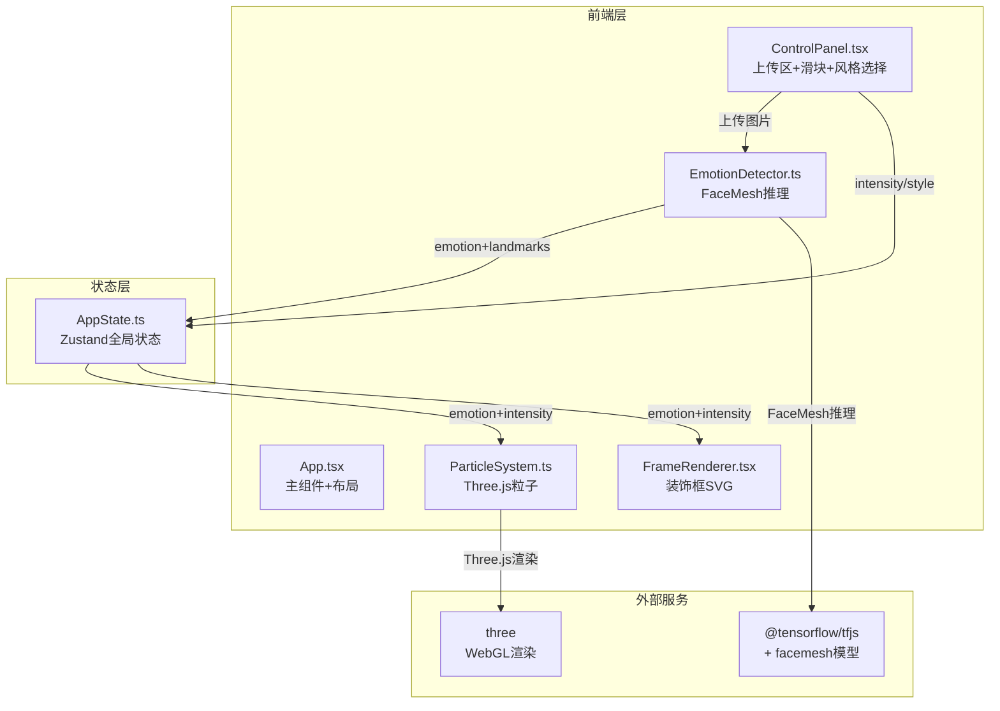

## 1. 架构设计



数据流向：
1. 用户上传图片 → EmotionDetector加载FaceMesh模型 → 提取68关键点 → 计算6种情绪概率 → 写入Zustand
2. 用户操作控制面板 → 更新intensity/style到Zustand
3. ParticleSystem和FrameRenderer从Zustand读取状态 → 每帧渲染

## 2. 技术说明

- 前端框架：React 18 + TypeScript + Vite
- 状态管理：Zustand
- 3D渲染：Three.js（Points粒子系统）
- AI推理：@tensorflow/tfjs + @tensorflow-models/facemesh
- 文件上传：react-dropzone
- 初始化工具：vite-init（react-ts模板）

## 3. 路由定义

| 路由 | 用途 |
|------|------|
| / | 主页面，包含上传、识别、粒子渲染、装饰框、控制面板 |

## 4. 文件结构与调用关系

```
src/
├── main.tsx                          # 入口，渲染App到#root
│   └── 导入 App.tsx
├── App.tsx                           # 主组件，CSS Grid布局
│   ├── 导入 ControlPanel.tsx         # 左侧面板
│   ├── 导入 FrameRenderer.tsx        # 装饰框组件
│   ├── 导入 ParticleCanvas.tsx       # 粒子Canvas容器
│   └── 导入 AppState.ts             # 全局状态
├── store/
│   └── AppState.ts                   # Zustand状态定义
│       字段: emotion, intensity, style, uploadedImage, faceLandmarks
│       Actions: updateEmotion, setIntensity, setStyle, setUploadedImage, setFaceLandmarks
├── facialAnalysisModule/
│   └── emotionDetector.ts            # FaceMesh模型加载+情绪计算
│       输入: HTMLImageElement
│       输出: { emotion, confidence, landmarks }
│       依赖: @tensorflow/tfjs, @tensorflow-models/facemesh
├── particleModule/
│   └── particleSystem.ts             # Three.js粒子系统管理
│       读取: Zustand emotion + intensity
│       渲染: 3000粒子Points系统
│       依赖: three, AppState
├── decorationModule/
│   └── FrameRenderer.tsx             # 装饰框React组件
│       读取: Zustand emotion + intensity + style
│       渲染: SVG双层圆角矩形+旋转光束+角部光球
│       依赖: AppState
└── uiPanelModule/
    └── ControlPanel.tsx              # 控制面板组件
        功能: 文件上传、强度滑块、风格选择
        依赖: react-dropzone, AppState, emotionDetector
```

调用关系：
- `main.tsx` → `App.tsx`
- `App.tsx` → `ControlPanel.tsx`, `FrameRenderer.tsx`, `ParticleCanvas.tsx`, `AppState.ts`
- `ControlPanel.tsx` → `emotionDetector.ts`, `AppState.ts`, `react-dropzone`
- `FrameRenderer.tsx` → `AppState.ts`
- `ParticleCanvas.tsx` → `particleSystem.ts`, `AppState.ts`
- `particleSystem.ts` → `AppState.ts`, `three`
- `emotionDetector.ts` → `@tensorflow/tfjs`, `@tensorflow-models/facemesh`

## 5. 关键类型定义

```typescript
interface Point {
  x: number;
  y: number;
  z?: number;
}

interface EmotionResult {
  emotion: string;
  confidence: number;
  landmarks: Point[];
}

interface AppStateType {
  emotion: string;
  intensity: number;
  style: 'minimal' | 'romantic' | 'fantasy';
  uploadedImage: string | null;
  faceLandmarks: Point[];
  updateEmotion: (emotion: string, confidence: number) => void;
  setIntensity: (intensity: number) => void;
  setStyle: (style: string) => void;
  setUploadedImage: (image: string | null) => void;
  setFaceLandmarks: (landmarks: Point[]) => void;
}
```
