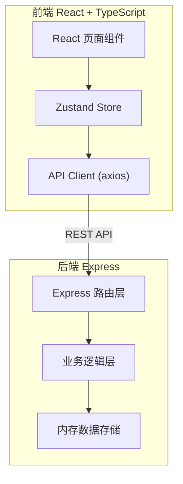
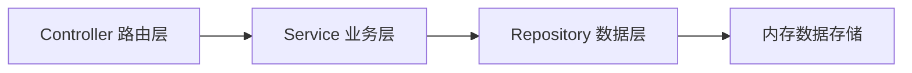
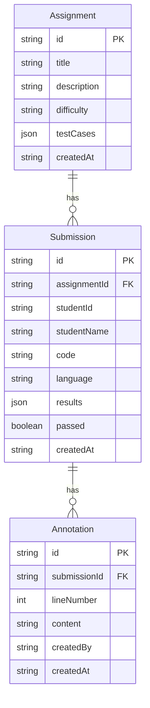

## 1. 架构设计



## 2. 技术说明

- 前端：React 18 + TypeScript + Tailwind CSS + Vite
- 初始化工具：vite-init (react-express-ts 模板)
- 后端：Express 4 + TypeScript (ESM)
- 数据库：内存数据存储（使用 Map/数组模拟，适合原型验证）
- 状态管理：Zustand
- HTTP 客户端：axios

## 3. 路由定义

| 路由 | 用途 |
|------|------|
| / | 教师面板 - 题目列表与统计 |
| /assignment/new | 创建新题目 |
| /assignment/:id/edit | 编辑题目 |
| /assignment/:id/submissions | 查看某题所有提交与批注 |
| /student | 学生面板 - 题目选择 |
| /student/assignment/:id | 学生代码提交与测试结果 |
| /student/history | 学生提交历史 |

## 4. API 定义

### 题目接口

```typescript
interface Assignment {
  id: string;
  title: string;
  description: string;
  difficulty: "beginner" | "intermediate" | "advanced";
  testCases: TestCase[];
  createdAt: string;
}

interface TestCase {
  input: string;
  expectedOutput: string;
}
```

- `GET /api/assignments` — 获取所有题目
- `GET /api/assignments/:id` — 获取单个题目
- `POST /api/assignments` — 创建题目
- `PUT /api/assignments/:id` — 更新题目
- `DELETE /api/assignments/:id` — 删除题目

### 提交接口

```typescript
interface Submission {
  id: string;
  assignmentId: string;
  studentId: string;
  studentName: string;
  code: string;
  language: "javascript" | "python";
  results: TestResult[];
  passed: boolean;
  createdAt: string;
}

interface TestResult {
  input: string;
  expectedOutput: string;
  actualOutput: string;
  passed: boolean;
}
```

- `GET /api/submissions?assignmentId=` — 获取某题所有提交
- `GET /api/submissions?studentId=` — 获取某学生所有提交
- `POST /api/submissions` — 提交代码（触发自动测试）
- `GET /api/submissions/:id` — 获取单个提交详情

### 批注接口

```typescript
interface Annotation {
  id: string;
  submissionId: string;
  lineNumber: number;
  content: string;
  createdBy: string;
  createdAt: string;
}
```

- `GET /api/annotations?submissionId=` — 获取某提交的所有批注
- `POST /api/annotations` — 添加批注
- `DELETE /api/annotations/:id` — 删除批注

## 5. 服务器架构



### 自动测试流程

```mermaid
flowchart TD
    "接收代码提交" --> "解析测试用例"
    "解析测试用例" --> "逐个执行测试"
    "逐个执行测试" --> "比较实际输出与期望输出"
    "比较实际输出与期望输出" --> "生成 TestResult"
    "生成 TestResult" --> "汇总结果返回"
```

对于 JavaScript 提交，使用 `new Function()` 安全执行；对于 Python，模拟执行返回结果（因服务端环境限制，Python仅做基础字符串匹配模拟）。

## 6. 数据模型

### 6.1 数据模型定义



### 6.2 数据定义语言

使用内存数据结构（TypeScript Map 和数组），初始化时预置示例数据：

- 2道示例题目（含测试用例）
- 3条示例提交记录
- 2条示例批注
