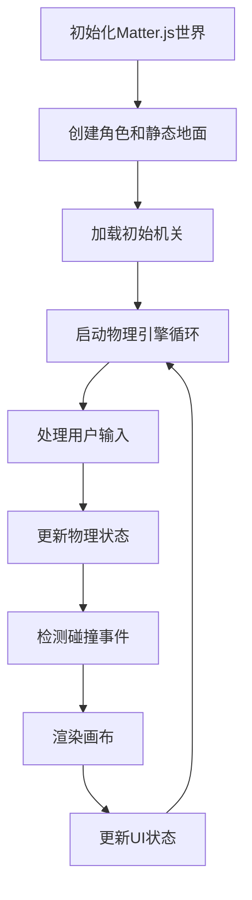
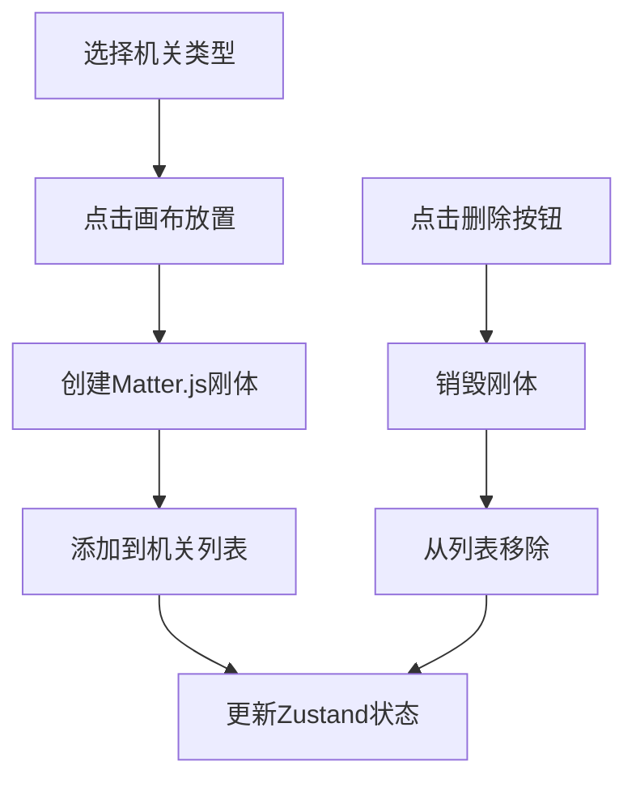

## 1. 产品概述

2D平台游戏物理交互原型，用于快速验证角色与动态机关（移动平台、旋转齿轮、传送门）之间的碰撞与弹跳效果，帮助关卡设计师在开发前直观测试物理反馈和运动节奏。

### 核心价值
- 解决横版过关游戏关卡设计阶段无法快速验证物理效果的痛点
- 提供实时可交互的物理模拟环境
- 支持快速搭建和编辑机关布局

## 2. 核心功能

### 2.1 功能模块
1. **角色控制系统**：圆形角色物理运动、重力、跳跃、二段跳、落地动画
2. **动态机关系统**：移动平台、旋转齿轮、传送门三种机关类型
3. **物理碰撞系统**：基于Matter.js的实时碰撞检测与响应
4. **关卡编辑器**：机关放置、列表管理、删除功能
5. **状态面板**：FPS计数器、角色坐标显示

### 2.2 功能详情

| 模块名称 | 功能描述 | 关键参数 |
|---------|---------|---------|
| 角色控制 | 键盘方向键控制移动，空格跳跃，空中可二段跳 | 半径15px，重力0.4，跳跃力-9，二段跳1次 |
| 移动平台 | 水平方向来回移动，角色随平台移动 | 宽100px高20px，速度1.5px/帧，范围±100px |
| 旋转齿轮 | 绕中心逆时针旋转，可碰撞 | 半径30px，8齿，速度0.03rad/帧 |
| 传送门 | 入口接触即传送到出口，重置速度 | 入口左高台，出口右地面，宽20px高60px |
| 关卡编辑器 | 下拉选择机关类型，点击画布放置，列表管理 | 控制面板宽240px，折叠式设计 |
| 视觉效果 | 径向渐变角色、落地粒子、画布渐显 | 粒子6个，扩散20px，持续0.3s |

## 3. 核心流程

### 3.1 游戏主循环流程

### 3.2 关卡编辑流程

## 4. 用户界面设计

### 4.1 设计风格
- **主题色调**：深蓝基底 #1a1a2e，科技感深色主题
- **机关色彩**：亮蓝 #3498db（移动平台）、橙 #e67e22（齿轮）、紫 #9b59b6（传送门）
- **角色色彩**：高亮红 #ff6b6b，带径向渐变高光
- **地面色彩**：绿色 #2ecc71
- **视觉风格**：扁平化+微渐变，科幻游戏风格

### 4.2 页面布局
- **整体尺寸**：900px × 600px 画布 + 240px 右侧控制面板
- **画布区域**：左侧主游戏区，带虚线网格背景
- **控制面板**：右侧折叠式面板，默认展开
- **状态显示**：左上角FPS，右上角坐标

### 4.3 动画与动效
- 画布进入：0.5s渐显动画
- 角色落地：Y轴压缩0.9比例，0.15s恢复
- 落地粒子：6个白色小点扩散消失
- 按钮悬停：颜色微变过渡

### 4.4 响应式设计
桌面端固定布局，非移动端优化，聚焦物理模拟精度。
