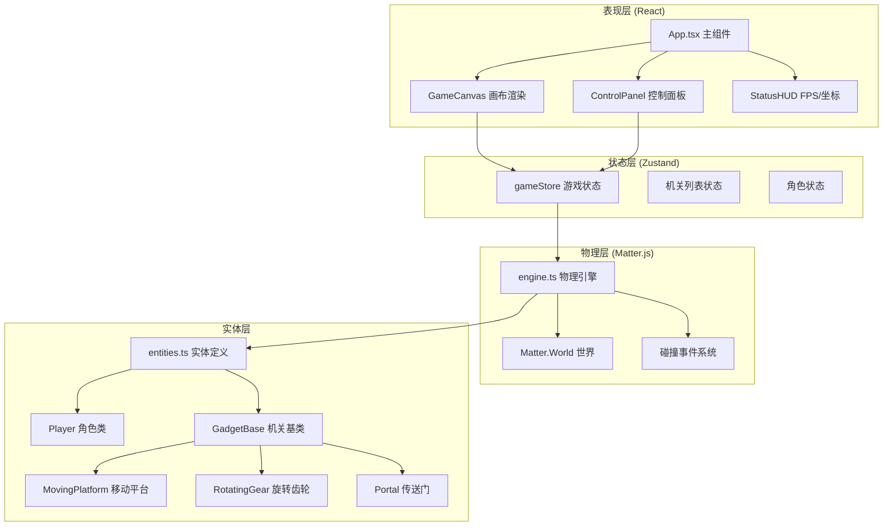

## 1. 架构设计



## 2. 技术选型

| 层级 | 技术 | 版本说明 | 用途 |
|-----|------|---------|-----|
| 构建工具 | Vite | 最新稳定版 | 开发服务器、构建 |
| UI框架 | React | 18.x | 组件化开发 |
| 语言 | TypeScript | 5.x | 类型安全 |
| 状态管理 | Zustand | 4.x | 轻量状态管理 |
| 物理引擎 | Matter.js | 0.19.x | 2D物理碰撞 |
| 样式方案 | 原生CSS / Canvas | - | 游戏渲染用Canvas，UI用CSS |

## 3. 目录结构

```
src/
├── engine.ts          # Matter.js物理引擎核心
├── entities.ts        # 角色与机关实体类
├── store.ts           # Zustand状态管理
├── App.tsx            # React主组件
├── main.tsx           # 应用入口
└── index.css          # 全局样式
```

## 4. 核心数据模型

### 4.1 角色状态
```typescript
interface PlayerState {
  x: number;
  y: number;
  vx: number;
  vy: number;
  isGrounded: boolean;
  canDoubleJump: boolean;
  squashScale: number;
}
```

### 4.2 机关类型
```typescript
type GadgetType = 'movingPlatform' | 'rotatingGear' | 'portal';

interface Gadget {
  id: string;
  type: GadgetType;
  x: number;
  y: number;
  body?: Matter.Body;
  options?: Record<string, any>;
}
```

### 4.3 游戏状态Store
```typescript
interface GameStore {
  gadgets: Gadget[];
  playerPos: { x: number; y: number };
  fps: number;
  selectedGadgetType: GadgetType | null;
  isPanelOpen: boolean;
  addGadget: (type: GadgetType, x: number, y: number) => void;
  removeGadget: (id: string) => void;
  setPlayerPos: (x: number, y: number) => void;
  setFps: (fps: number) => void;
  setSelectedGadgetType: (type: GadgetType | null) => void;
  togglePanel: () => void;
}
```

## 5. 物理引擎设计

### 5.1 世界配置
- 重力：y方向0.4像素/帧²
- 引擎更新：requestAnimationFrame驱动
- 碰撞检测：Matter.js内置SAT算法

### 5.2 碰撞类别
- 角色：category 0x0001
- 静态地面：category 0x0002
- 移动平台：category 0x0004
- 旋转齿轮：category 0x0008
- 传送门：category 0x0010（传感器，无物理碰撞）

### 5.3 性能指标
- 目标帧率：60 FPS
- 最低帧率：50 FPS（10个机关时）
- 优化策略：限制刚体数量，合理使用碰撞过滤器

## 6. 关键实现点

### 6.1 Matter.js与React集成
- 使用useRef保存引擎实例，避免重渲染
- useEffect初始化和清理引擎
- 用requestAnimationFrame驱动渲染循环

### 6.2 角色控制
- 键盘事件监听，记录按键状态
- 每帧根据按键施加水平力
- 跳跃时检查地面状态，实现二段跳

### 6.3 机关运动
- 移动平台：每帧更新位置，约束在范围内
- 旋转齿轮：设置角速度，Matter.js处理旋转
- 传送门：碰撞检测触发，瞬间传送并重置速度

### 6.4 视觉渲染
- Canvas 2D渲染所有游戏元素
- 角色径向渐变用createRadialGradient
- 粒子用数组管理生命周期
