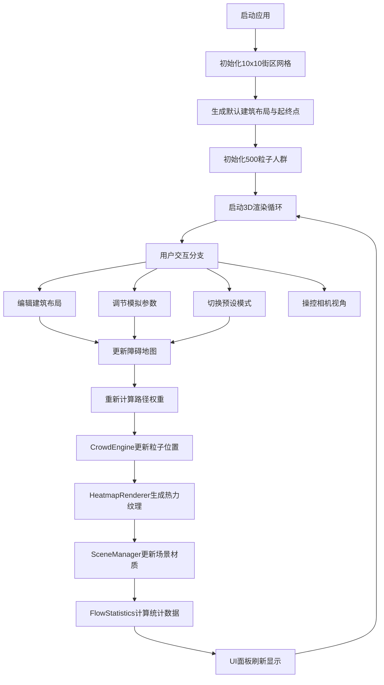

## 1. 产品概述

城市人群流动热力图3D模拟应用，为社区规划团队提供新建商业区对不同时段人群流动影响的可视化评估工具。通过三维街区网格、粒子人群模拟和实时热力图，帮助用户快速理解不同建筑布局下的人流分布特征与路径选择规律。

- 主要用途：城市规划辅助决策、商业区人流预评估、交通流量模拟分析
- 目标用户：城市规划师、社区规划团队、交通工程设计师、房地产开发评估人员
- 产品价值：降低规划评估成本，缩短方案迭代周期，直观展示人流瓶颈与热点区域

## 2. 核心功能

### 2.1 用户角色

| 角色 | 注册方式 | 核心权限 |
|------|----------|----------|
| 规划师用户 | 无需注册，本地工具 | 编辑建筑布局、调节模拟参数、查看统计数据、切换预设模式 |

### 2.2 功能模块

1. **3D场景主视图**：10x10街区网格渲染、建筑方块展示、人群粒子动画、实时热力图叠加、OrbitControls视角控制
2. **建筑布局编辑器**：点击添加/移除建筑、拖拽调整位置与高度、半透明预览确认、建筑高度颜色映射
3. **人群模拟引擎**：500-2000粒子系统、Dijkstra最短路径算法、避障移动、到达延迟循环、速度渐变着色
4. **实时热力渲染**：高斯核密度估计、蓝-青-红颜色映射、15fps更新频率、噪声波动效果
5. **参数控制面板**：人群数量滑块、速度倍率滑块、到达延迟滑块、早高峰/周末预设模式
6. **数据统计面板**：平均人流密度进度条、平均速度直方图、粒子总数、运行计时器

### 2.3 页面详情

| 页面名称 | 模块名称 | 功能描述 |
|----------|----------|----------|
| 主应用页 | 3D场景主视图 | 渲染10x10街区网格（街道宽2单位，街区边长8单位），支持鼠标拖拽旋转（0.5度/px）、滚轮缩放（5-50单位）、点击聚焦（0.6秒缓出动画） |
| 主应用页 | 建筑布局编辑器 | 点击网格节点添加4x4x(2~6)建筑方块，预览半透明（0.5），确认后完全不透明带漫反射光泽；拖拽调整水平位置（步进1）和高度（步进1）；高度从#cccccc到#333333渐变 |
| 主应用页 | 人群模拟引擎 | 2-5个红色起始点(#e74c3c)和绿色目的地(#2ecc71)圆柱标记(r=0.5,h=0.2)；500个蓝色(#3498db)到红色(#e74c3c)渐变粒子(r=0.1)；速度0.5-2单位/秒随机；到达后1秒延迟重新出发循环 |
| 主应用页 | 实时热力渲染 | 半透明(0.6)热力图叠加，高斯核(r=2,σ=1)密度估计，蓝→青→红映射，15fps更新，噪声(0.02,0.8s)波动 |
| 主应用页 | 参数控制面板 | 人群数量(100-2000,步50)、速度倍率(0.5-3.0,步0.1)、到达延迟(0.5-3s,步0.1)滑块；早高峰模式（左下起点→右上终点，1500粒子）；周末模式（随机起点→中心广场，800粒子） |
| 主应用页 | 数据统计面板 | 右下角半透明面板(240px,rgba(0,0,0,0.7),圆角8px)；平均密度进度条(180x12px,热力渐变)；平均速度+直方图(10区间,2s更新)；粒子总数；mm:ss运行时间；1s刷新 |

## 3. 核心流程

用户打开应用 → 默认生成10x10街区网格 + 500粒子基础模拟 → 用户可编辑建筑布局（点击/拖拽） → 调节参数或切换预设模式 → 实时观察粒子路径变化与热力图分布 → 查看右下角数据面板统计指标 → 相机视角自由探索场景

## 4. 用户界面设计

### 4.1 设计风格
- **主色调**：深色背景 #0d1117，辅助面板 #161b22，边框 #30363d
- **强调色**：交互蓝 #58a6ff（悬停 #79c0ff）、成功绿 #238636（悬停 #2ea043，点击 #1b6b2e）
- **热力色系**：低密度蓝 #3498db → 中等青 #1abc9c → 高密度红 #e74c3c
- **建筑色系**：低楼浅灰 #cccccc → 高楼深灰 #333333
- **起终点色**：起点红 #e74c3c、终点绿 #2ecc71
- **粒子色系**：慢速蓝 #3498db → 快速红 #e74c3c 线性渐变
- **字体**：系统无衬线字体栈，标题14px粗体，正文12px常规
- **按钮风格**：圆角6px，0.2s过渡，悬停上提亮，按下加深
- **布局风格**：左侧固定控制栏(280px) + 中央3D场景 + 右下角悬浮统计面板
- **模式卡片**：100x60px圆角6px，选中时2px蓝色边框 + 上移3px，0.3s过渡

### 4.2 页面设计概述

| 页面名称 | 模块名称 | UI元素 |
|----------|----------|--------|
| 主应用页 | 3D场景主视图 | 深色背景#0d1117，地面网格纹理#2c3e50线宽0.5px，OrbitControls，点击聚焦动画 |
| 主应用页 | 左侧控制面板 | 宽280px，背景#161b22，1px#30363d边框，圆角8px，内边距16px；分组标题14px#c9d1d9，底部2px#30363d实线；滑块轨道180x4px#21262d，滑块φ14px#58a6ff；按钮圆角6px#238636白字 |
| 主应用页 | 模式切换卡片 | 2张卡片100x60px，圆角6px，背景#1c2128，选中外圈2px#58a6ff+上移3px，0.3s过渡 |
| 主应用页 | 统计面板 | 宽240px，rgba(0,0,0,0.7)，圆角8px，边距16px；密度进度条180x12px热力渐变；直方图10区间柱状图；mm:ss时间格式 |
| 主应用页 | 响应式适配 | 窗口<900px时左侧面板折叠为顶部60px栏，内嵌可展开下拉菜单 |

### 4.3 响应式
- **设计优先**：桌面端优先（宽屏适配最佳体验）
- **断点设计**：900px为临界断点
  - ≥900px：左侧280px固定控制面板 + 中央3D场景 + 右下角统计面板
  - <900px：顶部60px折叠栏（汉堡菜单展开控制项）+ 全屏3D场景 + 统计面板缩小并可拖拽
- **触控优化**：移动端支持双指捏合缩放、单指滑动旋转、长按放置建筑

### 4.4 3D场景指导
- **环境氛围**：深空蓝灰雾效（FogExp2，密度0.008），模拟城市天际线朦胧感
- **灯光配置**：HemisphereLight（天空#87ceeb，地面#2c3e50，强度0.6）+ DirectionalLight（#ffffff，强度0.8，阴影开启）+ AmbientLight（#404040，强度0.3）
- **相机参数**：PerspectiveCamera（fov=60，near=0.1，far=1000），初始位置(40, 35, 40)，聚焦(0,0,0)
- **相机动画**：点击聚焦采用Quadratic easeOut缓动，0.6秒平滑过渡
- **构图焦点**：等距45度俯视角，建筑中心为视觉重心，粒子流动引导视线
- **交互细节**：
  - 粒子0.3秒尾迹（透明度0.6→0线性衰减）
  - 热力图噪声波动（幅度0.02，周期0.8秒正弦）
  - 建筑方块环境光遮蔽（AO强度0.5）
  - 放置预览方块呼吸脉冲动画（±0.1透明度，周期1s）
- **后处理效果**：Bloom泛光（强度0.4，阈值0.85），粒子发光体溢出微光；FXAA抗锯齿
- **性能预算**：2000粒子场景下≥30FPS，每帧逻辑更新+热力计算≤10ms

## 5. 性能与质量要求
- **帧率目标**：普通场景（500粒子）≥60FPS，大场景（2000粒子）≥30FPS
- **计算耗时**：每帧粒子位置更新 + 热力图生成总耗时 ≤ 10ms
- **热力精度**：15FPS更新频率，高斯核半径2单位，σ=1
- **内存占用**：粒子系统内存 ≤ 50MB，纹理资源 ≤ 20MB
