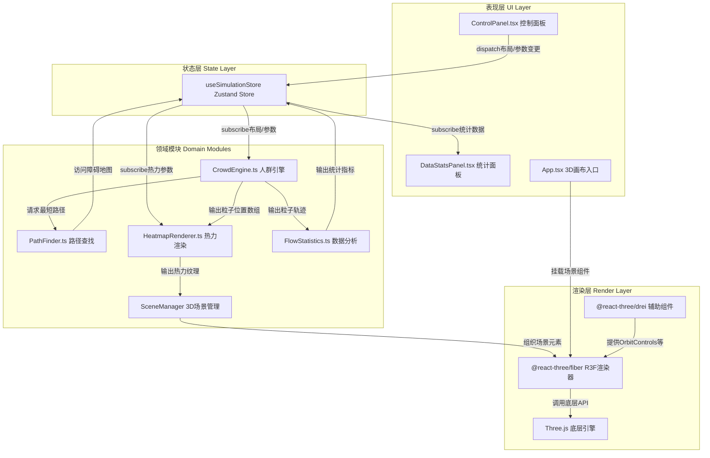

## 1. 架构设计

采用分层模块化架构，以Zustand全局状态为数据枢纽，通过单向数据流协调各独立模块协作。模块间通过接口契约解耦，确保人群流、热力渲染、UI控制、统计分析四大域独立演进。



## 2. 技术描述

- **前端框架**：React@18 + TypeScript@5（严格模式，target ES2020）
- **构建工具**：Vite@5（路径别名@→src，HMR支持）
- **3D引擎**：Three.js@0.160 + @react-three/fiber@8 + @react-three/drei@9
- **状态管理**：Zustand@4（扁平化状态结构，选择器订阅优化渲染）
- **空间计算**：@turf/helpers@6（距离/中心点计算辅助）
- **可视化辅助**：d3-scale@7（颜色插值、区间分桶）
- **粒子尾迹**：@react-three/postprocessing（EffectComposer+Bloom可选优化）
- **样式方案**：原生CSS + CSS Modules（避免Tailwind体积开销，精细控制UI组件）

## 3. 目录结构与文件职责

```
src/
├── modules/
│   ├── crowdSim/
│   │   ├── CrowdEngine.ts       # 人群引擎：粒子矩阵管理、每帧路径更新、碰撞检测
│   │   ├── PathFinder.ts        # Dijkstra路径查找：街区网格最短路径、障碍避绕
│   │   └── types.ts             # 人群域类型：Particle、GridNode、StartPoint、EndPoint
│   ├── render/
│   │   ├── HeatmapRenderer.ts   # 热力渲染：高斯核密度估计、颜色映射、Canvas纹理生成
│   │   ├── SceneManager.tsx     # 场景管理：灯光/相机/网格初始化、R3F组件装配
│   │   ├── Buildings.tsx        # 建筑渲染：方块生成、拖拽交互、高度着色
│   │   ├── Particles.tsx        # 粒子渲染：InstancedMesh批量渲染、尾迹效果、速度着色
│   │   ├── HeatmapLayer.tsx     # 热力层：纹理叠加平面、噪声动画
│   │   └── Markers.tsx          # 标记渲染：起终点圆柱体
│   ├── ui/
│   │   ├── ControlPanel.tsx     # 控制面板：布局编辑、参数滑块、模式切换
│   │   ├── DataStatsPanel.tsx   # 数据面板：密度进度条、速度直方图、运行计时
│   │   ├── Slider.tsx           # UI原子：自定义滑块组件
│   │   ├── ModeCard.tsx         # UI原子：模式切换卡片组件
│   │   └── styles/
│   │       ├── ControlPanel.css # 控制面板样式
│   │       └── DataStatsPanel.css # 数据面板样式
│   ├── analytics/
│   │   └── FlowStatistics.ts    # 数据统计：密度峰值计算、通过时间、直方图分桶
│   └── shared/
│       ├── types.ts             # 全局类型：BuildingBlock、SimulationParams、ModePreset
│       └── constants.ts         # 常量：网格尺寸、颜色映射表、性能参数
├── store/
│   └── useSimulationStore.ts    # Zustand全局Store：布局/参数/统计统一管理
├── App.tsx                      # 应用入口：模块装配、响应式布局、循环协调
├── main.tsx                     # React根挂载
└── index.css                    # 全局样式：CSS变量、主题色、重置样式
```

### 模块调用关系与数据流向

| 源模块 | 目标模块 | 数据类型 | 触发时机 |
|--------|----------|----------|----------|
| ControlPanel | useSimulationStore | BuildingBlock[] / params | 用户拖拽滑块、点击按钮、切换模式 |
| useSimulationStore | CrowdEngine | {buildings, starts, ends, params} | 布局/参数变更（防抖50ms） |
| CrowdEngine | PathFinder | {from: GridNode, to: GridNode, obstacles: Set} | 粒子需要新路径时 |
| PathFinder | useSimulationStore | obstacles: Set<string> | 初始化/建筑变更时加载障碍图 |
| CrowdEngine | HeatmapRenderer | positions: Float32Array[N×3] | 每帧更新 |
| CrowdEngine | FlowStatistics | {positions, speeds, startTimes} | 每帧更新，统计1s窗口聚合 |
| HeatmapRenderer | HeatmapLayer | texture: CanvasTexture | 15fps间隔更新 |
| FlowStatistics | useSimulationStore | {avgDensity, speedHistogram, totalParticles, runTime} | 每秒聚合后推送 |
| useSimulationStore | DataStatsPanel | 统计指标对象 | 统计变更时选择器订阅 |
| SceneManager | R3F Canvas | JSX组件树 | 挂载时一次性装配 |

## 4. 核心数据模型

```typescript
// shared/types.ts
export interface BuildingBlock {
  id: string;
  gridX: number;      // 0-9 网格X坐标
  gridZ: number;      // 0-9 网格Z坐标
  height: number;     // 2-6 单位高度
  worldX: number;     // 世界坐标（根据网格计算）
  worldZ: number;
}

export interface MarkerPoint {
  id: string;
  gridX: number;
  gridZ: number;
  worldX: number;
  worldZ: number;
}

export interface SimulationParams {
  particleCount: number;       // 100-2000
  speedMultiplier: number;     // 0.5-3.0
  arrivalDelay: number;        // 0.5-3.0 秒
}

export type PresetMode = 'normal' | 'morning_peak' | 'weekend';

export interface StatsData {
  avgDensity: number;          // 0-1 归一化
  speedHistogram: number[];    // 10个区间计数
  avgSpeed: number;            // 单位/秒
  totalParticles: number;
  runTimeSeconds: number;
}

// crowdSim/types.ts
export interface Particle {
  id: number;
  pos: THREE.Vector3;
  velocity: THREE.Vector3;
  speed: number;               // 0.5-2 * speedMultiplier
  pathIndex: number;           // 当前路径节点索引
  path: THREE.Vector3[];       // 当前走的路径
  startIdx: number;            // 所属起点
  endIdx: number;              // 目标终点
  state: 'moving' | 'waiting'; // 移动中/等待重出发
  waitTimer: number;           // 等待计时（秒）
}

export type GridCell = { x: number; z: number; walkable: boolean };
```

## 5. 关键算法与性能优化策略

### 5.1 人群路径与更新
- **路径预计算缓存**：起终点配对 → 预计算完整路径 → 粒子共享引用，避免每粒子重复Dijkstra
- **网格节点坐标映射**：10×10街区网格，街道节点坐标为 `(x*10, z*10)`，共11×11可通行节点
- **增量路径更新**：仅当建筑布局变更时重新计算路径缓存，变更后50ms防抖批量重算
- **粒子数组TypedArray存储**：`Float32Array(N×3)`存储位置，`Uint8Array(N)`存储速度等级，GPU友好

### 5.2 热力图计算
- **降采样网格**：50×50像素热力纹理（对应100×100世界坐标覆盖），每像素2单位
- **空间分桶加速**：粒子先填入10×10分桶哈希表，高斯核仅遍历相邻9桶粒子，O(N)→O(K)
- **15fps节流更新**：热力纹理独立于渲染帧，`setInterval` 66ms触发一次Canvas重绘
- **离屏Canvas**：使用`OffscreenCanvas`（兼容回退普通Canvas），主线程阻塞最小化

### 5.3 粒子渲染性能
- **InstancedMesh**：单Mesh + 2000 Instance矩阵，1次Draw Call
- **尾迹轨迹缓冲池**：复用历史位置数组，环形覆盖写入，避免GC
- **视锥剔除优化**：建筑与标记开启frustumCulled，粒子整体不剔除（体积小）

## 6. Zustand Store结构

```typescript
// store/useSimulationStore.ts
interface SimulationState {
  // 布局状态
  buildings: BuildingBlock[];
  startPoints: MarkerPoint[];
  endPoints: MarkerPoint[];
  
  // 模拟参数
  params: SimulationParams;
  mode: PresetMode;
  
  // 统计数据
  stats: StatsData;
  
  // 相机状态
  targetFocus: THREE.Vector3 | null;
  
  // Actions
  addBuilding: (block: BuildingBlock) => void;
  removeBuilding: (id: string) => void;
  updateBuilding: (id: string, patch: Partial<BuildingBlock>) => void;
  setParams: (patch: Partial<SimulationParams>) => void;
  setMode: (mode: PresetMode) => void;
  applyPreset: (mode: PresetMode) => void;
  setStats: (stats: Partial<StatsData>) => void;
  setTargetFocus: (pos: THREE.Vector3 | null) => void;
}
```

## 7. 性能监控指标（内建）
- `window.__PERF__` 暴露：每帧更新耗时ms、热力计算耗时ms、FPS滑动平均
- 开发模式右上角迷你监控面板（50ms刷新）
- 热力纹理Canvas `imageSmoothingEnabled=false` 确保锐利像素风
