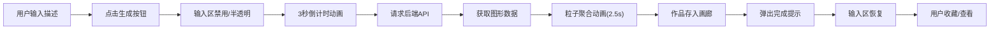

## 1. 产品概述
灵感速写板是一款AI驱动的抽象艺术生成工具，用户通过简短文字描述即可实时生成独特的抽象艺术画作，并可收藏管理个人灵感画廊。
- 核心价值：将瞬时灵感转化为视觉艺术，降低艺术创作门槛，为用户提供沉浸式的创意体验
- 目标用户：设计师、创意工作者、艺术爱好者、普通用户

## 2. 核心功能

### 2.1 用户角色
| 角色 | 注册方式 | 核心权限 |
|------|----------|----------|
| 普通用户 | 无需注册，本地存储 | 生成画作、查看画廊、收藏管理 |

### 2.2 功能模块
1. **主画布区域**：倒计时动画、粒子聚合动画、星点旋转背景、作品大图展示
2. **输入控制区**：文本输入框（60字限制）、生成按钮、加载状态反馈
3. **灵感画廊**：横向滚动画廊、缩略图展示、收藏按钮、已收藏置顶
4. **反馈提示**：生成完成气泡提示、禁用状态视觉反馈

### 2.3 页面详情
| 页面名称 | 模块名称 | 功能描述 |
|----------|----------|----------|
| 首页 | 星点背景层 | Canvas绘制缓慢旋转星点，周期60秒，营造沉浸氛围 |
| 首页 | 倒计时动画 | 3→2→1数字居中放大，缩放0.8→1.2，过渡0.3s |
| 首页 | 粒子聚合动画 | 彩色粒子（2-5px，HSL随机）从四周飞向中心，带轻微曲线路径，持续2.5秒 |
| 首页 | 文本输入区 | 60字限制输入框，生成中禁用半透明（opacity 0.5） |
| 首页 | 生成按钮 | 生成中禁用半透明，完成后恢复，触发气泡提示 |
| 首页 | 完成提示气泡 | 底部滑入，停留2秒后淡出 |
| 首页 | 灵感画廊 | 横向滚动，背景#2c2c2c，缩略图120x120px圆角8px间隔12px |
| 首页 | 缩略图交互 | 悬停上浮3px+1px白色边框，过渡0.2s；点击重绘大图 |
| 首页 | 收藏功能 | 心形按钮（空心#fff/填满#ff4d6d），已收藏固定最左侧 |

## 3. 核心流程
用户输入描述文字→点击生成按钮→输入区禁用→倒计时3秒动画→请求后端获取图形数据→粒子开始聚合（延迟<500ms）→2.5秒聚合完成→作品存入画廊→弹出完成提示→输入区恢复→用户可收藏/点击查看

## 4. 用户界面设计

### 4.1 设计风格
- **主色调**：深蓝#0f3460、紫灰#533483、亮粉#e94560、画布背景#1a1a2e、画廊背景#16213e、画廊内部#2c2c2c
- **按钮风格**：圆角设计，亮粉渐变强调色，悬停微放大
- **字体**：现代无衬线字体，标题粗体，正文常规
- **布局风格**：上下分层结构，上方为主画布+输入区，下方为横向画廊
- **动效风格**：流畅过渡动画，粒子运动带曲线，倒计时缩放弹性

### 4.2 页面设计概述
| 页面名称 | 模块名称 | UI元素 |
|----------|----------|----------|
| 首页 | 画布区域 | 居中Canvas，#1a1a2e背景，星点旋转，粒子动画层叠 |
| 首页 | 输入控制 | 输入框左+按钮右，深色输入框，亮粉按钮，加载态半透明 |
| 首页 | 画廊区域 | 背景#16213e，内部#2c2c2c，横向滚动，缩略图网格排列 |
| 首页 | 提示气泡 | 底部中央，圆角深色背景，白色文字，滑入+淡出 |

### 4.3 响应式设计
- **桌面端（1080p+）**：缩略图120x120px，间隔12px
- **平板端（768px）**：缩略图100x100px，间隔8px
- **布局**：桌面优先，使用CSS媒体查询适配
- **滚动**：画廊区域保持横向滚动，移动端支持触摸滑动

### 4.4 性能要求
- 点击生成到第一个粒子开始延迟≤500ms
- 倒计时动画主导时间，后端处理需快速返回
- 粒子渲染使用Canvas 2D，避免DOM操作
- 响应式切换无布局抖动
