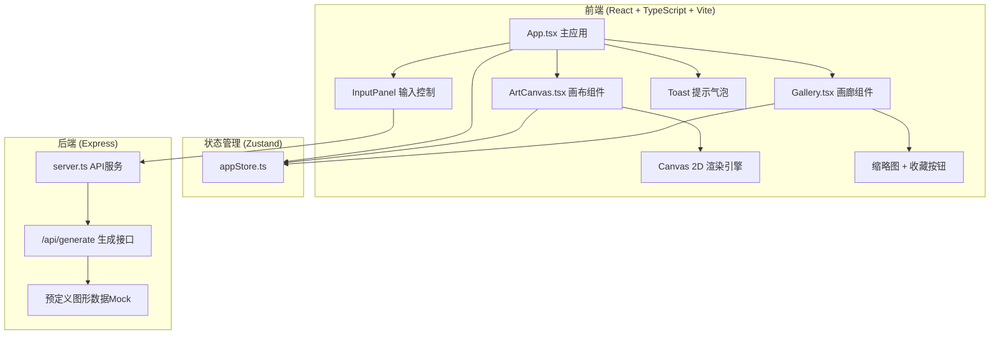
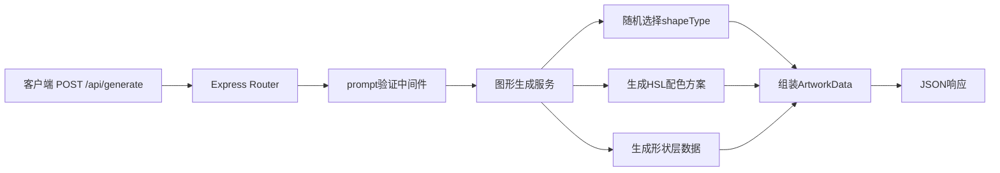
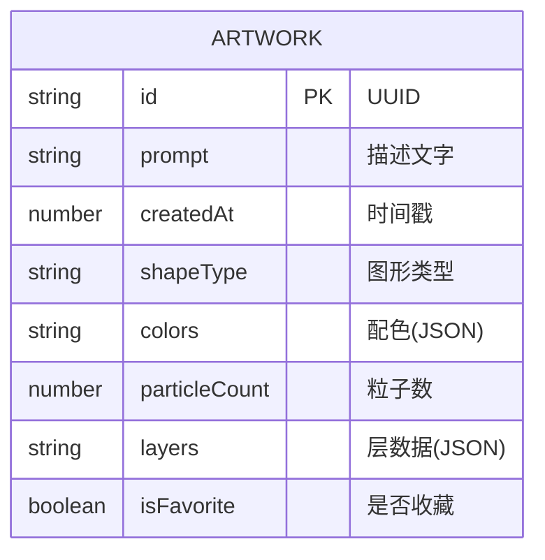

## 1. 架构设计



## 2. 技术说明
- **前端**：React@18 + TypeScript@5 + Vite@5 + Zustand@4 + Axios@1
- **初始化工具**：Vite
- **后端**：Express@4 + CORS + UUID
- **数据**：内存Mock数据，无持久化数据库，前端用localStorage保存收藏

## 3. 路由定义
| 路由 | 用途 |
|------|------|
| / | 主页面（画布+输入+画廊） |
| /api/generate | POST，接收文本描述，返回抽象图形数据 |

## 4. API定义

### 4.1 生成抽象图形
**请求**：
```typescript
interface GenerateRequest {
  prompt: string; // 用户输入的描述文字，最多60字
}
```

**响应**：
```typescript
interface ArtworkData {
  id: string;              // UUID
  prompt: string;          // 原始描述
  createdAt: number;       // 时间戳
  shapeType: 'circles' | 'waves' | 'spirals' | 'grid' | 'burst' | 'organic';
  colors: string[];        // HSL颜色数组，5-8个主色
  particleCount: number;   // 粒子数量，200-400
  layers: ShapeLayer[];    // 图形层定义
}

interface ShapeLayer {
  type: 'circle' | 'arc' | 'line' | 'bezier' | 'polygon';
  points: Array<{ x: number; y: number; }>; // 相对画布中心的坐标(0-1范围)
  size: number;            // 大小系数
  rotation: number;        // 旋转角度(弧度)
  colorIndex: number;      // 对应colors数组索引
  opacity: number;         // 透明度 0.3-1.0
}
```

## 5. 服务端架构图



## 6. 数据模型

### 6.1 数据模型定义



### 6.2 Zustand Store定义

```typescript
interface AppState {
  artworks: Artwork[];           // 所有作品
  favorites: string[];           // 收藏的作品ID
  currentArtwork: Artwork | null;// 当前展示的作品
  isGenerating: boolean;         // 是否正在生成
  countdownValue: number | null; // 倒计时数字
  isAggregating: boolean;        // 是否正在粒子聚合
  toastMessage: string | null;   // 提示消息
  
  generateArtwork: (prompt: string) => Promise<void>;
  toggleFavorite: (id: string) => void;
  selectArtwork: (id: string) => void;
  setCountdown: (v: number | null) => void;
  setAggregating: (v: boolean) => void;
  showToast: (msg: string) => void;
  getSortedArtworks: () => Artwork[]; // 收藏优先排序
}
```

## 7. 项目文件结构

```
auto83/
├── package.json
├── index.html
├── vite.config.js
├── tsconfig.json
├── src/
│   ├── App.tsx                 # 主应用组件
│   ├── main.tsx                # 入口文件
│   ├── index.css               # 全局样式
│   ├── components/
│   │   ├── ArtCanvas.tsx       # 中央画布组件
│   │   └── Gallery.tsx         # 底部画廊组件
│   └── store/
│       └── appStore.ts         # Zustand状态管理
└── api/
    └── server.ts               # Express后端服务
```
