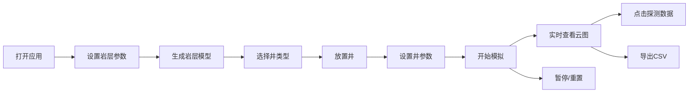

## 1. 产品概述

地下岩层多相流渗流模拟3D交互应用，为地质工程师和科研人员提供直观、可交互的可视化原型工具，帮助理解复杂的多相流耦合行为。

- 主要用途：模拟地下岩层中流体在多孔介质中的渗流过程，实时生成压力场和饱和度云图

- 目标用户：地质工程师、科研人员、石油工程专业学生

- 核心价值：将抽象的渗流数学模型转化为直观的3D可视化交互体验，降低理解复杂多相流行为的门槛

## 2. 核心功能

### 2.1 用户角色

| 角色 | 注册方式 | 核心权限 |
|------|----------|----------|
| 科研用户 | 无需注册 | 使用全部模拟功能，设置参数，运行模拟，导出数据 |

### 2.2 功能模块

1. **岩层模型构建模块**：参数设置、非均质分布模式选择、3D网格化岩层体生成

2. **井管理模块**：注入井/生产井放置、参数设置、动态粒子流线

3. **渗流模拟模块**：基于Darcy定律的多相流计算、实时压力场和饱和度场更新

4. **数据探测与导出模块**：点击探测、数据卡片、CSV导出

5. **3D渲染模块**：场景渲染、动画效果、交互控制

### 2.3 页面详情

| 页面名称 | 模块名称 | 功能描述 |
|-----------|----------|------------|
| 主界面 | 岩层参数面板 | 尺寸、孔隙度、渗透率、非均质模式参数调节 |
| 主界面 | 井控制面板 | 井放置模式切换、速率设置、井列表管理 |
| 主界面 | 模拟控制条 | 播放、暂停、重置、时间进度显示 |
| 主界面 | 3D场景区域 | 岩层网格、井模型、体素云、坐标轴、时间显示 |
| 主界面 | 信息卡片 | 点击探测点数据显示、拖拽移动 |

## 3. 核心流程

用户打开应用 → 设置岩层参数（尺寸、孔隙度、渗透率、非均质模式）→ 点击确认生成岩层模型 → 选择井类型（注入/生产）→ 在岩层表面点击放置井 → 设置井参数（速率）→ 点击开始模拟 → 实时查看压力场和饱和度云图 → 点击岩层内部探测数据 → 导出CSV数据 → 暂停/重置模拟

## 4. 用户界面设计

### 4.1 设计风格

- **主色调**：深色科技风格

  - 主背景：#0d1117

  - 次要面板：#161b22

  - 面板背景：#21262d

  - 字体颜色：#c9d1d9

  - 强调色（按钮）：#238636（悬停#2ea043）

  - 滑块颜色：#58a6ff

  - 注入井：#00bfff（蓝色）

  - 生产井：#ff6347（红色）

  - 孔隙度颜色映射：#1e3a5f（蓝）到 #b22222（红）渐变

- **按钮风格**：圆角6px，悬停变亮，点击0.1秒缩放效果

- **字体**：现代无衬线字体，清晰可读

- **布局风格**：左侧可折叠面板 + 右侧3D场景 + 底部控制条

### 4.2 页面设计概览

| 页面名称 | 模块名称 | UI元素 |
|-----------|----------|--------|
| 主界面 | 左侧控制面板 | 参数滑块、下拉菜单、功能按钮、井列表 |
| 主界面 | 3D场景区域 | 半透明岩层网格、井模型（发光圆柱+动画）、体素云、坐标轴、时间显示 |
| 主界面 | 底部控制条 | 播放/暂停/重置按钮、时间进度条 |
| 主界面 | 信息卡片 | 半透明背景、圆角8px、白色文字、可拖拽 |

### 4.3 响应式设计

- 桌面端（≥1280x720）：完整显示所有面板

- 窗口缩放时：左侧面板可折叠或隐藏

- 触摸优化：支持鼠标拖拽旋转3D场景，滚轮缩放

### 4.4 3D场景指导

- **环境**：深色背景，营造科技感和深度感

- **灯光**：环境光 + 方向光，确保3D物体可见且有立体感

- **相机**：透视相机，初始角度可查看整个岩层，支持轨道控制

- **交互**：鼠标左键旋转，滚轮缩放，右键平移

- **动画**：井口脉冲光环（周期1.5秒）、生产井旋转、粒子流线运动、体素云平滑过渡

- **后期处理**：抗锯齿，确保画面清晰

## 5. 性能指标

- 模拟计算更新周期：≤0.5秒

- 界面动画帧率：≥30fps

- 交互延迟：≤100ms

