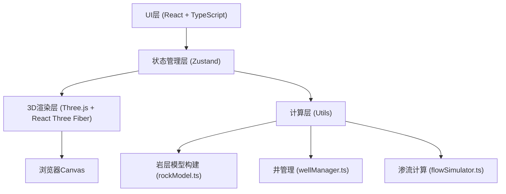

## 1. 架构设计



## 2. 技术描述

### 2.1 前端技术栈

- **框架**：React 18 + TypeScript

- **构建工具**：Vite 5.x

- **3D渲染**：Three.js + @react-three/fiber + @react-three/drei

- **状态管理**：Zustand

- **文件导出**：file-saver

### 2.2 核心依赖版本

| 依赖包 | 版本 | 用途 |
|--------|------|------|
| react | ^18.2.0 | 前端框架 |
| react-dom | ^18.2.0 | React DOM渲染 |
| typescript | ^5.4.0 | 类型安全 |
| three | ^0.162.0 | 3D渲染引擎 |
| @react-three/fiber | ^8.15.0 | React Three.js绑定 |
| @react-three/drei | ^9.99.0 | Three.js辅助组件 |
| zustand | ^4.5.0 | 状态管理 |
| file-saver | ^2.0.5 | 文件导出 |

## 3. 项目结构

```
src/
├── main.tsx                 # React应用入口
├── store/
│   └── simulationStore.ts  # Zustand状态管理
├── components/
│   ├── UIPanel.tsx        # 左侧控制面板UI
│   └── SceneRenderer.tsx    # 3D场景渲染
└── utils/
    ├── rockModel.ts         # 岩层模型构建
    ├── flowSimulator.ts    # 渗流计算模块
    └── wellManager.ts      # 井管理工具
```

## 4. 状态管理设计

### 4.1 数据类型定义

```typescript
// 岩层参数
interface RockParams {
  sizeX: number;      // X方向尺寸（1-10）
  sizeY: number;      // Y方向尺寸（1-8）
  sizeZ: number;      // Z方向尺寸（1-5）
  porosity: number;     // 孔隙度（0.1-0.4）
  permeability: number;  // 渗透率（1e-12 - 1e-9）
  heterogeneity: 'uniform' | 'layered' | 'random';  // 非均质模式
}

// 井参数
interface Well {
  id: string;
  type: 'injector' | 'producer';
  position: { x: number; y: number; z: number };
  rate: number;        // 速率（0.1-5.0）
}

// 模拟状态
interface SimulationState {
  rockParams: RockParams;
  wells: Well[];
  isRunning: boolean;
  currentTime: number;
  timeStep: number;
  pressureField: number[][][];     // 压力场数据
  saturationField: number[][][];  // 饱和度场数据
  velocityField: number[][][][];  // 速度场数据
  porosityField: number[][][];      // 孔隙度场
  permeabilityField: number[][][];  // 渗透率场
}

// UI状态
interface UIState {
  panelCollapsed: boolean;
  selectedWellId: string | null;
  probeData: ProbeData | null;
  probePosition: { x: number; y: number };
  wellPlacementMode: 'none' | 'injector' | 'producer';
}

// 探测点数据
interface ProbeData {
  position: { x: number; y: number; z: number };
  porosity: number;
  permeability: number;
  pressure: number;
  saturation: number;
}
```

### 4.2 Store Action 方法

- `setRockParams(params: Partial<RockParams>)` - 设置岩层参数

- `confirmRockModel()` - 确认生成岩层模型

- `addWell(well: Omit<Well>)` - 添加井

- `removeWell(id: string)` - 删除井

- `updateWellRate(id: string, rate: number)` - 更新井速率

- `startSimulation()` - 开始模拟

- `pauseSimulation()` - 暂停模拟

- `resetSimulation()` - 重置模拟

- `setProbeData(data: ProbeData | null)` - 设置探测点数据

- `togglePanel()` - 切换面板折叠

- `setWellPlacementMode(mode: 'none' | 'injector' | 'producer')` - 设置井放置模式

- `exportCSV()` - 导出CSV数据

## 5. 计算模块设计

### 5.1 岩层模型构建 (rockModel.ts)

```typescript
// 生成网格顶点数据
export function generateRockMesh(params: RockParams): {
  positions: Float32Array;
  indices: Uint32Array;
  porosityField: number[][][];
  permeabilityField: number[][][];
}

// 生成孔隙度分布
export function generatePorosityField(
  sizeX: number,
  sizeY: number,
  sizeZ: number,
  basePorosity: number,
  mode: 'uniform' | 'layered' | 'random'
): number[][][]

// 生成渗透率分布
export function generatePermeabilityField(
  porosityField: number[][][],
  basePermeability: number
): number[][][]
```

### 5.2 渗流计算 (flowSimulator.ts)

```typescript
// 初始化模拟数据
export function initSimulation(
  gridX: number,
  gridY: number,
  gridZ: number,
  porosity: number[][][],
  permeability: number[][][]
): {
  pressure: number[][][];
  saturation: number[][][];
  velocity: number[][][][];
}

// 单步模拟计算
export function stepSimulation(
  pressure: number[][][],
  saturation: number[][][],
  velocity: number[][][][],
  porosity: number[][][],
  permeability: number[][][],
  wells: Well[],
  dt: number,
  gridSize: { dx: number; dy: number; dz: number }
): {
  newPressure: number[][][];
  newSaturation: number[][][];
  newVelocity: number[][][][];
}
```

### 5.3 井管理 (wellManager.ts)

```typescript
// 创建井
export function createWell(
  type: 'injector' | 'producer',
  position: { x: number; y: number; z: number },
  rate: number
): Well

// 验证井位置是否在岩层表面
export function validateWellPosition(
  position: { x: number; y: number; z: number },
  rockSize: { x: number; y: number; z: number }
): boolean
```

## 6. 性能优化策略

### 6.1 计算优化

- 渗流计算使用WebAssembly或Web Worker避免阻塞主线程

- 简化的有限差分法，网格精度固定为10x8x5

- 模拟更新周期0.5秒，与渲染帧率分离

### 6.2 渲染优化

- 体素云使用InstancedMesh减少Draw Call

- 粒子系统使用BufferGeometry

- 动画使用requestAnimationFrame

- 适当的LOD（层次细节）

### 6.3 内存优化

- 及时释放Three.js资源

- 重用几何体和材质

- 避免频繁创建新对象

## 7. 构建配置

### 7.1 Vite 配置

- TypeScript 严格模式

- ES2020 目标

- 模块解析：ESNext

- 开发服务器端口：5173

### 7.2 TypeScript 配置

- strict: true

- target: ES2020

- module: ESNext

- moduleResolution: bundler

- jsx: react-jsx
