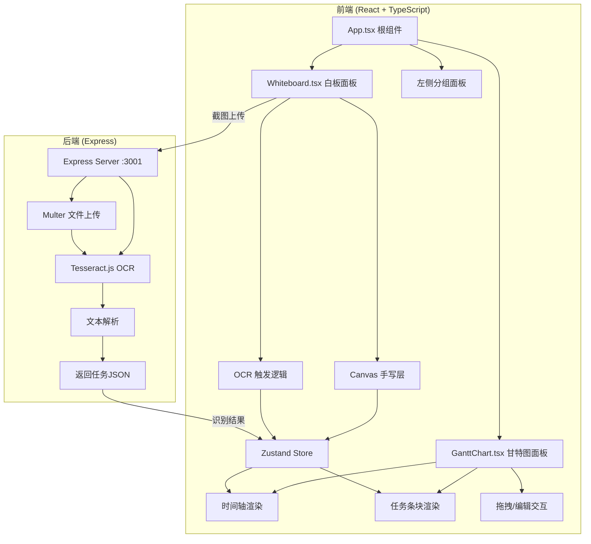
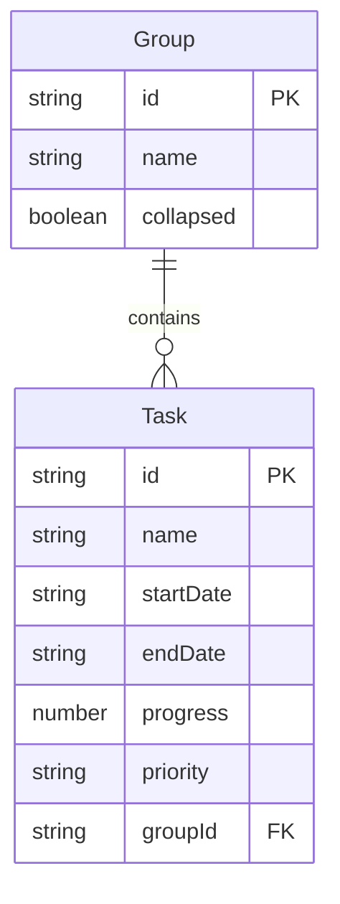

## 1. 架构设计



## 2. 技术说明
- 前端：React@18 + TypeScript + Vite + Zustand
- 初始化工具：vite-init (react-express-ts 模板)
- 后端：Express@4 + Multer + Tesseract.js
- 状态管理：Zustand
- 样式：Tailwind CSS + 自定义CSS
- 无数据库（状态存储于Zustand内存）

## 3. 路由定义
| 路由 | 用途 |
|------|------|
| / | 主页面（白板 + 甘特图双栏布局） |

## 4. API定义

### 4.1 OCR识别接口
```
POST /api/ocr
Content-Type: multipart/form-data
Body: { image: File }

Response 200:
{
  "tasks": [
    {
      "name": "调研完成",
      "startDate": "2026-03-15",
      "endDate": "2026-03-20",
      "progress": 60,
      "priority": "medium"
    }
  ]
}
```

### 4.2 TypeScript类型定义
```typescript
interface Task {
  id: string;
  name: string;
  startDate: string;
  endDate: string;
  progress: number;
  priority: 'high' | 'medium' | 'low';
  groupId: string;
}

interface Group {
  id: string;
  name: string;
  collapsed: boolean;
}

interface StoreState {
  tasks: Task[];
  groups: Group[];
  leftWidth: number;
  searchQuery: string;
  progressFilter: [number, number];
  addTask: (task: Task) => void;
  updateTask: (id: string, updates: Partial<Task>) => void;
  removeTask: (id: string) => void;
  addGroup: (group: Group) => void;
  toggleGroup: (id: string) => void;
  setLeftWidth: (width: number) => void;
  setSearchQuery: (query: string) => void;
  setProgressFilter: (range: [number, number]) => void;
}
```

## 5. 服务端架构图

```mermaid
flowchart LR
    "Controller 路由处理" --> "Multer 文件中间件" --> "Tesseract.js OCR引擎" --> "Parser 文本解析" --> "JSON响应"
```

## 6. 数据模型

### 6.1 数据模型定义


### 6.2 数据存储
无持久化数据库，所有数据存储于Zustand内存状态中，页面刷新后重置。
