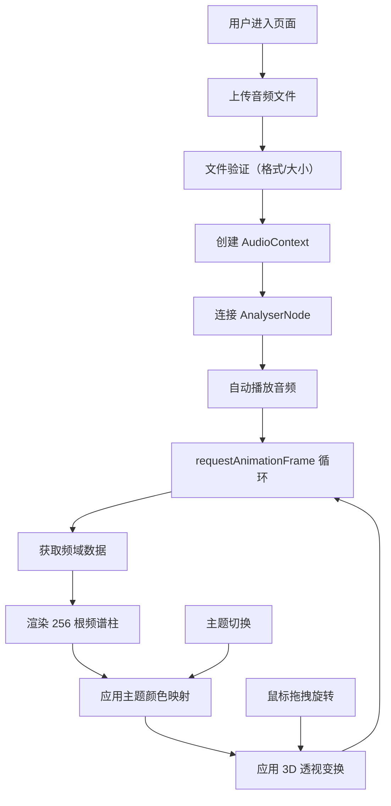

## 1. 产品概述

音乐可视化频谱墙是一个沉浸式音频可视化 Web 应用，用户上传任意音频文件后，系统实时解析频域数据并渲染为动态跳动的 3D 彩色柱状墙。目标是为音乐爱好者提供独特的视觉体验，让音乐"看得见"。

- 核心价值：将抽象的音频频率转化为具象的动态视觉艺术
- 目标用户：音乐爱好者、视觉艺术家、内容创作者
- 市场定位：轻量级、高性能、纯前端的音频可视化工具

## 2. 核心功能

### 2.1 功能模块

1. **音频上传与播放模块**：文件拖拽/点击上传、波形预览、播放控制、进度条
2. **频谱可视化模块**：256 根动态柱体、3D 透视效果、弹性动画、鼠标交互旋转
3. **主题切换模块**：火焰、海洋、极光三种视觉主题，平滑过渡动画

### 2.2 页面详情

| 页面名称 | 模块名称 | 功能描述 |
|----------|----------|----------|
| 主页面 | 上传区域 | 360x200px 圆角矩形拖拽上传区，支持 mp3/wav，最大 20MB |
| 主页面 | 波形预览 | Canvas 渲染振幅波形，宽 100% 高 80px |
| 主页面 | 播放控制 | 播放/暂停按钮、进度条、时间显示 |
| 主页面 | 频谱画布 | 宽 100% 高 500px，256 根柱体 3D 透视效果 |
| 主页面 | 主题切换 | 右上角三个圆形按钮，切换火焰/海洋/极光主题 |
| 主页面 | 底部控制栏 | 高 80px，半透明背景，整合播放控件 |

## 3. 核心流程

用户进入页面 → 拖拽或点击上传音频文件 → 系统自动解析并播放 → 实时渲染频谱柱状墙 → 用户可切换主题/拖拽旋转视角 → 播放结束或用户暂停

## 4. 用户界面设计

### 4.1 设计风格

- **主色调**：深色背景 `#0d0d1a`，深蓝画布 `#0a0a23`
- **强调色**：上传激活 `#00d4aa`，波形线条 `#4a90d9`，文字 `#e0e0e0`
- **按钮样式**：圆形主题按钮（直径 36px），选中时 2px 白色边框 + 1.1 倍放大
- **字体**：monospace 等宽字体，科技感十足
- **布局**：居中布局，柱状墙占主体，控制栏固定底部
- **动效**：所有交互元素 0.2s hover/active 过渡，主题切换 0.5s 平滑渐变

### 4.2 页面设计概述

| 页面名称 | 模块名称 | UI 元素 |
|----------|----------|----------|
| 主页面 | 上传区域 | 虚线边框 `#aaa`，拖拽时实线 `#00d4aa` + 淡绿背景 `rgba(0,212,170,0.1)`，过渡 0.3s |
| 主页面 | 频谱柱体 | 宽度自适应（最小 2px），高度 0-300px，HSL 颜色映射，顶部弹性回落 0.1s，底部发光 `box-shadow: 0 0 8px rgba(255,255,255,0.3)` |
| 主页面 | 3D 透视 | `transform: perspective(800px) rotateX(30deg)`，鼠标拖拽左右旋转 ±30° 带阻尼 |
| 主页面 | 主题按钮 | 火焰：径向渐变 `#ff4500`→`#ff6347`；海洋：`#0088cc`→`#00bfff`；极光：`#00ff7f`→`#7b68ee` |

### 4.3 响应式

- Desktop-first 设计，适配 1920x1080 和 1440x900 分辨率
- 画布宽度自适应容器，柱体宽度动态计算
- 控制栏固定底部，触摸设备优化拖拽交互

### 4.4 视觉层次

- 背景层：深色渐变营造沉浸感
- 柱体层：256 根柱体形成主视觉焦点
- 光晕层：柱体底部发光增强立体感
- 控制层：半透明底部控制栏，不干扰主体视觉
