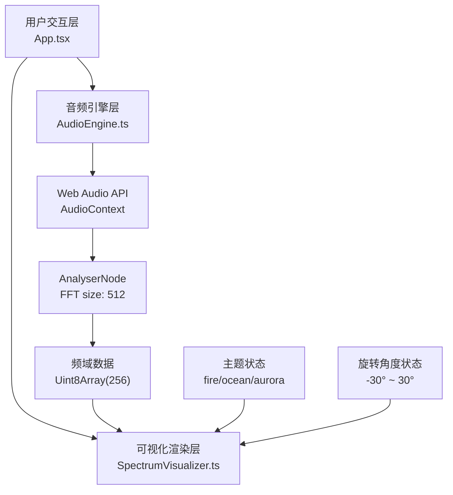

## 1. 架构设计



## 2. 技术描述

- **前端框架**：React 18 + TypeScript
- **构建工具**：Vite 5
- **音频处理**：原生 Web Audio API（AnalyserNode，无外部音频库）
- **可视化渲染**：Canvas 2D + requestAnimationFrame
- **状态管理**：React useState/useRef（轻量场景，无需 zustand）
- **样式方案**：内联 CSS + CSS 变量（无需 tailwind）

## 3. 文件结构

| 文件路径 | 职责描述 |
|----------|----------|
| `package.json` | 项目依赖与脚本配置 |
| `index.html` | 入口页面，含 viewport meta |
| `vite.config.js` | Vite 构建配置 |
| `tsconfig.json` | TypeScript 严格模式配置 |
| `src/App.tsx` | 主组件：上传、播放、主题切换、布局管理 |
| `src/AudioEngine.ts` | 音频引擎：AudioContext、AnalyserNode、频域数据获取 |
| `src/SpectrumVisualizer.ts` | 可视化组件：Canvas 渲染、3D 透视、主题颜色映射 |

## 4. 核心类型定义

```typescript
// 主题类型
export type ThemeType = 'fire' | 'ocean' | 'aurora';

// 音频引擎接口
export interface AudioEngine {
  start: (file: File) => Promise<void>;
  stop: () => void;
  connectAudio: (audioElement: HTMLAudioElement) => void;
  getFrequencyData: () => Uint8Array;
  getAudioElement: () => HTMLAudioElement | null;
}

// 可视化配置
export interface VisualizerConfig {
  barCount: number;
  minBarWidth: number;
  maxBarHeight: number;
  fftSize: number;
}
```

## 5. 核心模块设计

### 5.1 AudioEngine 模块

- **单例模式**：全局唯一 AudioContext 实例
- **AnalyserNode 配置**：fftSize = 512，frequencyBinCount = 256，smoothingTimeConstant = 0.8
- **数据获取**：`getByteFrequencyData()` 返回 Uint8Array(256)，值域 0-255
- **生命周期管理**：`start()` 创建上下文，`stop()` 断开连接释放资源

### 5.2 SpectrumVisualizer 模块

- **动画循环**：requestAnimationFrame 驱动，目标帧率 ≥ 30fps
- **柱体渲染**：256 根垂直柱体，宽度 = (canvasWidth / barCount)，最小 2px
- **高度映射**：`height = (frequencyData[i] / 255) * maxBarHeight`
- **弹性动画**：每帧应用 `currentHeight += (targetHeight - currentHeight) * 0.85`
- **颜色映射**：
  - 默认：低红(0-30)、中绿(90-150)、高蓝(200-260) HSL 分段
  - 火焰：基于频率位置从红到黄渐变
  - 海洋：基于振幅从蓝到青渐变
  - 极光：基于振幅和频率从紫到绿渐变
- **3D 透视**：Canvas 2D 模拟透视，近大远小，底部 y 偏移
- **鼠标交互**：mousedown/mousemove/mouseup 事件监听，计算旋转角度，应用阻尼平滑

### 5.3 App.tsx 主组件

- **状态管理**：
  - `audioFile`: File | null
  - `isPlaying`: boolean
  - `currentTime`: number
  - `duration`: number
  - `theme`: ThemeType
  - `rotationY`: number
- **拖拽上传**：dragenter/dragover/dragleave/drop 事件，阻止默认行为
- **文件验证**：accept="audio/mp3,audio/wav"，size ≤ 20MB
- **波形预览**：独立 Canvas，使用 `getByteTimeDomainData()` 渲染振幅波形
- **播放控制**：HTMLAudioElement play/pause，timeupdate 事件更新进度
- **主题切换**：点击按钮更新 theme 状态，CSS transition 0.5s 平滑过渡

## 6. 性能优化

- **requestAnimationFrame**：与浏览器刷新率同步，避免卡顿
- **TypedArray 复用**：重复使用同一个 Uint8Array，避免频繁 GC
- **Canvas 清屏优化**：使用 `clearRect()` 而非重绘背景
- **节流防抖**：鼠标拖拽事件应用阻尼，避免过度重绘
- **音频数据平滑**：AnalyserNode.smoothingTimeConstant = 0.8 减少突变

## 7. 启动脚本

```bash
npm install
npm run dev
```
