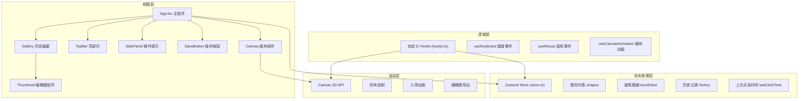

## 1. 架构设计



## 2. 技术选型

| 分类 | 技术 | 版本 | 说明 |
|------|------|------|------|
| 框架 | React | ^18 | UI 组件化开发 |
| 语言 | TypeScript | ^5 | 类型安全 |
| 构建 | Vite | ^5 | 快速开发构建 |
| 状态管理 | Zustand | ^4 | 轻量级状态管理 |
| 渲染 | Canvas 2D API | - | 原生高性能图形绘制 |
| 样式 | 原生 CSS / CSS-in-JS | - | 内联样式 + CSS 变量 |

## 3. 核心数据结构

### 3.1 图形数据 (Shape)

```typescript
interface Shape {
  id: string;
  type: 'circle' | 'triangle' | 'hexagon';
  x: number;
  y: number;
  radius: number;
  targetRadius: number;
  color: string;
  strokeColor: string;
  lineWidth: number;
  createdAt: number;
  animationProgress: number;
}
```

### 3.2 历史记录 (HistoryItem)

```typescript
interface HistoryItem {
  id: string;
  thumbnail: string;
  shapes: Shape[];
  createdAt: number;
}
```

### 3.3 Store 状态

```typescript
interface CanvasState {
  shapes: Shape[];
  brushSize: number;
  history: HistoryItem[];
  lastClickTime: number;
  maxShapes: number;
  maxHistory: number;
  
  addShape: (shape: Shape) => void;
  clearShapes: () => void;
  setBrushSize: (size: number) => void;
  saveToHistory: (thumbnail: string) => void;
  loadFromHistory: (id: string) => void;
  deleteFromHistory: (id: string) => void;
  updateShapeAnimation: (id: string, progress: number) => void;
}
```

## 4. 目录结构

```
.
├── index.html              # 入口 HTML
├── package.json            # 项目依赖
├── vite.config.js          # Vite 配置
├── tsconfig.json           # TypeScript 配置
├── src/
│   ├── main.tsx            # React 入口
│   ├── App.tsx             # 主组件
│   ├── store.ts            # Zustand 状态管理
│   ├── hooks.ts            # 自定义 Hooks
│   ├── types.ts            # 类型定义
│   └── utils/
│       ├── shapes.ts       # 形状绘制工具函数
│       ├── colors.ts       # 颜色工具函数
│       └── animation.ts    # 动画工具函数
```

## 5. 关键算法与实现方案

### 5.1 节奏间隔计算半径

```
间隔区间: 50ms - 2000ms
半径映射: 间隔越短 → 半径越大
公式: radius = maxRadius - (interval - minInterval) / (maxInterval - minInterval) * (maxRadius - minRadius)
范围: 10px - 60px
```

### 5.2 互补色计算

将 HEX 颜色转换为 RGB，再计算互补色：
- 互补色 RGB = (255 - R, 255 - G, 255 - B)
- 提高亮度保证描边可见性

### 5.3 入场动画 (ease-out)

```
progress = 当前时间 / 动画总时长 (0~1)
easeOut = 1 - (1 - progress)^3
当前半径 = 目标半径 * easeOut
```

### 5.4 性能优化策略

1. **图形数量限制**：超过 500 个时淘汰最早的图形
2. **requestAnimationFrame**：使用 RAF 驱动画布重绘
3. **脏矩形优化**：仅重绘有动画的区域（可选，初期全量重绘）
4. **离屏缩略图**：保存时使用离屏 canvas 生成缩略图

### 5.5 长按删除检测

- mousedown / touchstart 启动计时器
- 超过 800ms 触发长按事件
- mouseup / touchend / mouseleave 取消计时器

## 6. 响应式实现

- 使用 CSS `@media (max-width: 768px)` 媒体查询
- Canvas 缩放：保持宽高比 4:3，宽度填充视口（减去边距）
- 画廊方向切换：桌面端 flex-row + overflow-x，移动端 flex-col + overflow-y
