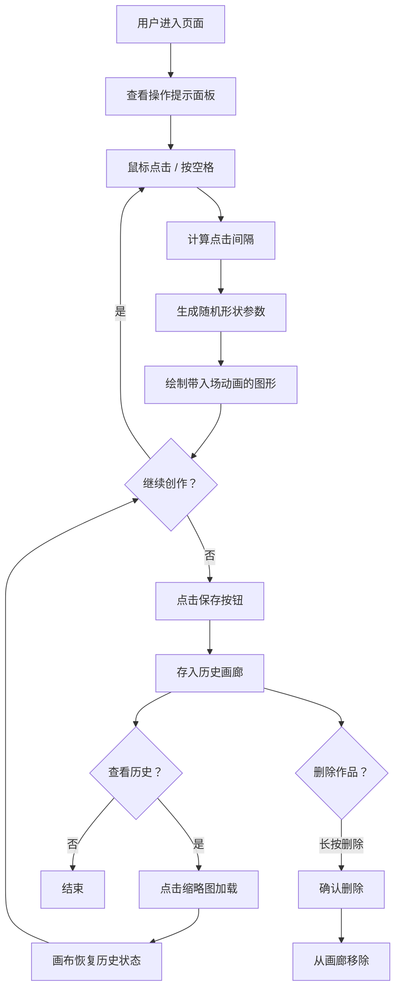

## 1. 产品概述

节奏灵感画布是一款通过节奏输入驱动视觉创作的互动艺术应用。用户通过鼠标点击或键盘按键生成随机节奏模式，系统根据节奏的强弱和间隔在画布上自动绘制抽象几何图形，形成由音乐节奏驱动的动态视觉作品。

- 核心价值：将节奏律动转化为视觉艺术，让用户在即兴创作中获得灵感与乐趣
- 目标用户：音乐爱好者、视觉设计师、创意工作者
- 产品定位：轻量级创意工具，专注于节奏与视觉的即兴碰撞

## 2. 核心功能

### 2.1 功能模块

1. **主画布模块**：Canvas 2D 绘图区域，支持实时绘制形状与动画效果
2. **节奏输入模块**：监听鼠标点击与键盘事件，计算节奏间隔并生成图形参数
3. **画笔控制模块**：调整画笔粗细、清除画布、保存创作
4. **历史画廊模块**：保存、展示、加载和删除历史创作记录
5. **操作提示模块**：固定侧边栏显示快捷键与操作说明

### 2.2 功能详情

| 模块名称 | 功能点 | 描述 |
|---------|--------|------|
| 主画布 | 随机形状生成 | 从圆形、三角形、六边形中随机选择形状 |
| 主画布 | 半径动态计算 | 点击间隔越短半径越大，范围 10-60px |
| 主画布 | 暖色配色方案 | 从 #ff6b6b / #ffd93d / #ff8e53 / #c06c84 中随机选取 |
| 主画布 | 入场动画 | 0.2 秒缩放入场，ease-out 缓动 |
| 主画布 | 描边效果 | 1px 亮色描边，颜色为形状颜色的互补色 |
| 节奏输入 | 鼠标点击 | 左键点击画布任意位置生成形状 |
| 节奏输入 | 键盘触发 | 空格键在画布中心生成形状 |
| 节奏输入 | 画笔粗细 | 数字键 1-5 对应 1-5px 线宽 |
| 节奏输入 | 清除画布 | R 键清空所有图形 |
| 历史画廊 | 保存创作 | 点击保存按钮将当前画布存入画廊 |
| 历史画廊 | 缩略图展示 | 底部横向滚动，最多 20 张，150x112px 缩略图 |
| 历史画廊 | 加载创作 | 点击缩略图将历史作品加载回主画布 |
| 历史画廊 | 删除确认 | 长按缩略图弹出删除确认提示 |
| 操作提示 | 快捷键面板 | 左侧固定面板显示所有快捷键说明 |

## 3. 核心流程

用户打开应用 → 查看左侧操作提示 → 通过鼠标点击或空格键在画布上生成形状 → 调整画笔粗细（可选）→ 持续创作形成视觉作品 → 点击保存按钮存入画廊 → 点击画廊缩略图回顾或继续创作 → 长按删除不需要的作品

## 4. 用户界面设计

### 4.1 设计风格

- **设计方向**：深邃科技感 + 暖色点缀的艺术创作氛围
- **主色调**：深灰蓝 #1a1a2e（主背景）、深蓝 #16213e（辅助色）、钴蓝 #0f3460（强调色）
- **点缀色**：青绿色 #00d4aa（功能色，保存按钮、选中态）、暖色系 4 色（图形填充色）
- **字体**：现代无衬线字体，清晰易读，数字展示使用等宽风格
- **动效**：所有交互元素 0.2s 缩放过渡 + 颜色渐变，按下时 0.1s 内阴影下沉
- **质感**：半透明玻璃态面板、微妙发光效果、圆角设计

### 4.2 页面布局

| 区域 | 位置 | 尺寸 | 内容 |
|------|------|------|------|
| 顶部栏 | 顶部固定 | 高度 60px | 画笔粗细显示、形状计数 |
| 操作提示 | 左侧固定 | 宽 180px | 快捷键列表、半透明背景、圆角 12px |
| 主画布 | 中央区域 | 800×600px | 深灰背景、图形绘制区 |
| 保存按钮 | 画布右下角 | 直径 40px | 圆形按钮、青绿色背景 |
| 历史画廊 | 页面底部 | 高度自适应 | 横向滚动缩略图列表 |

### 4.3 响应式设计

- **桌面端**（≥768px）：主画布 800×600px 居中，画廊横向滚动
- **移动端**（<768px）：主画布等比缩放填充宽度，画廊改为竖向滚动
- 触摸优化：长按删除功能适配触摸设备，按钮尺寸保证触控友好

### 4.4 性能指标

- 交互延迟 < 50ms
- 图形数量上限 500 个，超出时自动淘汰最早绘制的图形
- 动画帧率稳定 60fps
