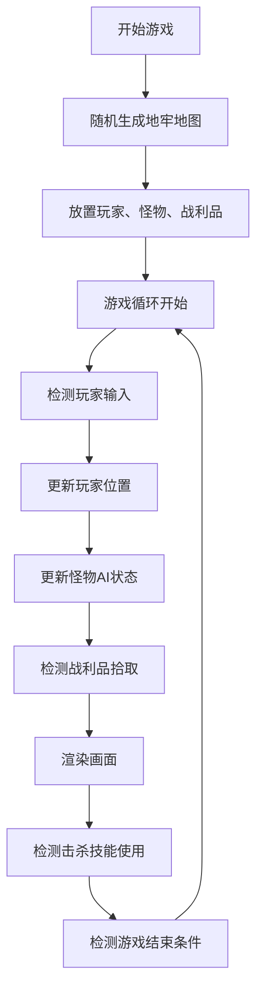

## 1. 产品概述

地牢随机生成与潜行交互原型是一款roguelite地牢探险游戏的技术验证原型，用于验证随机地图布局、怪物巡逻路径和战利品掉落逻辑之间的配合效果。目标用户为独立游戏开发者和游戏设计爱好者，提供可交互的可视化原型以快速迭代游戏机制。

## 2. 核心功能

### 2.1 用户角色

| 角色 | 注册方式 | 核心权限 |
|------|----------|----------|
| 玩家 | 无需注册，直接体验 | 控制角色移动、探索地牢、拾取战利品、击杀怪物 |

### 2.2 功能模块

1. **主游戏画布**：全屏Canvas渲染地牢地图、玩家、怪物、战利品及视野迷雾
2. **地图生成系统**：递归回溯算法生成随机房间和走廊
3. **玩家控制系统**：WASD键盘移动，碰撞检测，视野跟随
4. **怪物AI系统**：BFS巡逻路径，玩家靠近时切换追踪模式
5. **战利品系统**：随机放置战利品，拾取动画与计数
6. **视野迷雾系统**：圆形视野区域，边缘羽化，靠近怪物时红色警告
7. **击杀系统**：连续拾取3个战利品后获得击杀能力
8. **小地图系统**：右下角迷你地图显示已探索区域、玩家、怪物、战利品

### 2.3 页面详情

| 页面名称 | 模块名称 | 功能描述 |
|----------|----------|----------|
| 游戏主界面 | 画布渲染模块 | 绘制地板、墙壁、玩家、怪物、战利品、迷雾遮罩 |
| 游戏主界面 | UI叠加层 | 左上角房间编号、右下角战利品计数、击杀按钮、小地图 |
| 游戏主界面 | 游戏控制模块 | 键盘输入处理、游戏循环、状态协调 |

## 3. 核心流程

玩家进入游戏后，系统随机生成一张40x40格的地牢地图，包含至少6个房间和连接走廊。玩家控制深蓝色圆形角色在地牢中移动，周围有半径150px的可见区域，其余被黑色迷雾覆盖。玩家需要躲避红色怪物的巡逻和追踪，同时收集金色战利品。连续收集3个战利品后可使用击杀技能消灭最近的怪物。怪物被击杀后15秒会在原房间重生。

## 4. 用户界面设计

### 4.1 设计风格

- **主色调**：暗黑地牢风格，深褐色地板(#3e2723)、深棕色墙壁(#5d4037)
- **强调色**：玩家深蓝(#1a237e)、怪物红色(#e53935)、战利品金色(#ffd54f)、击杀技能紫色(#6a1b9a)
- **整体氛围**：神秘幽暗，高对比度，迷雾营造探索感
- **动画风格**：短促流畅(0.15-0.5秒)，ease-out缓动，衔接自然

### 4.2 页面设计概述

| 页面名称 | 模块名称 | UI元素 |
|----------|----------|--------|
| 游戏主界面 | 画布区域 | 全屏Canvas，深灰背景(#1a1a2e)，地砖纹理，墙壁砖纹 |
| 游戏主界面 | 玩家角色 | 深蓝色圆形，白色高光，半径12px |
| 游戏主界面 | 怪物 | 红色圆形，白色眼睛，半径10px，追踪模式更亮 |
| 游戏主界面 | 战利品 | 金色菱形，顺时针旋转动画，边长10px |
| 游戏主界面 | 视野迷雾 | 黑色遮罩，径向渐变羽化边缘，怪物靠近时红色警告闪烁 |
| 游戏主界面 | UI-房间编号 | 左上角白色文字，显示当前所在房间 |
| 游戏主界面 | UI-战利品计数 | 右下角金色数字，拾取时弹跳动画 |
| 游戏主界面 | UI-击杀按钮 | 底部中央紫色圆形按钮，悬停亮度提升 |
| 游戏主界面 | UI-小地图 | 右下角150x150px半透明地图，悬停放大 |

### 4.3 响应式设计

- 画布尺寸随窗口大小自动调整，监听resize事件重新设置Canvas宽高
- UI元素使用绝对定位，相对于视口边缘固定
- 支持桌面端全尺寸显示，无滚动条
- 所有游戏元素使用像素坐标，保持比例一致

### 4.4 动效设计

- **视野平滑过渡**：玩家停止移动0.2秒内ease-out缓动到新位置
- **战利品拾取动画**：边长10→0px缩小，0.2秒后移除
- **屏幕闪白**：拾取时全屏白色闪烁，透明度0.8→0，持续0.15秒
- **计数弹跳**：拾取后数字1.2倍→1倍缩放，0.15秒ease-out
- **怪物警告**：靠近怪物时视野边缘红色闪烁，周期0.8秒
- **击杀动画**：怪物碎裂效果，颜色由红变白，碎片飞散，0.5秒
- **战利品飞行**：击杀后房间内战利品沿曲线飞向玩家，1.0秒ease-in-out
- **按钮悬停**：击杀按钮亮度提升1.2倍，0.2秒过渡
- **小地图悬停**：不透明度提升，1.1倍放大，0.2秒过渡
