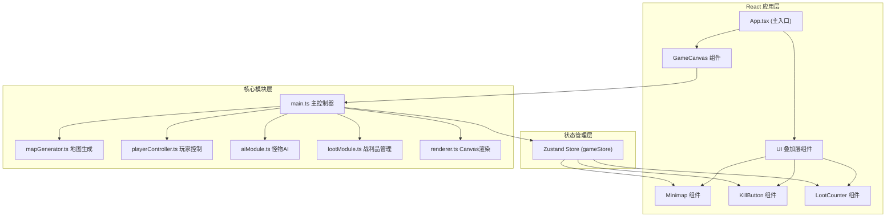

## 1. 架构设计



## 2. 技术描述

- **前端框架**: React 18 + TypeScript
- **构建工具**: Vite 5 (启用HMR热更新)
- **状态管理**: Zustand 4
- **渲染引擎**: Canvas 2D API
- **样式方案**: 内联样式 + CSS变量
- **开发服务器**: Vite Dev Server

## 3. 数据模型

### 3.1 核心类型定义

```typescript
// 格子类型
enum TileType {
  WALL = 0,
  FLOOR = 1,
}

// 格子数据
interface Tile {
  type: TileType;
  roomId?: number;
}

// 房间数据
interface Room {
  id: number;
  x: number;
  y: number;
  width: number;
  height: number;
  centerX: number;
  centerY: number;
}

// 玩家状态
interface Player {
  x: number;
  y: number;
  targetX: number;
  targetY: number;
  radius: number;
  viewRadius: number;
  currentRoomId: number;
}

// 怪物状态
interface Monster {
  id: number;
  x: number;
  y: number;
  radius: number;
  state: 'patrol' | 'chase' | 'dying' | 'dead';
  patrolPoints: { x: number; y: number }[];
  currentPatrolIndex: number;
  speed: number;
  roomId: number;
  respawnTimer: number;
  deathAnimation: { progress: number; fragments: Fragment[] };
}

// 战利品状态
interface Loot {
  id: number;
  x: number;
  y: number;
  size: number;
  rotation: number;
  collected: boolean;
  collectAnimation: { progress: number };
  flyingToPlayer: { progress: number; startX: number; startY: number } | null;
  roomId: number;
}

// 游戏状态
interface GameState {
  grid: Tile[][];
  rooms: Room[];
  player: Player;
  monsters: Monster[];
  loots: Loot[];
  lootCount: number;
  killCharges: number;
  screenFlash: { active: boolean; alpha: number; duration: number };
  lootCountBounce: { active: boolean; scale: number };
  exploredTiles: Set<string>;
}
```

## 4. 文件结构

```
src/
├── main.tsx              # React入口
├── App.tsx               # 根组件
├── game/
│   ├── types.ts          # 类型定义
│   ├── constants.ts      # 常量配置
│   ├── store.ts          # Zustand状态管理
│   ├── mapGenerator.ts   # 地图生成模块
│   ├── playerController.ts # 玩家控制模块
│   ├── aiModule.ts       # 怪物AI模块
│   ├── lootModule.ts     # 战利品管理模块
│   ├── renderer.ts       # Canvas渲染模块
│   └── gameLoop.ts       # 游戏主循环
├── components/
│   ├── GameCanvas.tsx    # 游戏画布组件
│   ├── Minimap.tsx       # 小地图组件
│   ├── KillButton.tsx    # 击杀按钮组件
│   ├── LootCounter.tsx   # 战利品计数组件
│   └── RoomInfo.tsx      # 房间信息组件
└── styles/
    └── index.css         # 全局样式
```

## 5. 模块调用关系与数据流向

### 5.1 初始化流程
1. **App.tsx** → 初始化 **GameCanvas** 和 **UI组件**
2. **GameCanvas** → 调用 **gameLoop.ts** 启动游戏循环
3. **gameLoop.ts** → 调用 **mapGenerator.ts** 生成地图
4. **mapGenerator.ts** → 输出网格数据到 **Zustand store**
5. **gameLoop.ts** → 初始化玩家、怪物、战利品到 **Zustand store**

### 5.2 每帧更新流程
1. **gameLoop.ts** (requestAnimationFrame)
   - → 调用 **playerController.ts** 处理输入和移动
   - → 调用 **aiModule.ts** 更新怪物AI (每2帧更新一次非可见怪物)
   - → 调用 **lootModule.ts** 检测战利品拾取
   - → 调用 **renderer.ts** 渲染画面
   - → 更新 **Zustand store** 中的状态

### 5.3 数据流向表
| 源模块 | 目标模块 | 数据 | 触发时机 |
|--------|----------|------|----------|
| mapGenerator | store | grid, rooms | 初始化 |
| playerController | store | player position | 每帧 |
| aiModule | store | monsters array | 每帧 |
| lootModule | store | loots, lootCount | 每帧 |
| store | renderer | 全部游戏状态 | 每帧 |
| store | UI组件 | lootCount, killCharges | 状态变化时 |

## 6. 性能优化策略

1. **帧率控制**: 使用 requestAnimationFrame 维持60FPS
2. **AI降频**: 不可见区域怪物AI每2帧更新一次
3. **小地图降频**: 小地图每5帧刷新一次
4. **视野裁剪**: 仅对可见区域进行绘制计算
5. **动画清理**: 击杀动画和飞行动画完成后立即从更新循环移除
6. **对象池**: 复用碎片等临时对象，减少GC压力

## 7. 构建配置

- **vite.config.ts**: 启用React HMR，TypeScript支持
- **tsconfig.json**: strict模式，esModuleInterop
- **package.json**: 依赖react, react-dom, typescript, zustand
- **启动命令**: npm run dev
