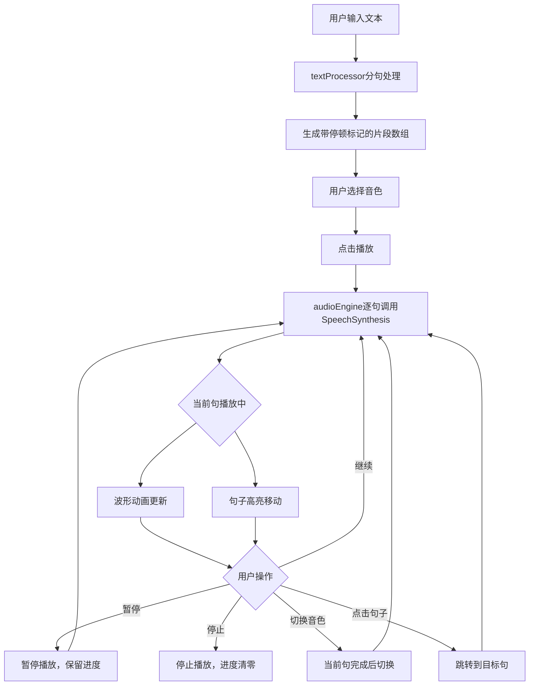

## 1. 产品概述

AI语音朗读面板是一款面向博客读者的语音朗读工具，支持将长文本自动分句并以多种音色朗读输出，配合可视化波形进度条和句子高亮跟随，提升阅读体验。
- 解决长文章阅读疲劳问题，为用户提供"听文章"的替代方式
- 目标用户为博客平台读者和内容创作者，核心价值在于零配置即用的浏览器端语音合成

## 2. 核心功能

### 2.1 用户角色

| 角色 | 使用方式 | 核心权限 |
|------|----------|----------|
| 读者 | 直接使用 | 输入文本、选择音色、控制播放 |

### 2.2 功能模块

1. **语音朗读面板页**：文本输入区、音色选择、播放控制、波形进度、文本高亮展示

### 2.3 页面详情

| 页面名称 | 模块名称 | 功能描述 |
|----------|----------|----------|
| 语音朗读面板 | 文本输入区 | 支持粘贴/键入最多5000字文本，自动调用分句处理 |
| 语音朗读面板 | 音色选择器 | 提供3种音色（默认女声、沉稳男声、可爱童声），播放中切换在当前句完成后生效，0.2秒淡入过渡 |
| 语音朗读面板 | 播放控制 | 播放/暂停/停止三个按钮，暂停后继续从暂停处播放，停止后进度清零 |
| 语音朗读面板 | 波形进度条 | 8根柱条随机模拟频谱跳动，进度色块从左向右填充，颜色从蓝色#2196f3渐变到紫色#9c27b0 |
| 语音朗读面板 | 文本高亮 | 当前播放句淡黄色#fff9c4高亮，完成后自动移至下一句；点击任意句跳转播放 |
| 语音朗读面板 | 错误处理 | 浏览器不支持时提示使用Chrome/Edge；超长句(>150字)自动拆分加300ms停顿 |

## 3. 核心流程

用户输入文本 → 自动分句并标记停顿 → 选择音色 → 点击播放 → 语音合成逐句朗读 → 波形动画同步展示 → 句子高亮跟随 → 暂停/继续/停止控制

## 4. 用户界面设计

### 4.1 设计风格

- 主色调：蓝色系 (#2196f3)，辅色紫色 (#9c27b0)
- 按钮风格：圆形图标按钮，带0.3秒过渡动画和悬浮阴影效果
- 字体：16px正文，深灰色#333，行高2.0
- 布局：左窄右宽两栏布局（左侧280px操作面板 + 右侧文本视图）
- 背景：极浅灰#fafafa，圆角8px统一风格

### 4.2 页面设计概览

| 页面名称 | 模块名称 | UI元素 |
|----------|----------|--------|
| 语音朗读面板 | 左侧操作面板 | textarea(高度60%)、3个音色卡片(横向排列,选中时边框加亮+0.2秒缩放)、3个圆形播放按钮(绿#4caf50/橙#ff9800/红#f44336,间距12px) |
| 语音朗读面板 | 右侧文本视图 | 顶部60px波形进度条(底部阴影)、下方文本滚动区(每句一行,高亮#fff9c4) |

### 4.3 响应式适配

- 桌面端（≥768px）：左右两栏布局，左侧固定280px
- 移动端（<768px）：上下布局，操作面板高度自适应，波形和文本区域依次排列
- 触摸优化：按钮尺寸适配触摸操作，间距合理
