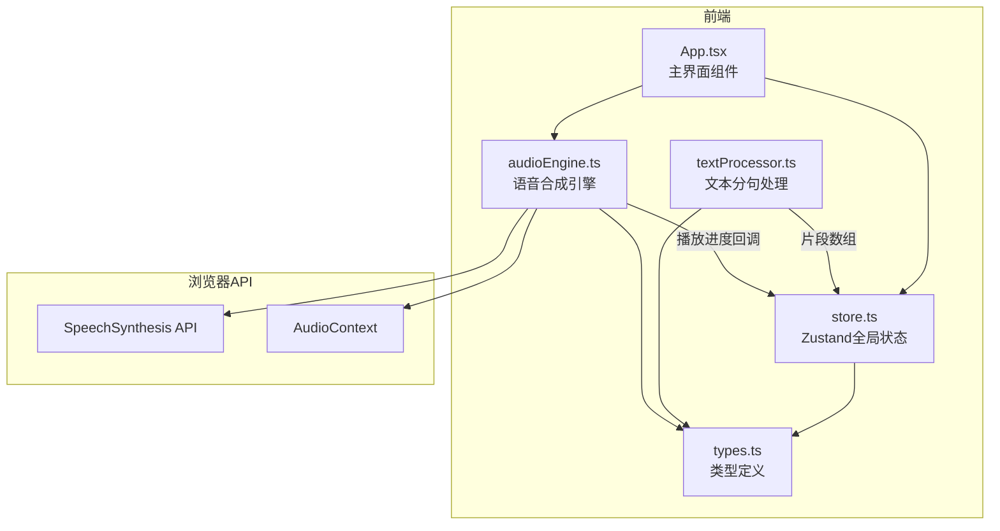

## 1. 架构设计



## 2. 技术说明

- 前端：React@18 + TypeScript + Vite + Zustand
- 初始化工具：vite-init（react-ts模板）
- 后端：无（纯前端应用，使用浏览器Web Speech API）
- 样式：CSS Modules + Tailwind CSS
- 状态管理：Zustand

## 3. 路由定义

| 路由 | 用途 |
|------|------|
| / | 语音朗读面板主页（单页应用） |

## 4. 模块职责

### 4.1 types.ts — 类型定义模块
- `TextSegment`：文本片段（id、文本内容、停顿时长、标点类型）
- `VoiceConfig`：音色配置（id、名称、SpeechSynthesisVoice引用、图标标识）
- `PlayState`：播放状态枚举（idle/playing/paused）
- `AudioEvent`：音频事件回调类型

### 4.2 textProcessor.ts — 文本处理模块
- 输入：原始字符串
- 处理：按句号/问号/感叹号/逗号切分，为每个片段添加预设停顿毫秒
- 超长句处理：超过150字自动拆分，中间插入300ms停顿
- 输出：`TextSegment[]`片段数组
- 性能要求：5000字文本在50ms内完成

### 4.3 audioEngine.ts — 音频引擎模块
- 音色注册：从`speechSynthesis.getVoices()`获取可用音色，映射为3种预设音色
- 播放队列：逐句调用SpeechSynthesis，通过onend回调推进下一句
- 控制：play/pause/resume/stop/seekTo(sentenceIndex)
- 进度报告：通过回调向store报告当前播放位置百分比
- 音色切换：当前句完成后生效，0.2秒淡入过渡

### 4.4 store.ts — 状态管理模块（Zustand）
- `textContent`：当前输入文本
- `segments`：分句后的片段数组
- `selectedVoiceId`：选中的音色ID
- `playState`：播放状态（idle/playing/paused）
- `currentSegmentIndex`：当前播放片段索引
- `progress`：播放进度百分比
- `error`：错误信息

### 4.5 App.tsx — 主界面组件
- 组合子组件：TextInput、VoiceSelector、PlayControls、WaveformBar、TextDisplay
- 响应store状态变化渲染
- 响应式两栏/单栏布局切换

## 5. 数据流

```
用户输入文本 → store.setTextContent() → textProcessor.process() → store.setSegments()
用户选择音色 → store.setSelectedVoiceId() → audioEngine切换音色
用户点击播放 → audioEngine.play(segments, voiceId) → SpeechSynthesis.speak()
播放中回调 → audioEngine报告进度 → store.setProgress() / store.setCurrentSegmentIndex()
UI订阅store → 重新渲染波形/高亮/按钮状态
```

## 6. 性能策略

- 文本分句：纯字符串操作，O(n)线性扫描，确保50ms内完成
- 波形动画：使用requestAnimationFrame，30fps节流，避免主线程卡顿
- 播放切换：SpeechSynthesis原生API调用，响应时间<100ms
- 组件渲染：Zustand细粒度订阅，仅相关组件更新
