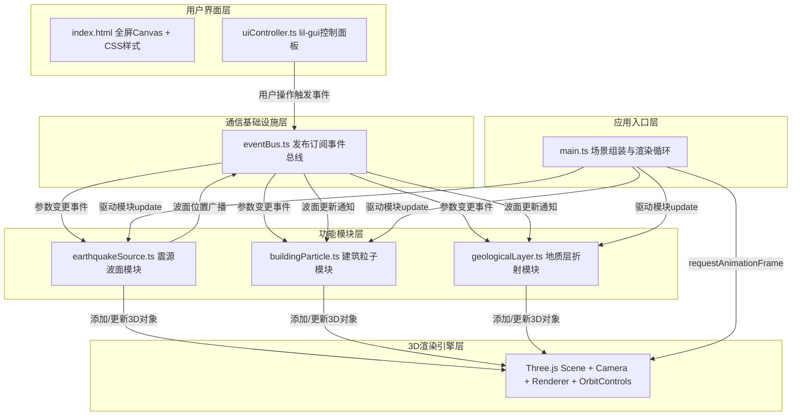

## 1. 架构设计



## 2. 技术说明

- **前端框架**：原生 TypeScript（ES2022）+ Three.js + lil-gui
- **构建工具**：Vite 5.x（端口8080，HMR热更新）
- **类型系统**：TypeScript 严格模式 strict: true，moduleResolution: bundler
- **3D引擎**：three@0.160 + @types/three
- **UI控件**：lil-gui 生成专业控制面板
- **模块通信**：自定义发布-订阅 EventBus（无第三方依赖）
- **后端**：无（纯前端可视化项目）

## 3. 模块职责与接口定义

### 3.1 EventBus（事件总线）
**文件**：`src/eventBus.ts`

事件定义：
| 事件名 | 负载类型 | 发布方 | 订阅方 | 说明 |
|-------|---------|-------|-------|------|
| `params:changed` | `{depth, magnitude, waveType}` | uiController | 全部功能模块 | 用户修改震源参数 |
| `simulation:start` | `{depth, magnitude, waveType}` | uiController | 全部功能模块 | 点击启动按钮 |
| `wavefront:update` | `{pRadius, sRadius, lRadius, time}` | earthquakeSource | buildingParticle, geologicalLayer | 波面半径每帧更新 |
| `simulation:progress` | `{progress: 0~1}` | earthquakeSource | uiController | 进度百分比更新 |
| `simulation:complete` | `void` | earthquakeSource | 全部 | 模拟结束 |

接口：
```typescript
type EventCallback<T = any> = (payload: T) => void;
interface EventBus {
  on<T>(event: string, cb: EventCallback<T>): void;
  off<T>(event: string, cb: EventCallback<T>): void;
  emit<T>(event: string, payload: T): void;
}
```

### 3.2 EarthquakeSource（震源波面模块）
**文件**：`src/earthquakeSource.ts`

- **职责**：根据震源参数创建半透明波面球壳Mesh，每0.5秒按波速更新半径，驱动脉动动画
- **物理常量**：
  - P波速：7000 m/s → 场景缩放后 7 单位/秒
  - S波速：4000 m/s → 场景缩放后 4 单位/秒
  - L波速：3500 m/s → 场景缩放后 3.5 单位/秒（仅地表）
- **材质**：ShaderMaterial 或 MeshBasicMaterial + vertex colors + transparent: true + opacity: 0.3
- **关键方法**：
  - `constructor(scene: THREE.Scene, bus: EventBus)`
  - `start(params: SimParams): void`
  - `update(dt: number, elapsed: number): void` — 由渲染循环每帧调用

### 3.3 BuildingParticle（建筑震动粒子模块）
**文件**：`src/buildingParticle.ts`

- **职责**：随机生成50栋建筑Mesh；根据波面距离计算当前摆动；动态创建THREE.Points粒子系统管理粉尘
- **关键计算**：
  - 震动频率：`freq = 1 + (magnitude - 3) * 0.66` Hz（线性映射3级→1Hz，9级→5Hz）
  - 震动幅度：`amp = baseAmp * magnitude * exp(-distance / decay)`
  - 摆动偏移：`offset = sin(elapsed * freq * 2π) * amp`
- **粒子池**：THREE.BufferGeometry 动态 positions/colors，总粒子数 ≤ 2500
- **关键方法**：
  - `constructor(scene: THREE.Scene, bus: EventBus)`
  - `generateBuildings(params: SimParams): void`
  - `update(dt: number, elapsed: number, waveRadii: WaveRadii): void`

### 3.4 GeologicalLayer（地质层模块）
**文件**：`src/geologicalLayer.ts`

- **职责**：创建三个半透明平面（地壳/地幔/外核）；根据P/S波路径绘制折线Line；在若干质点显示位移箭头Helper
- **界面深度映射**（场景单位）：
  - 地壳：0 → -40（绿色平面，厚度2份）
  - 地幔：-40 → -100（橙色平面，厚度3份）
  - 外核：-100 → -140（红色平面，厚度2份）
- **折射计算**：Snell定律 `sinθ₁/sinθ₂ = v₁/v₂`
- **位移向量**：使用ArrowHelper，每0.2秒刷新 direction/length
- **关键方法**：
  - `constructor(scene: THREE.Scene, bus: EventBus)`
  - `initializeLayers(): void`
  - `updateRayPath(time: number, params: SimParams): void`
  - `updateDisplacementVectors(elapsed: number): void`

### 3.5 UIController（UI控制模块）
**文件**：`src/uiController.ts`

- **职责**：实例化lil-gui.GUI并自定义样式，创建slider和selector控件绑定事件；自定义启动按钮（含涟漪CSS动画）；监听进度更新
- **样式覆盖**：通过CSS变量或style标签注入将lil-gui默认主题改为赛博朋克配色
- **响应式**：CSS Grid + `@media (max-width: 768px)` 媒体查询

### 3.6 Main（应用入口）
**文件**：`src/main.ts`

- **职责**：
  1. 创建THREE.WebGLRenderer + THREE.Scene + THREE.PerspectiveCamera
  2. 配置OrbitControls，设置阴影，添加网格辅助地面
  3. 实例化EventBus及四个模块并互相绑定
  4. 启动requestAnimationFrame循环，依次调用各模块update
  5. 处理窗口resize

## 4. 文件结构

```
auto110/
├── package.json
├── vite.config.js
├── tsconfig.json
├── index.html
└── src/
    ├── main.ts
    ├── eventBus.ts
    ├── earthquakeSource.ts
    ├── buildingParticle.ts
    ├── geologicalLayer.ts
    └── uiController.ts
```

## 5. 性能优化策略

1. **粒子池复用**：粉尘粒子使用统一BufferGeometry，通过生命周期标记visible而非反复创建销毁
2. **波面LOD**：球壳Geometry使用Segments按距离动态降低（64→32）
3. **建筑合并**：50栋建筑BufferGeometry使用mergeGeometries减少draw call（如动画不冲突）
4. **按需刷新**：位移向量每0.2秒刷新而非每帧
5. **帧率节流**：若连续检测到<30fps，自动降低粒子上限至2500

## 6. 启动与开发

| 命令 | 用途 |
|-----|------|
| `npm install` | 首次安装依赖 |
| `npm run dev` | 启动Vite开发服务器（端口8080） |
| `npx tsc --noEmit` | TypeScript类型检查 |
