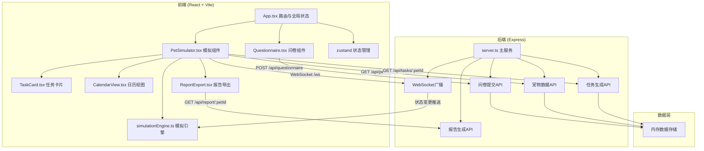
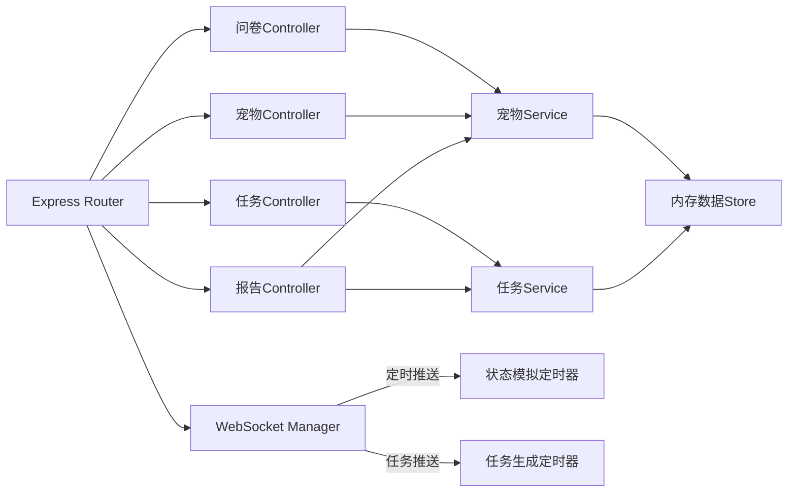
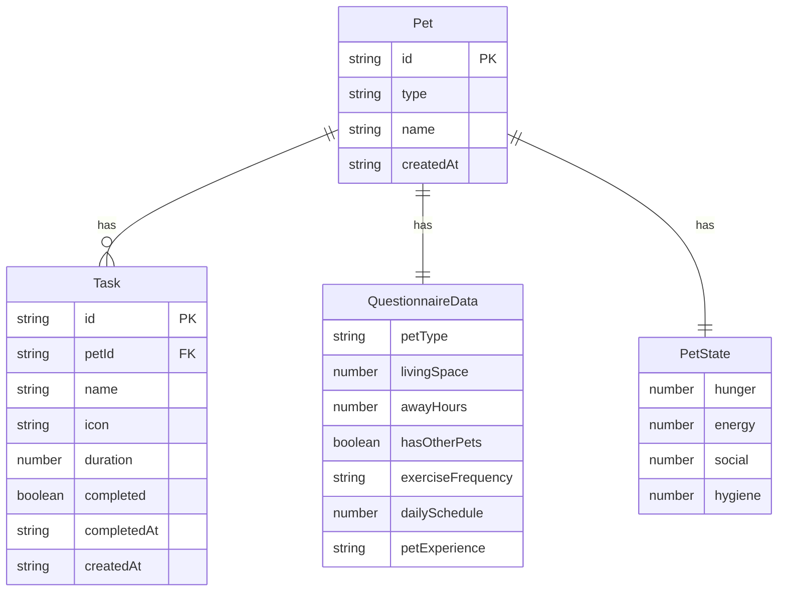

## 1. 架构设计



## 2. 技术说明

- 前端：React@18 + TypeScript + Vite + TailwindCSS + zustand + react-router-dom + axios + date-fns
- 初始化工具：vite-init（react-express-ts模板）
- 后端：Express@4 + cors + uuid + body-parser + ws（WebSocket）
- 数据库：内存数据存储（Map结构），无外部数据库依赖
- PDF生成：前端使用Canvas绘制图表+jsPDF生成PDF

## 3. 路由定义

| 路由 | 用途 |
|------|------|
| / | 问卷页面，用户选择宠物种类并填写问卷 |
| /simulate | 模拟页面，展示虚拟宠物状态、任务推送、日历视图 |

## 4. API定义

### 4.1 TypeScript类型定义

```typescript
type PetType = 'cat' | 'dog';

interface QuestionnaireData {
  petType: PetType;
  livingSpace: number;
  awayHours: number;
  hasOtherPets: boolean;
  exerciseFrequency: 'low' | 'medium' | 'high';
  dailySchedule: number;
  petExperience: 'none' | 'some' | 'experienced';
}

interface PetState {
  hunger: number;
  energy: number;
  social: number;
  hygiene: number;
}

interface Task {
  id: string;
  petId: string;
  name: string;
  icon: string;
  duration: number;
  completed: boolean;
  completedAt?: string;
  createdAt: string;
}

interface Pet {
  id: string;
  type: PetType;
  name: string;
  questionnaire: QuestionnaireData;
  state: PetState;
  createdAt: string;
}
```

### 4.2 API端点

| 方法 | 路径 | 请求体 | 响应 | 说明 |
|------|------|--------|------|------|
| POST | /api/questionnaire | QuestionnaireData | { petId: string } | 提交问卷并生成宠物 |
| GET | /api/pet/:id | - | Pet | 获取宠物数据 |
| GET | /api/pet/:id/state | - | PetState | 获取宠物当前状态 |
| GET | /api/tasks/:petId | - | Task[] | 获取宠物任务列表 |
| PUT | /api/tasks/:taskId/complete | - | Task | 完成任务 |
| GET | /api/report/:petId | - | { pdfUrl: string } | 生成评估报告 |
| GET | /api/history/:petId/:date | - | Task[] | 获取指定日期历史任务 |

### 4.3 WebSocket消息格式

```typescript
interface WSMessage {
  type: 'state_update' | 'task_new' | 'task_complete';
  payload: PetState | Task;
}
```

## 5. 服务器架构图



## 6. 数据模型

### 6.1 数据模型定义



### 6.2 数据流向

1. 前端问卷提交 → POST /api/questionnaire → 后端生成Pet+初始PetState+初始Tasks → 返回petId
2. 前端进入模拟页面 → GET /api/pet/:id + GET /api/tasks/:petId → 建立WebSocket连接
3. 后端定时器每5分钟更新PetState → WebSocket广播state_update → 前端simulationEngine接收并驱动动画
4. 后端每日生成4-6个Task → WebSocket广播task_new → 前端更新任务列表
5. 用户点击完成任务 → PUT /api/tasks/:taskId/complete → 后端更新Task → WebSocket广播task_complete
6. 用户导出报告 → GET /api/report/:petId → 后端聚合数据 → 前端生成PDF下载
