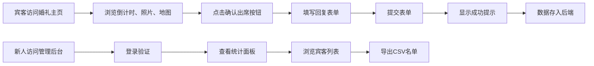

## 1. 产品概述

在线婚礼请柬与宾客互动管理系统，为新人提供个性化婚礼邀请页面，支持宾客在线回复出席、选择餐食偏好、提交祝福语，同时为新人提供数据统计和宾客名单管理后台。

- 主要目的：打造优雅的线上婚礼邀请体验，简化宾客回复流程，帮助新人高效管理宾客信息
- 目标用户：准备举办婚礼的新人及其受邀宾客
- 产品价值：替代传统纸质请柬，节省成本，提升互动体验，实现数字化宾客管理

## 2. 核心功能

### 2.1 用户角色

| 角色 | 注册方式 | 核心权限 |
|------|---------|---------|
| 宾客 | 无需注册 | 浏览婚礼主页、提交出席回复、选择餐食偏好、发送祝福语 |
| 新人（管理员） | 预设账号登录 | 查看回复统计、导出宾客名单、管理所有回复数据 |

### 2.2 功能模块

1. **婚礼主页**：新人信息展示、实时倒计时、照片轮播、地图导航、留言墙
2. **回复表单**：出席确认、携带人数、餐食偏好、祝福语提交
3. **管理后台**：登录验证、数据统计面板、宾客列表、CSV导出

### 2.3 页面详情

| 页面名称 | 模块名称 | 功能描述 |
|---------|---------|---------|
| 婚礼主页 | 新人信息与倒计时 | 显示新人姓名、婚礼日期，精确到秒的实时倒计时，红色脉冲动画 |
| 婚礼主页 | 照片轮播 | 3张预设照片全屏渐变轮播，fade过渡，底部金色圆点指示器 |
| 婚礼主页 | 地图导航 | Leaflet地图嵌入，展示婚礼地点，圆角边框设计 |
| 婚礼主页 | 留言墙 | 瀑布流网格展示宾客祝福语，随机背景色卡片，悬停动效 |
| 回复表单 | 模态框表单 | 出席状态、携带人数、餐食偏好选择，150字祝福语，成功提示 |
| 管理后台 | 登录页 | 用户名密码验证，渐变背景，与回复表单同风格按钮 |
| 管理后台 | 统计面板 | 四个统计卡片展示总人数、已回复、出席、未回复数据 |
| 管理后台 | 宾客列表 | 表格展示所有回复信息，奇偶行交替背景，悬停高亮，CSV导出 |

## 3. 核心流程

宾客访问婚礼主页后，可以浏览所有展示内容，点击"确认出席"按钮弹出回复表单，填写完成后提交，数据存入后端。新人通过独立入口登录管理后台，查看回复统计和宾客列表，并可导出CSV文件。

## 4. 用户界面设计

### 4.1 设计风格

- **主色调**：金色系 #FFD93D、#FFB347、#D4A574
- **强调色**：珊瑚红 #FF6B6B
- **辅助色**：柔和背景色 #FFF8E1、#FFE0B2、#F3E5F5、#E3F2FD、#E8F5E9、#FFEBEE
- **中性色**：#333333、#757575、#999999、#E0E0E0、#F5F5F5、#FFFFFF
- **按钮风格**：圆角矩形，金色渐变背景，白色字体，悬停时放大并提升亮度
- **字体**：优雅的衬线体配合现代无衬线体，标题使用衬线体，正文使用无衬线体
- **布局风格**：卡片式布局，充足留白，精致阴影，柔和过渡动画
- **设计基调**：浪漫、优雅、温暖，符合婚礼氛围

### 4.2 页面设计概述

| 页面名称 | 模块名称 | UI元素 |
|---------|---------|--------|
| 婚礼主页 | 倒计时 | 数字使用 #FF6B6B 红色，每秒脉冲缩放动画，精确到秒 |
| 婚礼主页 | 照片轮播 | 全屏渐变背景，fade-in/fade-out 过渡，每张4秒，底部圆点指示器放大1.3倍 |
| 婚礼主页 | 地图 | 容器圆角12px，边框2px实线 #D4A574 |
| 婚礼主页 | 留言墙 | 瀑布流网格，卡片宽200px，随机背景色，圆形头像40px，悬停上浮4px |
| 回复表单 | 出席按钮 | 渐变 #FFD93D 到 #FFB347，14px字体，悬停16px，亮度+10% |
| 回复表单 | 圆形选择按钮 | 选中填充渐变色，未选中 #E0E0E0 |
| 回复表单 | 数字选择器 | 中央粗体 #333333，左右圆角按钮 #FF6B6B，下压动画0.1s |
| 回复表单 | 标签按钮组 | 选中背景 #FFD93D 文字 #333333，未选中背景 #F5F5F5 文字 #999999 |
| 回复表单 | 文本框 | 圆角8px，边框 #D4A574，聚焦时边框 #FFD93D 并放大1.02倍 |
| 管理后台 | 登录页 | 居中表单，渐变背景 #FCE4EC 到 #FFF3E0 |
| 管理后台 | 统计卡片 | 圆角8px，不同背景色，数字28px粗体，标题14px灰色 |
| 管理后台 | 表格 | 奇偶行交替，表头 #D4A574，悬停高亮 #FFE0B2 |
| 管理后台 | 浮动按钮 | 圆形48px，背景 #FFD93D，右下角返回主页 |

### 4.3 响应式设计

- 采用桌面优先设计，适配移动端
- 轮播图在移动端保持全屏显示
- 留言墙网格在移动端自动调整列数
- 表单控件在移动端优化触控区域
- 统计卡片在移动端改为垂直堆叠

### 4.4 动画与交互

- 倒计时数字每秒脉冲缩放动画
- 轮播图淡入淡出过渡
- 按钮悬停时的缩放和亮度变化
- 卡片悬停时的上浮和阴影效果
- 表单提交后的成功提示条
- 所有状态切换都有0.1s-0.2s的平滑过渡
