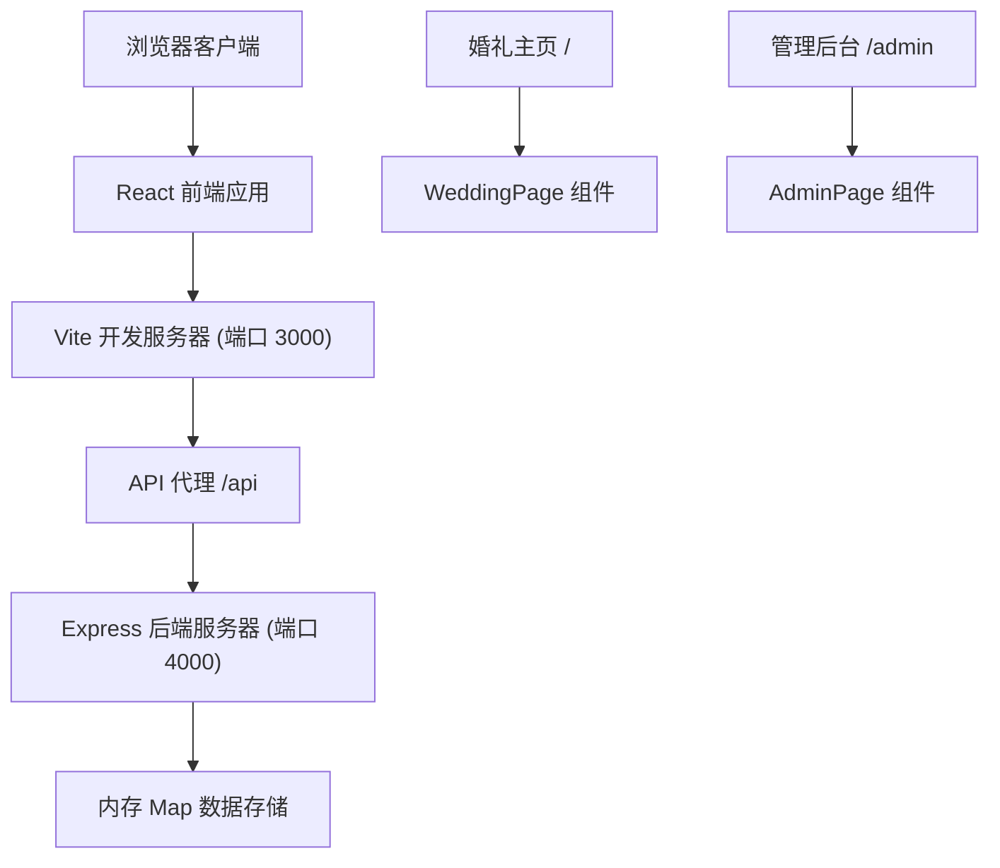
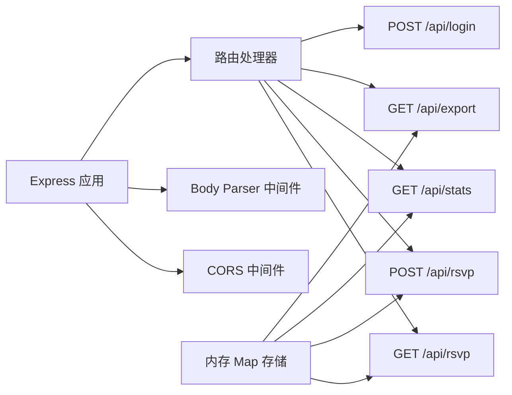
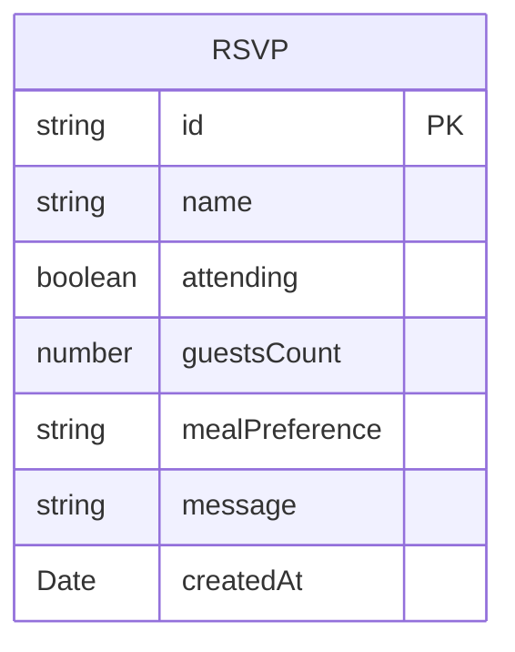

## 1. 架构设计



## 2. 技术描述

- **前端**：React 18 + TypeScript + Vite
- **构建工具**：Vite 5.x，支持 HMR 热更新
- **后端**：Express 4.x，RESTful API
- **数据存储**：内存 Map 对象（无需数据库）
- **HTTP 客户端**：Axios
- **地图组件**：Leaflet 开源地图库
- **样式方案**：CSS-in-JS / 内联样式 + CSS 动画
- **唯一标识**：uuid 库生成 ID

## 3. 路由定义

| 路由 | 用途 |
|------|------|
| / | 婚礼主页，展示倒计时、轮播、地图、留言墙 |
| /admin | 管理后台入口，包含登录和数据管理 |

## 4. API 定义

### 4.1 TypeScript 类型定义

```typescript
// 宾客回复数据结构
interface RSVP {
  id: string;
  name: string;
  attending: boolean;
  guestsCount: number;
  mealPreference: 'vegetarian' | 'seafood' | 'beef';
  message: string;
  createdAt: Date;
}

// 统计数据结构
interface Stats {
  totalInvited: number;
  responded: number;
  attending: number;
  notResponded: number;
}

// API 响应结构
interface ApiResponse<T> {
  success: boolean;
  data?: T;
  error?: string;
}
```

### 4.2 后端 API 端点

| 方法 | 路径 | 描述 | 请求参数 | 响应数据 |
|------|------|------|---------|---------|
| GET | /api/rsvp | 获取所有宾客回复列表 | - | RSVP[] |
| POST | /api/rsvp | 提交宾客回复 | { name, attending, guestsCount, mealPreference, message } | RSVP |
| GET | /api/stats | 获取统计数据 | - | Stats |
| GET | /api/export | 导出 CSV 文件 | - | CSV 文件流 |
| POST | /api/login | 管理员登录 | { username, password } | { success: boolean } |

### 4.3 服务器架构



## 5. 数据模型

### 5.1 数据存储结构



### 5.2 内存存储实现

使用 TypeScript Map 对象存储数据：
- Key: 宾客回复 ID (string)
- Value: RSVP 对象

初始化示例数据：
- 预设 3-5 条示例回复用于展示留言墙效果
- 模拟总邀请人数 100 人用于统计展示

## 6. 文件结构

```
├── package.json              # 项目依赖和脚本
├── vite.config.js            # Vite 构建配置
├── tsconfig.json             # TypeScript 配置
├── index.html                # 入口 HTML
└── src/
    ├── App.tsx               # 主应用组件，路由分发
    ├── server.ts             # Express 后端服务器
    ├── components/
    │   ├── WeddingPage.tsx   # 婚礼主页组件
    │   ├── RSVPModal.tsx     # 回复表单模态框
    │   └── AdminPage.tsx     # 管理后台组件
    └── types/
        └── index.ts          # 类型定义（可选）
```

## 7. 关键技术实现要点

### 7.1 前端实现

- **倒计时组件**：使用 `useState` 和 `useEffect` 每秒更新时间，CSS `@keyframes` 实现脉冲动画
- **轮播组件**：使用 `useState` 管理当前索引，`setInterval` 自动切换，CSS `transition` 实现淡入淡出
- **地图组件**：使用 Leaflet CDN 或 iframe 嵌入 OpenStreetMap
- **留言墙**：CSS Grid 瀑布流布局，`Math.random()` 随机背景色
- **表单验证**：150 字限制，必填项验证
- **路由**：简单的条件渲染或使用 React Router

### 7.2 后端实现

- **CORS 配置**：允许跨域请求
- **Body Parser**：解析 JSON 请求体
- **内存存储**：`Map<string, RSVP>` 存储所有回复
- **CSV 导出**：手动拼接 CSV 字符串，设置 `Content-Type: text/csv` 响应头
- **登录验证**：硬编码账号密码比对

### 7.3 并发脚本启动

使用 `concurrently` 或自定义脚本同时启动前端和后端：
- 前端：`vite` (端口 3000)
- 后端：`ts-node src/server.ts` 或编译后运行 (端口 4000)
