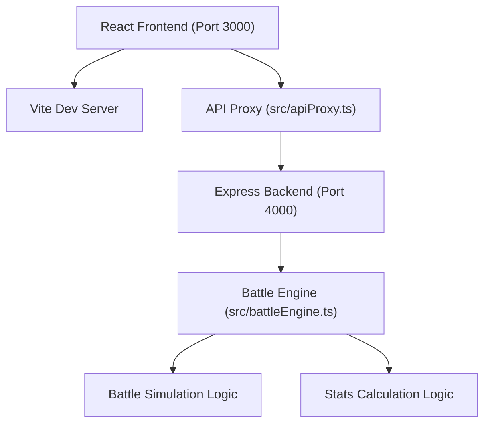
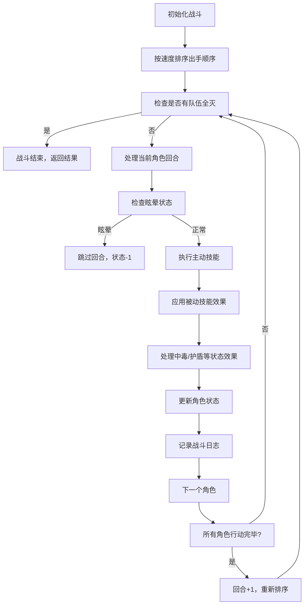

## 1. 架构设计



## 2. 技术描述

- **前端**：React@18 + TypeScript + Vite
- **后端**：Express@4 + CORS + body-parser
- **构建工具**：Vite@5（HMR热更新，代理/api到4000端口）
- **类型系统**：TypeScript严格模式，target ES2020
- **状态管理**：React useState/useEffect（轻量级，无需额外状态库）
- **样式方案**：CSS-in-JS（styled-components或内联样式），无需tailwindcss

## 3. 目录结构

```
project/
├── .trae/documents/
│   ├── PRD.md
│   └── TechArchitecture.md
├── src/
│   ├── battleEngine.ts    # 战斗引擎核心逻辑
│   ├── apiProxy.ts        # 后端API调用封装
│   └── App.tsx            # 主界面组件
├── server/
│   ├── index.js           # Express服务器
│   └── package.json       # 后端依赖
├── package.json           # 前端依赖
├── vite.config.js         # Vite配置
├── tsconfig.json          # TypeScript配置
└── index.html             # 入口HTML
```

## 4. API 定义

### 4.1 POST /api/battle
单场战斗模拟

**请求体**：
```typescript
interface BattleRequest {
  team1: Character[];
  team2: Character[];
}
```

**响应体**：
```typescript
interface BattleResponse {
  logs: BattleLog[];
  winner: 1 | 2;
  totalRounds: number;
  team1RemainingHP: number;
  team2RemainingHP: number;
}
```

### 4.2 POST /api/stats
多场战斗统计

**请求体**：
```typescript
interface StatsRequest {
  team1: Character[];
  team2: Character[];
  iterations: number; // 默认50
}
```

**响应体**：
```typescript
interface StatsResponse {
  team1WinRate: number;  // 0-100
  team2WinRate: number;  // 0-100
  avgRounds: number;
  fastestWin: number;
  totalBattles: number;
}
```

## 5. 核心数据模型

### 5.1 类型定义

```typescript
// 角色职业
type CharacterClass = 'warrior' | 'mage' | 'assassin' | 'knight' | 'priest' | 'archer';

// 状态效果类型
type StatusType = 'poison' | 'stun' | 'shield' | 'heal';

// 状态效果
interface StatusEffect {
  type: StatusType;
  duration: number;      // 剩余回合数
  value: number;         // 效果数值
}

// 技能
interface Skill {
  name: string;
  type: 'active' | 'passive';
  effect: StatusType;
  power: number;         // 技能威力
  cooldown: number;      // 冷却回合
  currentCooldown: number;
}

// 角色
interface Character {
  id: string;
  name: string;
  class: CharacterClass;
  team: 1 | 2;
  maxHP: number;         // 100-999
  currentHP: number;
  attack: number;        // 1-99
  defense: number;       // 1-99
  speed: number;         // 1-99
  activeSkill: Skill;
  passiveSkill: Skill;
  statusEffects: StatusEffect[];
  isAlive: boolean;
}

// 战斗日志
interface BattleLog {
  round: number;
  actor: string;
  target: string;
  action: 'attack' | 'heal' | 'status';
  value: number;
  message: string;
  team: 1 | 2;
  timestamp: number;
}
```

### 5.2 职业技能模板

| 职业 | 主动技能 | 被动技能 |
|------|---------|---------|
| 战士 | 重击（造成150%攻击伤害） | 坚韧（受到伤害减少10%） |
| 法师 | 火球术（造成200%攻击伤害，忽略30%防御） | 法力护盾（生命值低于30%时获得护盾） |
| 刺客 | 背刺（造成250%攻击伤害，50%概率眩晕） | 连击（30%概率额外攻击一次） |
| 骑士 | 盾击（造成100%攻击伤害，自身获得护盾） | 守护（为队友承担20%伤害） |
| 牧师 | 治愈（恢复队友30%最大生命） | 祝福（每回合恢复全队5%生命） |
| 射手 | 穿透箭（造成180%攻击伤害，无视护盾） | 精准（暴击率提升20%） |

## 6. 战斗引擎流程



## 7. 性能优化策略

1. **战斗引擎优化**：
   - 使用纯函数计算，避免不必要的对象复制
   - 回合数上限100，防止死循环
   - 预计算速度排序，每回合只排序一次

2. **统计计算优化**：
   - 50场战斗并行计算（使用Promise.all）
   - 复用角色配置，避免重复序列化
   - 后端计算，前端仅展示结果

3. **界面优化**：
   - 日志使用虚拟滚动（如超出1000条则裁剪旧记录）
   - React.memo优化角色卡片重渲染
   - CSS动画使用transform和opacity，避免重排
