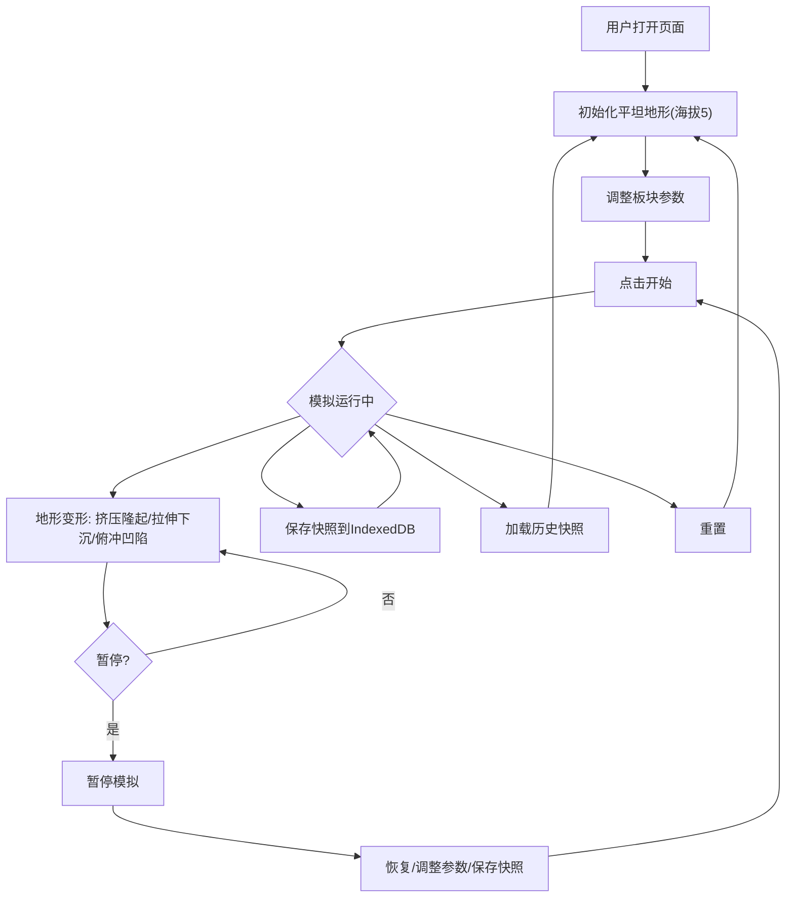

## 1. 产品概述

三维板块构造与地形演变模拟应用，面向地理教学场景，让学生通过交互式网页直观理解板块运动如何影响地表形态的演变。用户可调整板块运动方向、速度和时间步长，实时观察地壳挤压、拉伸和俯冲对地形高度与断层线的影响，支持快照保存与加载。

## 2. 核心功能

### 2.1 功能模块

1. **三维地形场景页**：64×64分辨率地形网格、海拔渐变着色、动态光照与雾效、鼠标交互（旋转/缩放/悬停海拔显示）
2. **控制面板**：板块运动方向/速度/时间步长滑块、开始/暂停/重置按钮、快照保存/管理/加载

### 2.2 页面详情

| 页面 | 模块名称 | 功能描述 |
|------|----------|----------|
| 三维地形场景 | 地形渲染区 | 64×64网格地形，海拔着色（绿→棕→灰白），平行光+半球光+雾效，OrbitControls交互 |
| 三维地形场景 | 鼠标悬停提示 | 鼠标悬停显示海拔值（精确到0.1米），半透明红色十字标记 |
| 控制面板-板块控制 | 方向/速度/步长滑块 | 方向0-359°、速度1-10、时间步长1-5秒，自定义滑块样式 |
| 控制面板-板块控制 | 开始/暂停/重置按钮 | 控制模拟运行状态，重置恢复平坦地形（海拔5） |
| 控制面板-快照管理 | 保存/加载/删除快照 | IndexedDB存储最多10个快照，含缩略图120×80、时间、描述 |
| 控制面板-状态栏 | 模拟状态与步数 | 显示运行中/已暂停状态及当前步数 |

## 3. 核心流程

用户打开页面 → 观察初始平坦地形 → 调整板块参数（方向/速度/步长）→ 点击开始 → 地形实时变形（挤压隆起/拉伸下沉/俯冲凹陷）→ 可随时暂停/恢复 → 保存快照 → 可加载历史快照 → 重置回初始状态

## 4. 用户界面设计

### 4.1 设计风格

- 主色调：深色系（背景#1E1E1E，场景雾色#1A1A1A）
- 强调色：#FF6B35橙色（按钮、滑块填充）
- 按钮风格：#FF6B35背景，圆角6px，悬停#FF8A50+上移2px阴影
- 滑块风格：轨道4px高#333背景，#FF6B35填充，16px直径白色中心滑块按钮
- 字体：Inter, sans-serif，14px，文字颜色#E0E0E0
- 地形颜色：海拔0-10 #2E7D32绿色，10-20 #795548棕色，20+ #9E9E9E灰色带白色雪顶

### 4.2 页面设计概览

| 模块名称 | UI元素 |
|----------|--------|
| 左侧面板 | 宽320px，背景#1E1E1E，圆角8px，内边距20px，三层折叠区域 |
| 板块控制区 | 可折叠，方向/速度/步长滑块，开始/暂停/重置按钮 |
| 快照管理区 | 可折叠，保存按钮+描述输入，快照列表（缩略图+时间+描述+删除） |
| 状态栏 | 固定底部，运行状态+步数显示 |
| 三维场景 | 自适应右侧剩余宽度，深灰背景 |

### 4.3 响应式设计

- 桌面优先：左侧面板320px + 右侧3D场景
- 小屏幕（<768px）：面板折叠为顶部工具栏（高度60px），展开按钮触发全屏覆盖菜单
- 折叠动画：0.3秒ease-out平滑高度过渡

### 4.4 3D场景指引

- 环境：深灰色背景（#1A1A1A雾色），无HDRI
- 光照：动态平行光（方向随板块方向变化）+ 半球环境光，柔和阴影
- 相机：OrbitControls，旋转灵敏度0.5，缩放范围2-50
- 交互：鼠标悬停Raycasting，海拔值浮窗+红色十字标记
- 性能：64×64网格更新+渲染 ≥45fps，拖拽 ≥30fps
