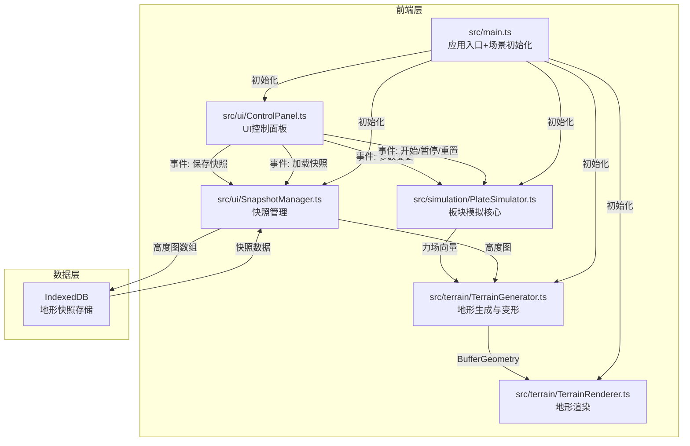

## 1. 架构设计



## 2. 技术说明

- 前端：TypeScript + Three.js（三维渲染）+ D3.js（地理投影与数据处理）
- 构建工具：Vite（端口3000，HMR开启）
- 数据存储：IndexedDB（快照持久化，最多10条）
- 无后端服务，纯前端应用

## 3. 文件结构与模块职责

| 文件路径 | 职责 | 输入 | 输出 |
|----------|------|------|------|
| `package.json` | 依赖管理：three, d3, d3-geo, typescript, vite, @types/three, @vitejs/plugin-react | - | - |
| `vite.config.js` | 构建配置，端口3000，HMR | - | 开发服务器 |
| `tsconfig.json` | TypeScript严格模式，ES2020，bundler | - | - |
| `index.html` | 入口页面，深灰背景 | - | DOM入口 |
| `src/main.ts` | 初始化Three.js场景、渲染器、控制器，加载各模块 | - | 应用实例 |
| `src/terrain/TerrainGenerator.ts` | D3投影+平面网格生成高度图，接收力向量更新顶点 | 板块力向量 | BufferGeometry |
| `src/terrain/TerrainRenderer.ts` | 接收BufferGeometry，海拔渐变着色+雾效+光照 | BufferGeometry | Three.js Mesh |
| `src/simulation/PlateSimulator.ts` | 板块数据结构、碰撞/分离力场计算、时间步长管理 | 控制参数 | 力场向量 |
| `src/ui/ControlPanel.ts` | 滑块/按钮UI，事件总线通信 | 用户操作 | 控制事件 |
| `src/ui/SnapshotManager.ts` | IndexedDB快照CRUD，缩略图生成 | 高度图数据 | 快照列表 |

## 4. 数据流

```
用户操作 → ControlPanel(事件) → PlateSimulator(力场计算)
    → TerrainGenerator(顶点更新) → TerrainRenderer(渲染更新) → 屏幕

用户保存 → ControlPanel(事件) → SnapshotManager → IndexedDB
用户加载 → ControlPanel(事件) → SnapshotManager → IndexedDB → TerrainGenerator(高度图恢复)
```

## 5. 关键数据结构

### 5.1 PlateData（板块数据）
```typescript
interface PlateData {
  velocity: number;
  direction: number;
  boundaryLength: number;
  position: { x: number; z: number };
}
```

### 5.2 ForceVector（力场向量）
```typescript
interface ForceVector {
  x: number;
  z: number;
  magnitude: number;
  type: 'compression' | 'extension' | 'subduction';
}
```

### 5.3 TerrainSnapshot（地形快照）
```typescript
interface TerrainSnapshot {
  id: string;
  heightMap: Float32Array;
  timestamp: number;
  description: string;
  thumbnail: string;
}
```

## 6. 性能预算

| 指标 | 目标 |
|------|------|
| 模拟运行帧率 | ≥45fps |
| 拖拽视角帧率 | ≥30fps |
| 快照保存响应 | ≤100ms |
| 按钮点击反馈 | ≤50ms |
