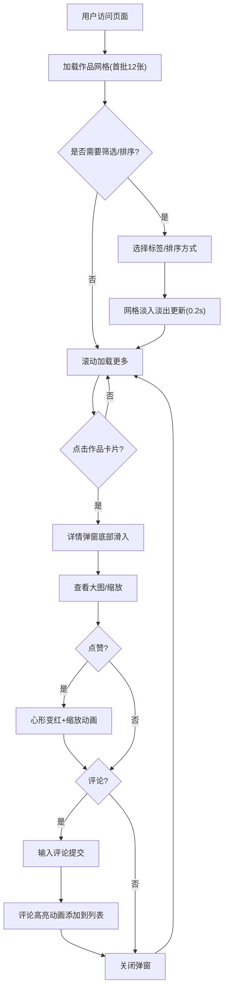

## 1. 产品概述

个人创意作品集展示应用——为设计师和摄影爱好者打造的在线作品展示平台，访客可浏览、点赞和留言互动。
- 解决设计师/摄影师作品展示与社交互动需求，提供沉浸式暗色主题浏览体验
- 目标用户：创意从业者（展示方）与作品欣赏者（访客），核心价值在于视觉冲击力与互动便捷性

## 2. 核心功能

### 2.1 用户角色
| 角色 | 注册方式 | 核心权限 |
|------|----------|----------|
| 访客 | 无需注册 | 浏览作品、点赞、评论 |

### 2.2 功能模块
1. **作品展示页**：响应式网格展示、标签筛选、排序、懒加载
2. **作品详情弹窗**：大图查看（缩放）、点赞互动、评论留言

### 2.3 页面详情
| 页面名称 | 模块名称 | 功能描述 |
|----------|----------|----------|
| 作品展示页 | 筛选栏 | 标签下拉筛选（摄影、插画、UI设计等）、排序下拉（日期升/降、点赞数降序），切换时0.2s淡入淡出 |
| 作品展示页 | 作品网格 | 3列响应式网格（<768px 2列，<480px 1列），卡片含缩略图16:9、标题、胶囊标签，悬停上浮8px+阴影扩散0.3s，IntersectionObserver懒加载每批12张 |
| 作品详情弹窗 | 大图展示 | 居中弹窗，半透明遮罩，大图支持滚轮缩放1-3倍，底部滑入0.3s ease-out |
| 作品详情弹窗 | 点赞互动 | 心形按钮，默认#666/点击后#ff4757+0.2s缩放动画1.2倍，localStorage持久化 |
| 作品详情弹窗 | 评论功能 | 评论列表含随机色圆形头像、用户名、内容(≤140字)、相对时间戳；输入框+提交按钮，新评论0.3s高亮动画 |

## 3. 核心流程

用户打开页面 → 浏览作品网格 → 使用筛选/排序缩小范围 → 点击卡片打开详情 → 点赞/评论互动 → 关闭弹窗继续浏览

## 4. 用户界面设计

### 4.1 设计风格
- 主色调：暗色主题（背景#0f0f0f，卡片#1a1a1a，文字#e0e0e0，强调色#ff4757）
- 按钮风格：圆角胶囊标签、心形点赞按钮
- 字体：标题使用 Playfair Display（优雅衬线体），正文使用 DM Sans（现代无衬线体）
- 布局风格：卡片网格+弹窗覆盖层，顶部60px导航
- 图标风格：lucide-react 线性图标

### 4.2 页面设计概述
| 页面名称 | 模块名称 | UI元素 |
|----------|----------|--------|
| 作品展示页 | 导航栏 | 高60px，暗色背景，Logo+筛选控件，暗色线条分隔 |
| 作品展示页 | 筛选栏 | 下拉选择器，暗色填充，圆角，#333背景#aaa文字 |
| 作品展示页 | 作品网格 | 3列网格，间距24px，卡片圆角12px，16:9缩略图，悬停上浮8px+阴影 |
| 作品详情弹窗 | 遮罩层 | rgba(0,0,0,0.7)半透明遮罩，点击关闭 |
| 作品详情弹窗 | 内容区 | 大图居中，标题描述下方，心形点赞+计数，评论区滚动列表 |
| 作品详情弹窗 | 评论输入 | 底部固定输入框+提交按钮，#1a1a1a背景 |

### 4.3 响应式适配
- 桌面优先设计，≥768px：3列网格，16:9缩略图
- 768px以下：2列网格，4:3缩略图，弹窗左右留10px
- 480px以下：1列网格，筛选栏收起为汉堡菜单

### 4.4 3D场景指引
- 不适用
