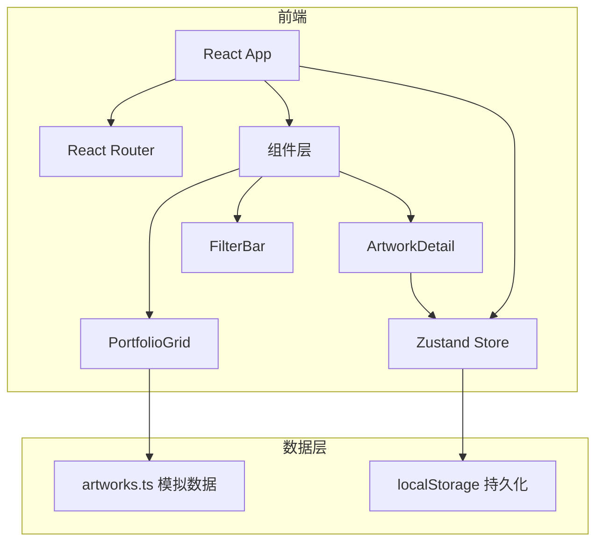
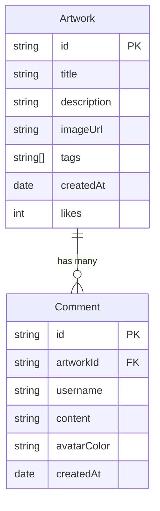

## 1. 架构设计



## 2. 技术说明
- 前端：React 18 + TypeScript + Vite
- 初始化工具：vite-init（react-ts 模板）
- 后端：无
- 数据库：无，使用模拟数据 + localStorage 持久化

## 3. 路由定义
| 路由 | 用途 |
|------|------|
| / | 作品展示主页，包含网格和筛选 |

## 4. API定义
- 不适用（纯前端项目，使用模拟数据）

## 5. 服务端架构图
- 不适用

## 6. 数据模型

### 6.1 数据模型定义



### 6.2 数据定义语言

```typescript
interface Artwork {
  id: string;
  title: string;
  description: string;
  imageUrl: string;
  tags: string[];
  createdAt: string;
  likes: number;
}

interface Comment {
  id: string;
  artworkId: string;
  username: string;
  content: string;
  avatarColor: string;
  createdAt: string;
}

interface AppState {
  artworks: Artwork[];
  comments: Record<string, Comment[]>;
  likedArtworks: Set<string>;
  activeFilter: string;
  sortMode: string;
  selectedArtwork: Artwork | null;
}
```
