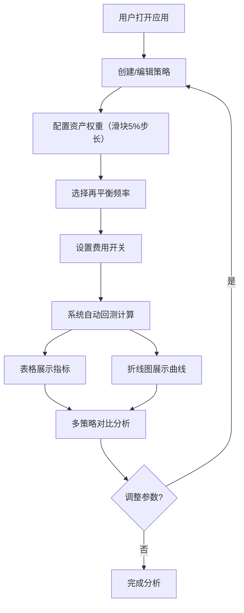

## 1. 产品概述

资产配置策略回测对比工具——帮助小型投资研究团队在网页上模拟和比较不同资产配置策略的历史回测收益与风险指标，解决在Excel中手工计算多策略下的年化收益率、最大回撤和夏普比率时效率低、易出错且难以直观对比的问题。

- 目标用户：小型投资研究团队成员
- 核心价值：将多策略回测计算从Excel手工操作转为自动化网页工具，提高效率、减少错误、直观可视化对比

## 2. 核心功能

### 2.1 用户角色

| 角色 | 注册方式 | 核心权限 |
|------|----------|----------|
| 研究员 | 无需注册，直接使用 | 创建策略、配置参数、查看回测结果 |

### 2.2 功能模块

1. **策略配置页面**：创建和管理1-5个模拟策略，配置资产权重、再平衡频率、费用开关
2. **回测结果展示页面**：以表格和折线图并排展示各策略的历史回测指标与累计收益率曲线

### 2.3 页面详情

| 页面名称 | 模块名称 | 功能描述 |
|----------|----------|----------|
| 主页面 | 导航栏 | 顶部60px深色导航栏，标题"资产配置策略回测对比工具"居中显示 |
| 主页面 | 策略配置面板 | 左侧40%区域，可折叠策略卡片，滑块调整权重，下拉菜单选择再平衡频率，费用开关，添加/删除策略按钮 |
| 主页面 | 回测结果表格 | 右侧60%区域上半部分，展示累计收益率、年化收益率、年化波动率、最大回撤、夏普比率 |
| 主页面 | 累计收益率折线图 | 右侧60%区域下半部分，Recharts LineChart绘制多策略累计收益率曲线，支持悬停交互 |

## 3. 核心流程

用户打开应用 → 创建策略（配置资产权重、再平衡频率、费用） → 系统自动计算回测指标 → 结果以表格和折线图展示 → 调整策略参数 → 实时更新结果 → 多策略对比分析

## 4. 用户界面设计

### 4.1 设计风格

- 主色调：#1A252F深色导航 + #2C3E50深蓝灰色表头 + #3498DB蓝色强调
- 次色调：#E74C3C红色（策略2）、#2ECC71绿色（策略3）
- 按钮风格：圆角6px，主按钮#3498DB蓝色，悬停变暗#2980B9
- 字体：系统字体栈，导航标题22px加粗白色
- 布局风格：一页式两栏布局，左侧策略配置卡片，右侧结果展示
- 背景：页面#F5F7FA浅灰，卡片白色

### 4.2 页面设计概览

| 页面名称 | 模块名称 | UI元素 |
|----------|----------|--------|
| 主页面 | 导航栏 | 高60px，背景#1A252F，标题白色22px加粗居中 |
| 主页面 | 策略卡片 | 圆角8px，白色背景，阴影2px，可折叠展开 |
| 主页面 | 权重滑块 | 四个资产滑块，5%步长，实时显示权重百分比 |
| 主页面 | 再平衡下拉 | 下拉菜单：每月/每季度/每年 |
| 主页面 | 费用开关 | 开关组件，默认开启0.1%管理费 |
| 主页面 | 结果表格 | 表头#2C3E50深蓝灰白字，数据行交替#F8F9FA/#E9ECEF |
| 主页面 | 折线图 | Recharts LineChart，3色折线，悬停白色圆角工具提示 |
| 主页面 | 添加策略按钮 | #3498DB蓝色圆角6px，悬停#2980B9，底部固定 |

### 4.3 响应式设计

- 桌面优先，页面宽度<768px时转为单栏纵向布局
- 策略配置面板和结果展示面板在移动端上下堆叠
- 折线图自适应容器宽度

### 4.4 动画交互

- 切换策略时折线图0.3秒淡入动画（opacity 0→1）
- 策略卡片折叠展开动画
- 按钮悬停颜色过渡
- 无效输入时红色提示文字
