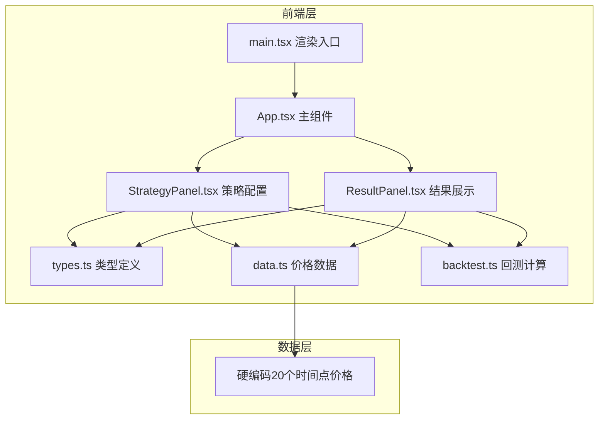

## 1. 架构设计



纯前端架构，无后端服务，所有数据硬编码在前端。

## 2. 技术说明

- 前端：React@18 + TypeScript + Vite
- 初始化工具：vite-init (react-ts模板)
- 图表库：Recharts
- 状态管理：React useState（项目规模小，无需zustand）
- 后端：无
- 数据库：无，所有数据硬编码在前端

## 3. 路由定义

| 路由 | 用途 |
|------|------|
| / | 单页面应用，包含所有功能模块 |

## 4. 文件结构

```
├── package.json
├── vite.config.js
├── tsconfig.json
├── index.html
└── src/
    ├── types.ts          # StrategyConfig、BacktestResult接口，AssetType枚举
    ├── data.ts           # 硬编码20个时间点价格数据
    ├── backtest.ts       # 回测计算函数
    ├── main.tsx          # ReactDOM渲染入口
    ├── App.tsx           # 主组件，策略状态管理
    └── components/
        ├── StrategyPanel.tsx  # 策略配置UI
        └── ResultPanel.tsx    # 结果展示UI
```

## 5. 核心数据类型

### 5.1 类型定义

```typescript
enum AssetType {
  Stock = 'stock',
  Bond = 'bond',
  Gold = 'gold',
  Cash = 'cash'
}

interface StrategyConfig {
  id: string;
  name: string;
  weights: Record<AssetType, number>;
  rebalanceFrequency: 'monthly' | 'quarterly' | 'yearly';
  feeEnabled: boolean;
}

interface BacktestResult {
  strategyId: string;
  cumulativeReturn: number;
  annualizedReturn: number;
  annualizedVolatility: number;
  maxDrawdown: number;
  sharpeRatio: number;
  cumulativeReturns: { date: string; value: number }[];
}
```

## 6. 回测计算逻辑

1. 根据策略权重和再平衡频率，按月计算投资组合价值
2. 若费用开关开启，每次再平衡扣除0.1%管理费
3. 计算指标：
   - 累计收益率 = (期末价值 - 期初价值) / 期初价值
   - 年化收益率 = (1 + 累计收益率)^(12/月数) - 1
   - 年化波动率 = 月收益率标准差 × √12
   - 最大回撤 = max((peak - trough) / peak)
   - 夏普比率 = (年化收益率 - 2%) / 年化波动率
4. 所有结果保留两位小数
