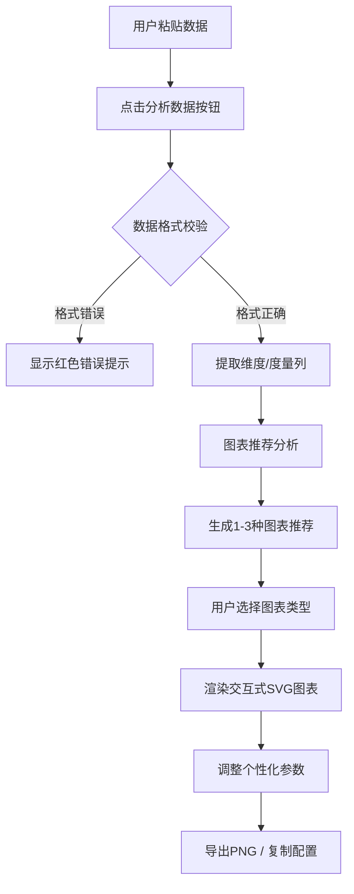

## 1. 产品概述

智能图表建议与生成工具(SmartChart)是一款面向在线教育平台讲师的图表制作工具，帮助用户快速将JSON/CSV格式的结构化数据自动转换为直观的交互式SVG图表。用户只需粘贴数据，系统自动分析数据类型并智能推荐最合适的图表类型，一键生成可用于课程演示的专业图表。

- 核心目标：解决讲师手动制作图表效率低的痛点，将数据到图表的转换时间从分钟级缩短到秒级
- 目标用户：在线教育讲师、数据分析师、需要快速可视化数据的内容创作者

## 2. 核心功能

### 2.1 用户角色

| 角色 | 注册方式 | 核心权限 |
|------|----------|----------|
| 普通用户 | 无需注册 | 完整使用所有功能，无需登录 |

### 2.2 功能模块

1. **数据解析模块**：JSON/CSV格式识别、数据完整性校验、维度列与度量列自动提取
2. **图表推荐模块**：基于数据特征智能推荐1-3种图表类型，展示置信度评分
3. **图表渲染模块**：SVG交互式图表生成，支持tooltip、动画效果
4. **个性化调整模块**：图表标题、配色方案、坐标轴样式调整
5. **导出分享模块**：PNG导出、图表配置复制分享

### 2.3 页面详情

| 页面名称 | 模块名称 | 功能描述 |
|---------|----------|------------|
| 主页面 | 顶部操作栏 | 显示应用标题、导出PNG按钮、复制配置按钮 |
| 主页面 | 左侧数据输入区 | Monaco风格多行文本框、格式错误提示、分析数据按钮 |
| 主页面 | 右侧图表展示区 | 主图表预览区（65%高度）、推荐卡片列表（30%高度） |
| 主页面 | 右侧控制面板 | 标题输入、配色方案选择、坐标轴字体大小调整 |

## 3. 核心流程

用户在数据输入框粘贴JSON或CSV格式数据 → 点击"分析数据"按钮 → 系统解析数据格式并校验完整性 → 若格式错误显示红色提示 → 若合法提取维度列和度量列 → 图表推荐模块分析数据特征 → 生成1-3种图表推荐（含缩略图和置信度）→ 用户点击推荐卡片切换图表类型 → 主预览区实时渲染交互式SVG图表 → 用户调整图表标题、配色、坐标轴样式 → 点击导出PNG或复制配置分享

## 4. 用户界面设计

### 4.1 设计风格

- **主色调**：深色主题
  - 主背景：#1a1a2e
  - 卡片背景：#16213e
  - 主文字：#e0e0e0
  - 主按钮色：#0f3460（悬停#1a5276）
  - 选中边框色：#e94560
  - 输入区背景：#0f0f23

- **按钮样式**：圆角设计，点击波纹扩散动画0.3秒，悬停时颜色加深

- **字体**：标题使用清晰无衬线字体，代码输入区使用Fira Code等宽字体

- **布局风格**：左右分栏布局（左侧30%输入区，右侧70%图表区），顶部固定操作栏

- **预设配色方案**：
  1. 经典蓝：#3498db, #2980b9, #1abc9c, #16a085
  2. 暖阳橙：#e67e22, #d35400, #f39c12, #e74c3c
  3. 森林绿：#27ae60, #2ecc71, #16a085, #1abc9c
  4. 莫兰迪灰：#7f8c8d, #95a5a6, #bdc3c7, #34495e

### 4.2 页面设计概述

| 页面名称 | 模块名称 | UI元素 |
|---------|----------|---------|
| 主页面 | 顶部操作栏 | 固定定位、标题"智能图表助理"、右侧操作按钮组 |
| 主页面 | 数据输入区 | Monaco风格文本框、Fira Code字体、深色背景、下方错误提示区域、分析按钮 |
| 主页面 | 图表预览区 | SVG图表容器、图例交互、tooltip提示、过渡动画 |
| 主页面 | 推荐卡片列表 | 每行3个卡片、80x60px缩略图、置信度百分比、选中时发光阴影 |
| 主页面 | 控制面板 | 标题输入框、配色方案选择器、字体大小滑块 |

### 4.3 响应式设计

- **桌面优先**：默认左右分栏布局
- **移动端适配**：视口宽度小于768px时，数据输入区和图表展示区改为上下排列
- **推荐卡片**：移动端每行改为2个卡片
- **触摸优化**：按钮最小点击区域44x44px，确保触摸友好

### 4.4 动画与交互

- **数据输入按钮**：点击时波纹扩散动画0.3秒
- **图表切换**：0.5秒缩放淡入过渡动画
- **悬停效果**：柱状图柱子高亮加亮20%并上浮2px
- **图例点击**：0.3秒淡入淡出动画
- **参数调整**：0.4秒过渡动画
- **推荐卡片选中**：边框亮色并发光阴影效果

## 5. 性能约束

- 数据解析与图表推荐：≤50ms（数据量≤500行）
- 图表渲染首帧：≤200ms
- 交互悬停tooltip响应：≤16ms（60FPS）

## 6. 图表类型支持

1. **柱状图**：圆角矩形柱子，均匀间距，悬停高亮上浮，tooltip显示数值
2. **折线图**：节点带小圆点，悬停圆点放大显示数值
3. **饼图**：分片悬停向外偏移10px，显示百分比
4. **散点图**：数据点分布，悬停显示坐标数值
5. **分组柱状图**：两个维度时支持分组展示
6. **堆叠柱状图**：两个维度时支持堆叠展示
