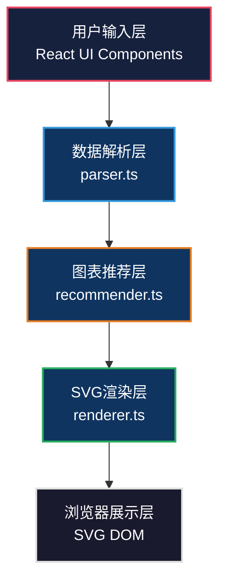
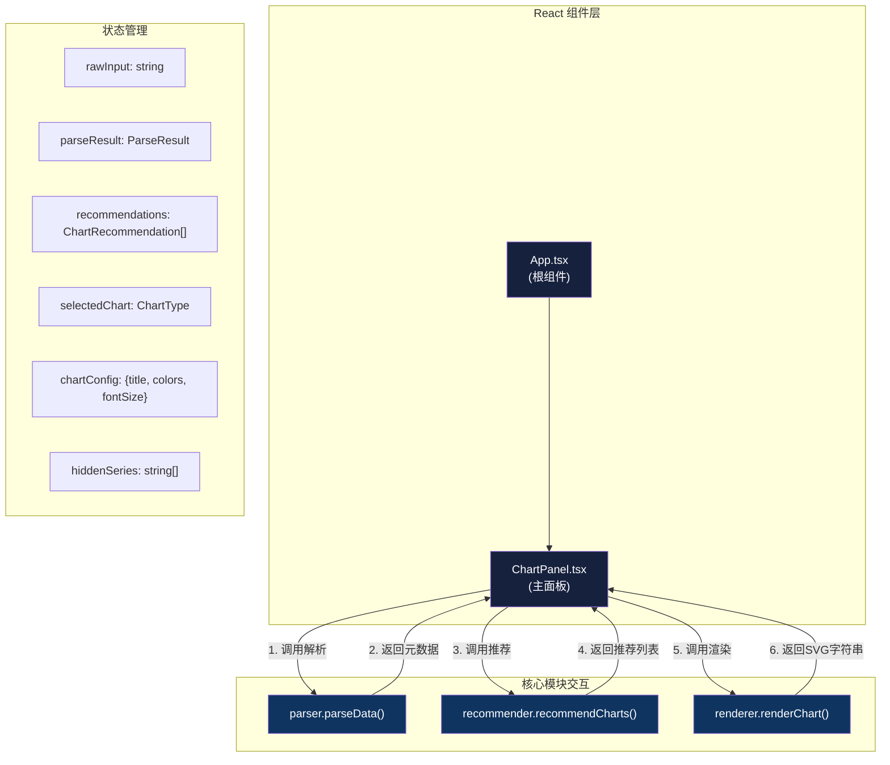

## 1. 架构设计

采用模块化三层架构，确保数据解析、图表推荐和SVG渲染三大核心模块完全解耦，通过React组件层进行协调。纯前端实现，无需后端服务。



## 2. 技术描述

- **前端框架**：React@18 + TypeScript@5
- **构建工具**：Vite@5 + @vitejs/plugin-react@4
- **样式方案**：CSS Modules + CSS Variables（深色主题）
- **状态管理**：React useState/useReducer（单页面应用无需额外状态库）
- **第三方依赖**：
  - uuid：唯一标识符生成
  - file-saver：PNG文件导出
- **不使用后端**：纯前端实现，数据仅在浏览器内存中处理

## 3. 项目文件结构

```
├── package.json              # 项目依赖与脚本配置
├── vite.config.js            # Vite构建配置（端口3000）
├── tsconfig.json             # TypeScript严格模式配置
├── index.html                # 入口HTML页面
└── src/
    ├── main.tsx              # React入口渲染
    ├── App.tsx               # 根组件
    ├── core/
    │   ├── parser.ts         # 数据解析模块（JSON/CSV校验，维度/度量提取）
    │   ├── recommender.ts    # 图表推荐模块（智能推荐算法）
    │   └── renderer.ts       # SVG渲染模块（交互式图表生成）
    └── components/
        └── ChartPanel.tsx    # 主面板UI组件
```

## 4. 核心模块接口定义

### 4.1 数据解析模块 parser.ts

```typescript
export interface ColumnMetadata {
  name: string;
  type: 'dimension' | 'measure';
  dataType: 'string' | 'number' | 'date';
  uniqueValues: number;
  sampleValues: any[];
}

export interface ParseResult {
  success: boolean;
  error?: string;
  data?: Record<string, any>[];
  metadata?: {
    columns: ColumnMetadata[];
    dimensionColumns: ColumnMetadata[];
    measureColumns: ColumnMetadata[];
    rowCount: number;
  };
}

export function parseData(input: string): ParseResult;
export function detectFormat(input: string): 'json' | 'csv' | 'unknown';
export function validateJSON(input: string): { valid: boolean; error?: string };
export function validateCSV(input: string): { valid: boolean; error?: string };
```

### 4.2 图表推荐模块 recommender.ts

```typescript
export type ChartType = 'bar' | 'line' | 'pie' | 'scatter' | 'groupedBar' | 'stackedBar';

export interface ChartRecommendation {
  type: ChartType;
  name: string;
  confidence: number;
  reason: string;
}

export interface RecommendationResult {
  recommendations: ChartRecommendation[];
  primaryRecommendation: ChartRecommendation;
}

export function recommendCharts(metadata: ParseResult['metadata']): RecommendationResult;
```

### 4.3 SVG渲染模块 renderer.ts

```typescript
export interface RenderOptions {
  width: number;
  height: number;
  title?: string;
  colors: string[];
  axisFontSize: number;
  animationDuration?: number;
}

export interface RenderResult {
  svg: string;
  interactiveHandlers: {
    onHover: (elementId: string) => void;
    onLeave: (elementId: string) => void;
    onLegendClick: (seriesName: string) => void;
  };
}

export function renderChart(
  chartType: ChartType,
  data: Record<string, any>[],
  metadata: ParseResult['metadata'],
  options: RenderOptions
): string;

export function renderThumbnail(
  chartType: ChartType,
  data: Record<string, any>[],
  colors: string[],
  width: number = 80,
  height: number = 60
): string;
```

## 5. 组件层级与数据流



## 6. 关键技术实现方案

### 6.1 数据解析方案
- **格式检测**：通过首字符检测（`{`或`[`判定JSON，否则尝试CSV解析）
- **JSON校验**：使用`JSON.parse()`包裹try-catch，校验数组结构一致性
- **CSV解析**：手动实现CSV解析器，支持引号包裹、逗号分隔，处理表头与数据行映射
- **列类型推断**：遍历列数据，根据值特征判断类型（数字→度量，字符串/日期→维度）

### 6.2 图表推荐算法
- **维度数量=1，度量数量=1**：
  - 唯一值≤10：推荐饼图(置信度85%)、柱状图(置信度80%)
  - 唯一值>10：推荐柱状图(置信度90%)、折线图(置信度70%)
- **维度数量=2，度量数量=1**：推荐分组柱状图(85%)、堆叠柱状图(80%)
- **维度数量=1，度量数量=2-3**：推荐折线图(85%)、柱状图(75%)
- **维度数量=2，度量数量=2**：推荐散点图(80%)、分组柱状图(75%)

### 6.3 SVG渲染方案
- **柱状图**：圆角rect元素，均匀分布间距，hover时y属性上移2px，fill颜色加亮20%
- **折线图**：path元素绘制线条，circle元素标记节点，hover时circle r属性放大
- **饼图**：path元素绘制扇形，hover时transform属性偏移10px
- **交互实现**：使用React事件绑定与状态管理实现tooltip和图例交互
- **动画实现**：CSS transition + SVG transform/opacity属性

### 6.4 PNG导出方案
- 将SVG字符串转换为Blob
- 创建Image对象加载SVG
- 使用Canvas绘制Image
- 调用`canvas.toDataURL('image/png')`转换为PNG
- 使用file-saver保存文件

### 6.5 性能优化方案
- **数据解析**：提前终止无效检测，避免不必要的全量遍历
- **图表渲染**：使用`useMemo`缓存SVG渲染结果，依赖变更才重绘
- **动画性能**：使用CSS transform和opacity属性触发GPU加速
- **Tooltip**：使用CSS:hover伪类优先，避免频繁JavaScript事件处理

## 7. 类型定义与常量

```typescript
// src/core/types.ts
export const COLOR_PALETTES = {
  classicBlue: ['#3498db', '#2980b9', '#1abc9c', '#16a085'],
  warmOrange: ['#e67e22', '#d35400', '#f39c12', '#e74c3c'],
  forestGreen: ['#27ae60', '#2ecc71', '#16a085', '#1abc9c'],
  morandiGray: ['#7f8c8d', '#95a5a6', '#bdc3c7', '#34495e'],
} as const;

export type ColorPaletteKey = keyof typeof COLOR_PALETTES;

export const CHART_NAMES: Record<ChartType, string> = {
  bar: '柱状图',
  line: '折线图',
  pie: '饼图',
  scatter: '散点图',
  groupedBar: '分组柱状图',
  stackedBar: '堆叠柱状图',
};

export const DEFAULT_CHART_CONFIG = {
  title: '数据图表',
  colorPalette: 'classicBlue' as ColorPaletteKey,
  axisFontSize: 12,
  width: 800,
  height: 400,
};
```

## 8. 开发规范

- **代码风格**：TypeScript严格模式，启用`strict: true`、`noImplicitAny: true`
- **命名规范**：组件使用PascalCase，函数使用camelCase，常量使用UPPER_SNAKE_CASE
- **文件组织**：core目录存放纯函数模块，components存放React组件
- **测试策略**：核心逻辑模块（parser、recommender）使用Vitest编写单元测试
- **性能验证**：使用`performance.now()`进行关键路径性能基准测试
