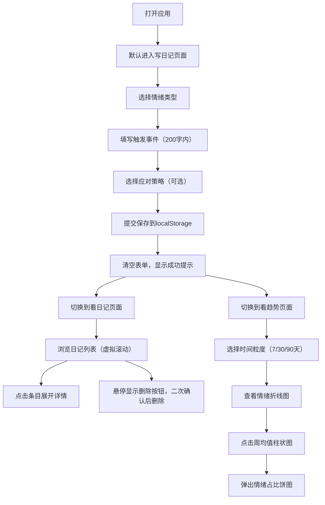

## 1. 产品概述

个人情绪日记与趋势分析应用，帮助用户记录每日情绪状态、触发事件和应对策略，通过可视化图表回顾情绪变化与周期性模式，提升用户情绪觉察能力和心理健康管理水平。

- 核心价值：为用户提供简单易用的情绪追踪工具，通过数据可视化帮助用户理解自身情绪模式
- 目标用户：关注心理健康、希望了解自身情绪变化规律的普通用户

## 2. 核心 Features

### 2.1 用户角色

| 角色 | 注册方式 | 核心权限 |
|------|----------|----------|
| 普通用户 | 无需注册，本地存储 | 记录情绪日记、查看历史记录、分析情绪趋势 |

### 2.2 功能模块

1. **写日记页面**：情绪选择面板、事件描述输入、应对策略选择、提交保存
2. **看日记页面**：日记列表展示、条目详情展开、删除确认、虚拟滚动
3. **看趋势页面**：时间粒度切换（7天/30天/90天）、情绪折线图、周均值柱状图、情绪占比饼图

### 2.3 页面详情

| 页面名称 | 模块名称 | 功能描述 |
|---------|----------|----------|
| 写日记 | 情绪选择面板 | 8种情绪（快乐、悲伤、愤怒、焦虑、平静、疲惫、惊讶、厌恶）卡片，点击选中后背景切换为对应颜色，0.3秒过渡动画 |
| 写日记 | 事件描述输入 | 自由文本输入框，限制200字，显示字数统计 |
| 写日记 | 应对策略选择 | 5种预设选项（运动、冥想、社交、阅读、其他），可选填写 |
| 写日记 | 提交保存 | 验证必填项，保存到localStorage，成功后清空表单 |
| 看日记 | 日记列表 | 时间倒序展示，每条显示日期、情绪emoji图标、摘要，支持虚拟滚动 |
| 看日记 | 条目详情 | 点击卡片展开完整内容，包含触发事件和应对策略 |
| 看日记 | 删除功能 | 悬停显示删除按钮，点击弹出二次确认对话框 |
| 看趋势 | 时间粒度切换 | 下拉菜单选择最近7天/30天/90天 |
| 看趋势 | 情绪折线图 | 使用recharts绘制，X轴日期，Y轴情绪强度0-10，每条情绪单独曲线 |
| 看趋势 | 周均值柱状图 | 每周情绪均值对比，每种情绪对应颜色，点击柱子高亮并弹出饼图 |
| 看趋势 | 情绪占比饼图 | 显示选中周的各情绪占比分布 |

## 3. 核心流程

### 用户主要流程

用户打开应用后，默认进入写日记页面，选择当前情绪，填写触发事件和应对策略，提交保存。用户可以切换到看日记页面浏览历史记录，或切换到看趋势页面查看情绪变化趋势。

## 4. 用户界面设计

### 4.1 设计风格

- **主色调**：#1976D2（导航选中状态、聚焦边框）
- **情绪色板**：
  - 快乐 #FFD54F
  - 悲伤 #64B5F6
  - 愤怒 #E53935
  - 焦虑 #FF8A65
  - 平静 #81C784
  - 疲惫 #A1887F
  - 惊讶 #CE93D8
  - 厌恶 #66BB6A
- **背景色**：#FAFAFA（主背景）、#FFFFFF（卡片背景）
- **文字色**：#212121（标题）、#616161（正文/未选中Tab）、#FFFFFF（选中Tab文字）
- **按钮样式**：圆角设计，聚焦时2px蓝色边框outline
- **卡片样式**：圆角12px，悬停阴影加深，间距16px
- **字体**：系统默认无衬线字体，标题18px粗体，正文14px
- **布局**：最大宽度960px居中，卡片式布局
- **图标**：使用emoji作为情绪图标，无背景
- **动画**：Tab切换淡入淡出0.3s，情绪卡片选中过渡0.3s

### 4.2 页面设计概览

| 页面名称 | 模块名称 | UI元素 |
|---------|----------|--------|
| 写日记 | 顶部导航 | 三个Tab标签，选中背景#1976D2白色文字，未选中透明灰色文字 |
| 写日记 | 情绪选择区 | 8个情绪卡片，2x4网格布局，选中时背景色填充，0.3s过渡 |
| 写日记 | 事件输入区 | 文本域，200字限制，字数统计，底部对齐 |
| 写日记 | 策略选择区 | 5个单选按钮，横向排列 |
| 写日记 | 提交按钮 | 蓝色背景白色文字，居中显示，禁用状态灰色 |
| 看日记 | 日记列表 | 垂直排列，虚拟滚动，卡片间距16px |
| 看日记 | 日记卡片 | 左上角情绪emoji，右上角相对时间，悬停阴影加深显示删除按钮 |
| 看日记 | 删除确认 | 模态对话框，确认/取消按钮 |
| 看趋势 | 粒度选择 | 下拉菜单，右侧对齐 |
| 看趋势 | 折线图区域 | 图表容器，图例在顶部，tooltip悬停显示 |
| 看趋势 | 柱状图区域 | 每周均值对比，圆角4px柱体，间距8px |
| 看趋势 | 饼图弹窗 | 居中模态框，显示情绪占比，关闭按钮 |

### 4.3 响应式设计

- **桌面优先**：最大宽度960px居中显示
- **移动端适配**：在小屏幕上自动调整为全宽显示，卡片间距适当缩小
- **触摸优化**：按钮和可点击区域最小44x44px，适合触摸操作

## 5. 性能要求

- **图表渲染**：加载30条记录时，图表渲染响应时间控制在500ms以内
- **列表滚动**：日记列表使用虚拟滚动（react-window），滚动时无明显卡顿
- **数据加载**：localStorage数据读取异步处理，不阻塞UI渲染
- **动画流畅**：所有过渡动画保持60fps流畅度
