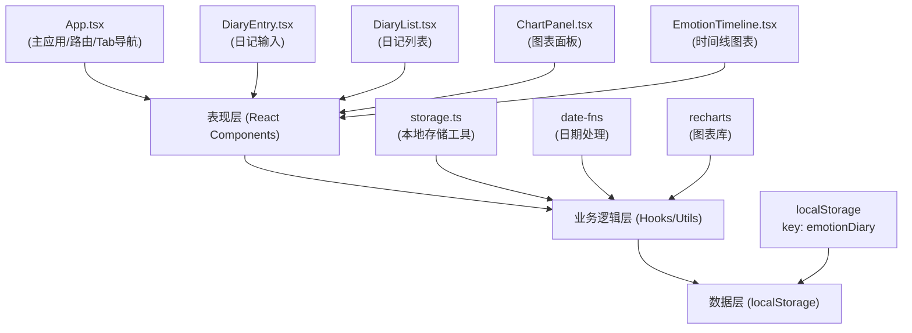

## 1. 架构设计

本应用为纯前端单页应用，使用localStorage进行数据持久化，无需后端服务。架构分为表现层、业务逻辑层和数据层。



## 2. 技术栈说明

- **前端框架**: React@18 + TypeScript@5
- **构建工具**: Vite@5 + @vitejs/plugin-react@4
- **图表库**: recharts@2（折线图、柱状图、饼图）
- **工具库**: 
  - uuid@9（生成唯一ID）
  - date-fns@3（日期格式化和相对时间计算）
  - react-window@1（虚拟滚动，性能优化）
- **数据存储**: localStorage（浏览器本地存储）
- **样式方案**: CSS Modules / 内联样式（无第三方CSS框架）

## 3. 路由与页面结构

应用使用Tab切换而非传统URL路由，通过React状态管理当前激活页面。

| Tab索引 | 页面名称 | 对应组件 | 说明 |
|---------|----------|----------|------|
| 0 | 写日记 | DiaryEntry | 情绪选择、事件描述、应对策略输入 |
| 1 | 看日记 | DiaryList | 历史日记列表，虚拟滚动，详情展开 |
| 2 | 看趋势 | ChartPanel + EmotionTimeline | 多维度情绪数据分析图表 |

## 4. 数据模型

### 4.1 数据结构定义

```typescript
// 情绪类型定义
type EmotionType = 'happy' | 'sad' | 'angry' | 'anxious' | 'calm' | 'tired' | 'surprised' | 'disgusted';

// 应对策略类型
type StrategyType = 'exercise' | 'meditation' | 'social' | 'reading' | 'other' | null;

// 日记条目数据结构
interface DiaryEntry {
  id: string;           // UUID
  date: string;         // ISO 8601 格式日期时间字符串
  emotion: EmotionType; // 情绪类型
  intensity: number;    // 情绪强度 0-10
  event: string;        // 触发事件描述（最多200字）
  strategy: StrategyType; // 应对策略（可选）
}

// 情绪配置（颜色、emoji、显示名称）
interface EmotionConfig {
  name: string;         // 中文名称
  color: string;        // 十六进制颜色
  emoji: string;        // emoji图标
  intensity: number;    // 默认强度值
}
```

### 4.2 情绪配置映射

```typescript
const EMOTIONS: Record<EmotionType, EmotionConfig> = {
  happy:     { name: '快乐', color: '#FFD54F', emoji: '😊', intensity: 8 },
  sad:       { name: '悲伤', color: '#64B5F6', emoji: '😢', intensity: 4 },
  angry:     { name: '愤怒', color: '#E53935', emoji: '😠', intensity: 7 },
  anxious:   { name: '焦虑', color: '#FF8A65', emoji: '😰', intensity: 6 },
  calm:      { name: '平静', color: '#81C784', emoji: '😌', intensity: 7 },
  tired:     { name: '疲惫', color: '#A1887F', emoji: '😫', intensity: 3 },
  surprised: { name: '惊讶', color: '#CE93D8', emoji: '😮', intensity: 7 },
  disgusted: { name: '厌恶', color: '#66BB6A', emoji: '🤢', intensity: 5 },
};
```

### 4.3 应对策略配置

```typescript
const STRATEGIES: { value: StrategyType; label: string }[] = [
  { value: 'exercise',   label: '运动' },
  { value: 'meditation', label: '冥想' },
  { value: 'social',     label: '社交' },
  { value: 'reading',    label: '阅读' },
  { value: 'other',      label: '其他' },
];
```

## 5. 组件层次结构

```
App.tsx (主应用)
├── Header (顶部导航Tab)
├── 内容区域 (淡入淡出切换)
│   ├── DiaryEntry.tsx (写日记)
│   │   ├── EmotionSelector (情绪选择面板)
│   │   ├── EventInput (事件描述输入)
│   │   ├── StrategySelector (应对策略选择)
│   │   └── SubmitButton (提交按钮)
│   ├── DiaryList.tsx (看日记)
│   │   ├── FixedSizeList (react-window虚拟滚动)
│   │   └── DiaryCard (日记卡片)
│   │       ├── Emoji图标
│   │       ├── 相对时间
│   │       ├── 删除按钮（悬停显示）
│   │       └── 详情内容（展开时显示）
│   └── ChartPanel.tsx (看趋势)
│       ├── TimeRangeSelector (时间粒度切换)
│       ├── EmotionTimeline.tsx (情绪折线图)
│       ├── WeeklyAverageChart (周均值柱状图)
│       └── PieChartModal (情绪占比饼图弹窗)
└── ConfirmModal (删除确认弹窗)
```

## 6. 目录结构

```
.
├── package.json
├── vite.config.js
├── tsconfig.json
├── index.html
├── src/
│   ├── App.tsx
│   ├── main.tsx (入口文件)
│   ├── modules/
│   │   ├── diary/
│   │   │   ├── DiaryEntry.tsx
│   │   │   └── DiaryList.tsx
│   │   └── charts/
│   │       ├── ChartPanel.tsx
│   │       └── EmotionTimeline.tsx
│   └── utils/
│       └── storage.ts
└── .trae/
    └── documents/
        ├── PRD-个人情绪日记与趋势分析应用.md
        └── 技术架构-个人情绪日记与趋势分析应用.md
```

## 7. 关键性能优化点

1. **虚拟滚动**: 使用`react-window`的`FixedSizeList`实现日记列表的虚拟滚动，只渲染可视区域内的条目
2. **图表性能**: 
   - 使用`recharts`的`isAnimationActive`控制动画，大数据量时禁用
   - 数据预处理在`useMemo`中进行，避免重复计算
3. **状态管理**: 使用React的`useState`和`useReducer`管理局部状态，避免不必要的重渲染
4. **localStorage操作**: 异步读写，使用防抖优化频繁写入
5. **组件拆分**: 合理拆分组件，使用`React.memo`优化纯展示组件

## 8. 存储工具API

```typescript
// storage.ts 导出接口
interface StorageUtils {
  // 获取所有日记
  getDiaries: () => DiaryEntry[];
  
  // 保存日记（新增或更新）
  saveDiary: (entry: DiaryEntry) => void;
  
  // 删除日记
  deleteDiary: (id: string) => void;
  
  // 清空所有日记
  clearAll: () => void;
}
```

## 9. 开发与构建配置

- **开发服务器**: Vite dev server，端口3000，开启HMR
- **TypeScript**: 严格模式（strict: true），target ES2020，moduleResolution bundler
- **构建输出**: `dist/`目录，生产环境构建
- **依赖安装**: `npm install`
- **启动命令**: `npm run dev`
