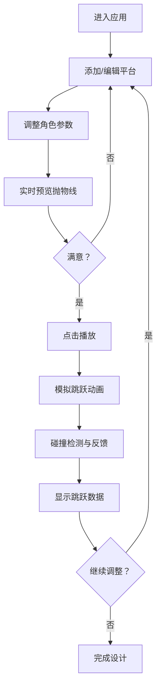

## 1. 产品概述

跑酷游戏关卡设计工具是一个面向游戏设计师的网页应用，用于快速模拟和可视化跑酷游戏中角色跳跃轨迹与平台碰撞判定。主要解决关卡设计中跳跃力度、平台间距、重力参数难以直观调整，导致角色频繁掉落或碰撞盒尺寸不合适的问题。

- 核心用户：游戏关卡设计师、独立游戏开发者
- 产品价值：将抽象的物理参数具象化，通过实时可视化反馈加速关卡迭代设计流程

## 2. 核心功能

### 2.1 用户角色
| 角色 | 注册方式 | 核心权限 |
|------|---------|---------|
| 设计师 | 无需注册，直接使用 | 完整的编辑、模拟、参数调整功能 |

### 2.2 功能模块
1. **关卡编辑器模块**：平台的添加、删除、拖拽移动、尺寸缩放
2. **角色配置模块**：跳跃速度、重力系数、水平速度的滑块调整
3. **实时模拟模块**：角色跳跃动画、抛物线绘制、碰撞检测、向量可视化
4. **数据面板模块**：跳跃数据记录与展示

### 2.3 页面详情
| 页面名称 | 模块名称 | 功能描述 |
|---------|---------|---------|
| 主工作区 | 左侧工具栏 | 工具图标：添加平台、删除、播放/暂停、重置 |
| 主工作区 | 中央编辑器 | 平台编辑、网格标尺、拖拽缩放、右键菜单 |
| 主工作区 | 右侧面板 | 角色参数滑块、跳跃数据记录面板 |
| 主工作区 | 模拟层 | 角色动画、抛物线虚线、速度向量、碰撞反馈 |

## 3. 核心流程

用户进入应用后，首先通过左侧工具栏添加平台，拖拽调整平台位置和尺寸。然后在右侧面板设置角色物理参数，滑块调整时实时预览抛物线轨迹。点击播放按钮后，角色从第一个平台起跳，沿抛物线运动至下一个平台，系统实时检测碰撞并反馈结果，同时记录跳跃数据。设计师可根据反馈反复调整参数直至满意。

## 4. 用户界面设计

### 4.1 设计风格
- **主色调**：暗色主题 `#1E1E1E` 背景，白色主字体
- **辅助色**：工具栏 `#2C2C2C`，网格线 `#424242`，图标 `#BDBDBD`
- **平台渐变色**：高度1绿色 `#81C784`，高度2橙色 `#FFB74D`，高度3红色 `#E57373`
- **滑块渐变**：蓝到红表示难度递增
- **按钮样式**：圆角矩形，悬停高亮，0.2秒 ease-in-out 过渡
- **字体**：无衬线现代字体，清晰的等宽数字用于数据展示
- **布局**：三栏式布局 - 左工具栏60px + 中编辑器70% + 右面板25%
- **图标风格**：简约线条图标，悬停白色高亮

### 4.2 页面设计概览
| 页面名称 | 模块名称 | UI元素 |
|---------|---------|---------|
| 主工作区 | 左侧工具栏 | 垂直图标按钮组、Tooltips提示、激活态高亮 |
| 主工作区 | 中央编辑器 | 网格背景、可拖拽平台（虚线边框+缩放手柄）、右键上下文菜单（圆角8px+阴影） |
| 主工作区 | 右侧面板 | 半透明深色背景 `rgba(33,33,33,0.9)`、滑块组（渐变色轨道）、数据行交替浅灰背景 |
| 主工作区 | 模拟层 | 圆形角色碰撞盒、虚线抛物线、速度（蓝）/重力（红）向量箭头、碰撞闪烁动画 |

### 4.3 响应式设计
- 桌面端优先设计（min-width: 1280px）
- 编辑器画布保持固定比例，窗口缩放时自适应调整
- 移动端降级为上下布局（工具栏→顶部，面板→底部）

### 4.4 动画与交互
- 平台拖拽：0.15秒弹性动画
- 碰撞命中：平台变绿0.3秒闪烁
- 掉落失败：角色变红 + 0.5秒震动动画
- 全局过渡：0.2秒 ease-in-out 缓动
- 性能目标：60fps模拟帧率，拖拽响应延迟 < 16ms
