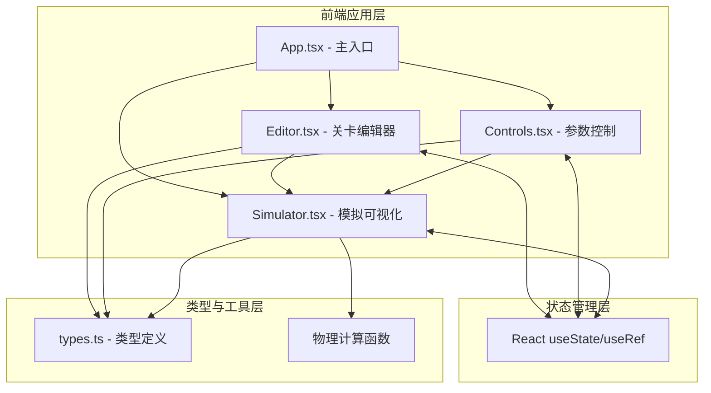
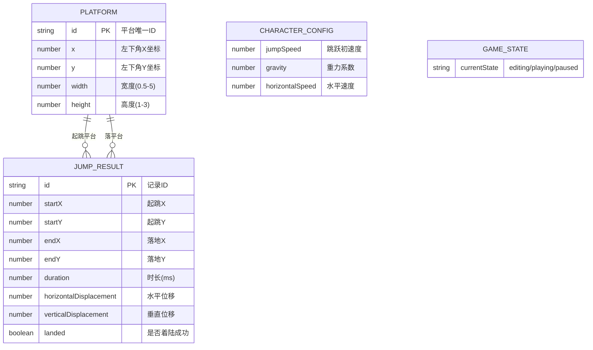

## 1. 架构设计



## 2. 技术描述
- **前端框架**：React@18 + TypeScript@5
- **构建工具**：Vite@5 + @vitejs/plugin-react
- **状态管理**：React Hooks (useState, useRef, useEffect, useCallback)
- **样式方案**：原生 CSS + CSS Modules（内联样式处理动态值）
- **渲染方案**：HTML5 Canvas 用于编辑器画布和模拟层
- **辅助库**：uuid（生成平台唯一ID）
- **后端**：无（纯前端应用）
- **数据库**：无（数据仅存在于内存中）

## 3. 路由定义
| 路由 | 用途 |
|-----|------|
| / | 主工作区（单页应用，唯一入口） |

## 4. API 定义
无后端 API，纯前端应用。内部组件接口定义如下：

### 类型接口（types.ts）
```typescript
// 平台类型
interface Platform {
  id: string;
  x: number;           // 左下角X坐标（单位：格）
  y: number;           // 左下角Y坐标（单位：格）
  width: number;       // 宽度（0.5-5格）
  height: 1 | 2 | 3;   // 高度（1-3格）
}

// 角色配置
interface CharacterConfig {
  jumpSpeed: number;      // 跳跃初速度 (5-20)
  gravity: number;        // 重力系数 (0.1-2.0)
  horizontalSpeed: number;// 水平移动速度 (3-12)
}

// 跳跃结果数据
interface JumpResult {
  id: string;
  startX: number;
  startY: number;
  endX: number;
  endY: number;
  duration: number;       // 毫秒
  horizontalDisplacement: number;
  verticalDisplacement: number;
  landed: boolean;        // 是否成功着陆
}

// 游戏状态枚举
type GameState = 'editing' | 'playing' | 'paused';

// 角色实时状态
interface CharacterState {
  x: number;
  y: number;
  vx: number;
  vy: number;
  radius: number;         // 碰撞盒半径 0.4格
}
```

### 组件 Props 接口
```typescript
// Editor 组件
interface EditorProps {
  platforms: Platform[];
  setPlatforms: React.Dispatch<React.SetStateAction<Platform[]>>;
  gameState: GameState;
  selectedPlatformId: string | null;
  setSelectedPlatformId: (id: string | null) => void;
  gridSize: number;       // 每格像素数
}

// Controls 组件
interface ControlsProps {
  config: CharacterConfig;
  setConfig: React.Dispatch<React.SetStateAction<CharacterConfig>>;
}

// Simulator 组件
interface SimulatorProps {
  platforms: Platform[];
  config: CharacterConfig;
  gameState: GameState;
  setGameState: (state: GameState) => void;
  onJumpComplete: (result: JumpResult) => void;
  gridSize: number;
}
```

## 5. 数据模型

### 6.1 数据模型定义



### 6.2 初始数据
应用启动时加载默认示例数据：
- 3个预设平台（演示不同高度和间距）
- 默认角色配置：jumpSpeed=12, gravity=0.6, horizontalSpeed=6
- 空的跳跃结果列表

## 6. 物理计算核心算法

### 抛物线轨迹计算
```
已知：初速度V，起跳角度θ（由jumpSpeed和horizontalSpeed合成）
任意时间t的位置：
  x(t) = x0 + horizontalSpeed * t
  y(t) = y0 + jumpSpeed * t - 0.5 * gravity * t²
```

### 碰撞检测算法（圆形-矩形）
```
圆形角色中心点(Cx, Cy)，半径r
矩形平台左下角(Px, Py)，宽W，高H
=> 矩形右上角(Px+W, Py+H)

最近点计算：
  nearestX = max(Px, min(Cx, Px+W))
  nearestY = max(Py, min(Cy, Py+H))

距离判断：
  dx = Cx - nearestX
  dy = Cy - nearestY
  碰撞 = dx² + dy² <= r²
  
顶部着陆判定：
  碰撞 && Cy - r >= Py + H - tolerance && vy < 0
```
