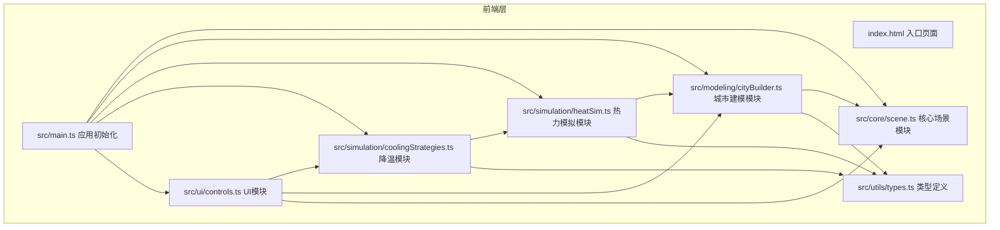

## 1. 架构设计



## 2. 技术说明
- 前端框架：TypeScript + Three.js（纯前端，无React/Vue）
- 初始化工具：Vite
- 3D渲染：Three.js + CSS2DRenderer（用于悬停标签）
- 相机控制：OrbitControls
- 构建工具：Vite，端口3000，开启HMR
- 无后端，无数据库

## 3. 模块依赖关系

| 模块 | 依赖 | 职责 |
|------|------|------|
| scene.ts | three | 管理Three.js场景、相机、OrbitControls、CSS2DRenderer、渲染循环 |
| cityBuilder.ts | scene.ts, types.ts | 生成建筑/道路/草坪/铺装几何体，管理地表格网数据，响应布局变更 |
| heatSim.ts | cityBuilder.ts, types.ts | 读取地表格网数据，计算稳态温度场，生成热力图纹理，管理动画 |
| coolingStrategies.ts | heatSim.ts, cityBuilder.ts, types.ts | 处理降温措施切换，修改地格参数，触发温度重算，计算综合效果 |
| controls.ts | coolingStrategies.ts, cityBuilder.ts, scene.ts | 管理侧边栏UI、控件交互、温度标签显示、响应式布局 |
| types.ts | 无 | 定义SurfaceMaterial、Building、GridCell、CoolingStrategy等接口 |

## 4. 数据流

```
用户操作 → controls.ts → cityBuilder.ts(布局变更) / coolingStrategies.ts(措施变更)
    → heatSim.ts(计算温度) → scene.ts(更新热力图纹理) → 渲染
```

## 5. 关键算法

### 5.1 稳态温度计算
基于简化能量平衡模型：
- 输入：每格地表材质的热容量和太阳辐射吸收率
- 环境参数：环境温度32°C、风速2m/s、相对湿度45%
- 对每个10x10米网格计算：Q_absorbed = α × Q_solar（吸收率×太阳辐射）
- 稳态温度：T_surface = T_ambient + (α × Q_solar - h_conv × (T - T_amb)) / (m × c)
- 热对流系数h_conv与风速相关
- 相邻网格间热传导影响

### 5.2 热力图色阶映射
- 温度范围28°C-52°C，每3°C一等级
- 色阶：#0000FF(28) → #00FFFF(31) → #FFFF00(34) → #FF0000(37+)
- 超出范围按最近等级映射

### 5.3 降温效果计算
- 屋顶绿化：吸收率0.9→0.5，温度降低4-7°C
- 透水铺装：道路/铺装吸收率降至0.55，温度降低2-4°C
- 增设水体：水池温度固定27°C，周围2格降温1-2°C

## 6. 文件结构
```
├── package.json
├── vite.config.js
├── tsconfig.json
├── index.html
└── src/
    ├── main.ts
    ├── core/
    │   └── scene.ts
    ├── modeling/
    │   └── cityBuilder.ts
    ├── simulation/
    │   ├── heatSim.ts
    │   └── coolingStrategies.ts
    ├── ui/
    │   └── controls.ts
    └── utils/
        └── types.ts
```

## 7. 运行方式
```bash
npm install && npm run dev
```
访问 http://localhost:3000
