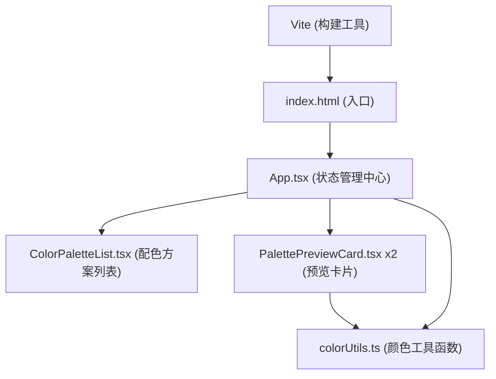

## 1. 架构设计


## 2. 技术说明
- 前端框架：React 18 + TypeScript
- 构建工具：Vite 5
- 状态管理：React useState + useCallback（组件内状态）
- 第三方依赖：uuid（生成唯一ID）
- 样式方案：原生CSS（内联样式 + CSS Modules）

## 3. 目录结构
```
auto157/
├── index.html
├── package.json
├── tsconfig.json
├── vite.config.js
└── src/
    ├── App.tsx
    ├── main.tsx
    ├── index.css
    ├── components/
    │   ├── ColorPaletteList.tsx
    │   └── PalettePreviewCard.tsx
    └── utils/
        └── colorUtils.ts
```

## 4. 数据模型

### 4.1 配色方案类型定义
```typescript
interface ColorPalette {
  id: string;
  name: string;
  primary: string;      // 主色
  secondary: string;    // 辅色
  background: string;   // 背景色
  text: string;         // 文字色
  accent: string;       // 强调色
  isCustom?: boolean;   // 是否为自定义
}

interface ContrastScore {
  primaryBg: number;      // 主色-背景对比度
  textBg: number;         // 文字-背景对比度
  primaryBgLevel: '优' | '良' | '差';
  textBgLevel: '优' | '良' | '差';
  totalScore: number;     // 综合评分 0-100
}
```

## 5. 核心模块说明

### 5.1 colorUtils.ts（纯函数模块）
- `hexToRgb(hex: string): { r: number; g: number; b: number }`
  - 十六进制颜色转RGB
- `getRelativeLuminance(r: number, g: number, b: number): number`
  - 计算相对亮度（WCAG标准）
- `getContrastRatio(color1: string, color2: string): number`
  - 计算两色对比度比值
- `ratioToLevel(ratio: number): '优' | '良' | '差'`
  - 根据对比度返回等级（≥7优，≥4.5良，<4.5差）
- `calculateScore(primaryBgRatio: number, textBgRatio: number): ContrastScore`
  - 计算综合评分对象
- `paletteToCssVariables(palette: ColorPalette): string`
  - 配色方案转CSS变量字符串

### 5.2 ColorPaletteList.tsx（配色方案列表）
Props：
- `presets: ColorPalette[]` - 预设色板
- `customPalettes: ColorPalette[]` - 自定义色板
- `selectedId: string | null` - 选中ID
- `onSelect: (id: string) => void` - 选中回调
- `onAddCustom: (palette: ColorPalette) => void` - 添加自定义回调

### 5.3 PalettePreviewCard.tsx（预览卡片）
Props：
- `palette: ColorPalette` - 配色方案
- `label: string` - 卡片标签（如"方案A"）
内部计算并展示评分

### 5.4 App.tsx（主应用）
状态：
- `presets: ColorPalette[]` - 10套预设色板（常量）
- `customPalettes: ColorPalette[]` - 自定义列表
- `selectedAId: string` - 方案A选中ID
- `selectedBId: string` - 方案B选中ID
- `copySuccess: boolean` - 导出复制成功提示状态
