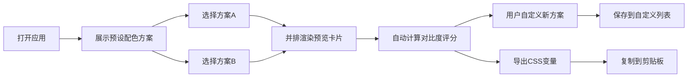

## 1. 产品概述
配色工坊是一款面向前端开发者的网页配色方案对比工具，帮助用户在设计初期从多个候选配色中直观判断整体视觉和谐度、文本可读性和按钮交互一致性。

- 目标用户：前端开发者、UI设计师
- 核心价值：提供WCAG标准的客观评分和可视化预览对比，加速配色决策过程

## 2. 核心功能

### 2.1 用户角色
无需用户登录，所有功能面向访客开放

### 2.2 功能模块
1. **配色方案管理**：预设10套主题色板，支持自定义色值输入和保存
2. **预览对比模式**：两套方案并排渲染，展示统一页面元素
3. **客观评分系统**：基于WCAG对比度标准自动计算可读性评分
4. **导出功能**：导出为CSS变量代码片段

### 2.3 页面详情
| 页面名称 | 模块名称 | 功能描述 |
|-----------|-------------|---------------------|
| 主页面 | 配色方案列表 | 横向滚动展示预设和自定义色板圆点，选中时放大并发光 |
| 主页面 | 对比预览区 | 并排渲染两张预览卡片，展示标题、正文、按钮、卡片元素 |
| 主页面 | 评分展示区 | 每张卡片底部显示对比度分数条和可读性评级 |
| 主页面 | 导出区 | 导出按钮，复制CSS变量到剪贴板并显示提示 |

## 3. 核心流程
用户打开应用后，预设配色方案展示在顶部横向滚动条中。用户选择两套配色方案，系统自动在预览区并排渲染并计算评分。用户可自定义新方案并保存，或导出当前选中方案的CSS变量代码。

## 4. 用户界面设计

### 4.1 设计风格
- 背景色：#FAFAFA（浅色）
- 主操作区：居中，最大宽度1200px，左右留白自适应
- 色板圆点：40x40px，选中时48x48px，金色#FFD700外发光
- 卡片圆角：12px，1px实线边框，内间距16px
- 按钮交互：悬停0.3秒缩放1.05，阴影加深
- 卡片点击：0.2秒涟漪波纹反馈
- 标题渐变：从左到右，1秒过渡

### 4.2 页面设计概述
| 页面名称 | 模块名称 | UI元素 |
|-----------|-------------|-------------|
| 主页面 | 配色方案列表 | 横向滚动条、色板圆点、自定义输入框 |
| 主页面 | 预览卡片 | 弹性布局两列、间距24px、响应式单列 |
| 主页面 | 评分条 | 颜色等级条（绿/橙/红）、分数（满分100）、评级文字 |
| 主页面 | 导出按钮 | 复制功能、淡出提示"已复制" |

### 4.3 响应式
桌面优先设计，屏幕宽度小于768px时对比卡片自动改为单列纵向堆叠。配色方案列表始终使用横向滚动条。

### 4.4 性能要求
- 切换配色方案响应时间 ≤ 200ms
- 对比度计算响应时间 ≤ 200ms
- 多卡片同时渲染帧率 ≥ 30fps
