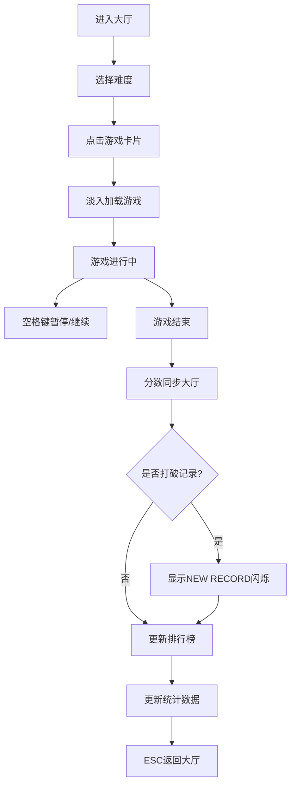

## 1. 产品概述
复古像素风格迷你游戏集合平台，玩家可在统一大厅选择并启动三款经典迷你游戏（贪吃蛇、打砖块、赛车），记录每款游戏的最高分和游玩时长，提供沉浸式像素游戏体验。

- **主要用途**：提供休闲娱乐体验，整合多款经典像素游戏
- **目标用户**：复古游戏爱好者、休闲玩家
- **产品价值**：一站式像素游戏体验平台，统一的游戏控制和分数管理

## 2. 核心功能

### 2.1 用户角色
| 角色 | 注册方式 | 核心权限 |
|------|----------|----------|
| 玩家 | 无需注册，本地存储 | 选择游戏、设置难度、查看排行榜、游玩游戏 |

### 2.2 功能模块
1. **游戏大厅**：游戏卡片展示、难度选择、分数排行、统计数据
2. **贪吃蛇游戏**：经典贪吃蛇玩法，网格移动，吃食物增长
3. **打砖块游戏**：挡板接球，击碎砖块，粒子特效
4. **赛车游戏**：躲避障碍，卷轴赛道，速度递增

### 2.3 页面详情
| 页面名称 | 模块名称 | 功能描述 |
|----------|----------|----------|
| 游戏大厅 | 游戏卡片网格 | 2列布局展示3款游戏，悬停动画，点击启动 |
| 游戏大厅 | 难度选择器 | 顶部下拉菜单，简单/普通/困难三档，实时切换边框颜色 |
| 游戏大厅 | 分数排行 | 每张卡片显示历史最高分，新记录闪烁提示 |
| 游戏大厅 | 统计面板 | 底部显示总游玩次数、总时长、总分数 |
| 游戏界面 | 游戏画布 | 全屏Canvas渲染，响应式适配 |
| 游戏界面 | 暂停系统 | 空格键暂停/继续，半透明蒙层，PAUSED文字 |
| 游戏界面 | 返回大厅 | ESC键返回，淡入淡出过渡动画 |

## 3. 核心流程

玩家进入大厅 → 选择难度 → 点击游戏卡片 → 游戏淡入加载 → 游戏进行中（可暂停）→ 游戏结束 → 分数同步回大厅 → 显示新记录提示（若打破）→ 更新统计数据

## 4. 用户界面设计

### 4.1 设计风格
- **主色调**：深色背景 #1a1a2e，卡片色彩区分（贪吃蛇绿#2e7d32、打砖块蓝#1565c0、赛车红#c62828）
- **强调色**：金色#ffd700（分数、选中边框），难度色（简单#81c784、普通#ffb74d、困难#e57373）
- **字体**：Press Start 2P 像素字体，通过Google Fonts加载
- **卡片样式**：圆角12px，悬停Y轴-8px上浮，阴影过渡动画0.2s
- **按钮风格**：像素风格，#e0e0e0文字，交互时颜色变化和微小缩放

### 4.2 页面设计概述
| 页面名称 | 模块名称 | UI元素 |
|----------|----------|--------|
| 游戏大厅 | 卡片网格 | 2列gap 20px，300x200px卡片，悬停动效，难度标签 |
| 游戏大厅 | 难度选择 | 顶部下拉，切换时卡片边框颜色变化 |
| 游戏大厅 | 分数显示 | 金色#ffd700等宽字体，新记录0.5秒闪烁 |
| 游戏大厅 | 统计面板 | 底部显示总游玩次数、总时长、总分数 |
| 游戏界面 | 画布 | 全屏100%宽100vh，60fps渲染 |
| 游戏界面 | 暂停蒙层 | #000000 60%不透明度，白色48px PAUSED文字居中 |
| 游戏界面 | 过渡动画 | 淡入淡出0.3秒切换 |

### 4.3 响应式
- **桌面优先**：默认2列卡片布局
- **移动端**：屏幕宽度<768px时改为单列布局，卡片宽度自适应
- **触摸优化**：游戏区域支持触摸操作（可选扩展）

### 4.4 动画与交互
- 卡片悬停：transform: translateY(-8px)，阴影加深
- 游戏加载：opacity 0→1 0.3秒淡入
- 新记录提示：0.5秒交替显示/隐藏
- 食物脉冲：0.5秒缩放1.0→1.2→1.0
- 砖块破碎：10个粒子随机扩散，0.3秒消失
