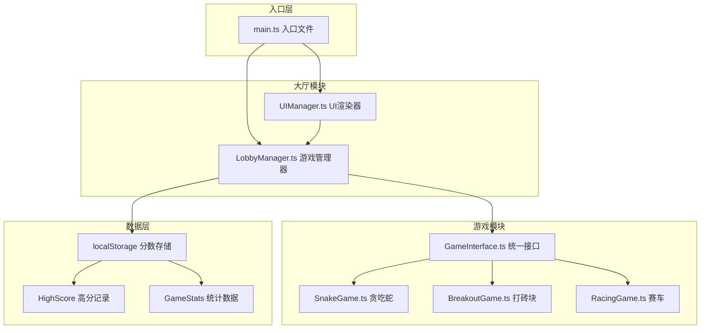

## 1. 架构设计



## 2. 技术描述
- **前端**：TypeScript + Vite，纯Canvas实现，无UI框架
- **构建工具**：Vite 5.x，端口3000，开启HMR
- **语言**：TypeScript 5.x，严格模式，target ES2020
- **字体**：Google Fonts - Press Start 2P
- **数据存储**：localStorage 本地持久化
- **依赖**：typescript、vite、@types/node、uuid

## 3. 模块定义

### 3.1 核心接口 (GameInterface)
```typescript
interface GameModule {
  init(canvas: HTMLCanvasElement, config: GameConfig): void;
  start(): void;
  pause(): void;
  resume(): void;
  destroy(): void;
  getScore(): number;
}

interface GameConfig {
  difficulty: 'easy' | 'normal' | 'hard';
  onGameEnd: (score: number) => void;
}
```

### 3.2 类型定义
```typescript
type Difficulty = 'easy' | 'normal' | 'hard';

interface HighScore {
  gameId: string;
  score: number;
  date: string;
}

interface GameStats {
  totalPlays: number;
  totalDuration: number;
  totalScore: number;
}

interface GameInfo {
  id: string;
  name: string;
  description: string;
  color: string;
  module: GameModule;
}
```

## 4. 文件结构
```
.
├── package.json
├── vite.config.js
├── tsconfig.json
├── index.html
└── src/
    ├── main.ts              # 入口文件
    ├── lobby/
    │   ├── LobbyManager.ts  # 游戏列表、分数、难度管理
    │   └── UIManager.ts     # 大厅UI渲染
    └── games/
        ├── GameInterface.ts # 统一游戏接口
        ├── snake/
        │   └── SnakeGame.ts # 贪吃蛇游戏
        ├── breakout/
        │   └── BreakoutGame.ts # 打砖块游戏
        └── racing/
            └── RacingGame.ts # 赛车游戏
```

## 5. 数据模型

### 5.1 本地存储结构
```typescript
// localStorage key: 'pixel_game_highscores'
{
  "snake": { "score": 100, "date": "2024-01-01" },
  "breakout": { "score": 250, "date": "2024-01-01" },
  "racing": { "score": 45, "date": "2024-01-01" }
}

// localStorage key: 'pixel_game_stats'
{
  "totalPlays": 50,
  "totalDuration": 3600,
  "totalScore": 5000
}
```

## 6. 性能约束
- **帧率**：游戏运行60fps（requestAnimationFrame），暂停时1fps
- **启动时间**：游戏初始化<100ms
- **内存管理**：游戏销毁时清理定时器和事件监听
- **动画**：CSS transitions 硬件加速
