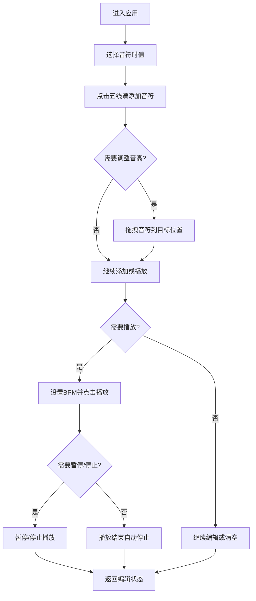

## 1. 产品概述

在线乐谱编辑器与简易播放预览应用，让用户可以在网页上创建、编辑和播放简单的单旋律乐谱。面向音乐爱好者、音乐学习者和创作者，提供轻量级的乐谱编写和听觉预览体验。

## 2. 核心功能

### 2.1 功能模块

1. **乐谱编辑区**：五线谱可视化编辑，支持点击添加/删除音符、拖拽调整音高
2. **播放引擎**：Web Audio API 合成钢琴音色，支持播放/暂停/停止、BPM 调节
3. **控制工具栏**：播放控制、BPM 调节、清空乐谱、撤销/重做
4. **时值选择器**：全音符、二分、四分、八分、十六分音符时值选择

### 2.2 页面详情

| 页面名称 | 模块名称 | 功能描述 |
|-----------|-------------|---------------------|
| 主页面 | 标题栏 | 显示应用名称"乐谱工坊" |
| 主页面 | 乐谱编辑区 | 高音谱号五线谱（C3-C5），可点击网格添加/删除音符，拖拽调整音高 |
| 主页面 | 时值选择栏 | 五种音符时值选择，选中高亮 |
| 主页面 | 播放控制栏 | 播放/暂停/停止按钮、BPM 滑块、清空按钮、撤销/重做 |

## 3. 核心流程

用户进入应用 → 选择音符时值 → 在五线谱上点击添加音符 → 可拖拽调整音高 → 设置 BPM → 点击播放预览 → 可暂停/停止/清空/撤销重做

## 4. 用户界面设计

### 4.1 设计风格

- **主色调**：深色主题，主背景 #1E1E2E，编辑区背景 #2A2A3E
- **强调色**：音符金黄色 #F9A825，拖拽时橙红色 #FF7043，选中态蓝色 #64B5F6，播放高亮淡蓝色 #BBDEFB
- **辅助色**：五线谱线条 #A0A0B0，文字 #E0E0E0，BPM 滑块紫色 #7E57C2
- **按钮风格**：圆角按钮，选中态背景变化 0.3 秒过渡
- **字体**：无衬线字体，标题 24px/700 字重
- **布局**：居中 80% 宽度，左右纯色留白
- **动画**：音符添加弹入动画 0.2s，播放高亮闪烁，所有交互过渡 0.2-0.3s

### 4.2 页面设计概览

| 页面名称 | 模块名称 | UI 元素 |
|-----------|-------------|-------------|
| 主页面 | 标题栏 | 左上角"乐谱工坊"文字，24px，#E0E0E0，700字重 |
| 主页面 | 五线谱编辑区 | 五条水平线（#A0A0B0，1.5px），高音谱号白色，金黄色椭圆符头，网格可点击 |
| 主页面 | 时值选择栏 | 五个按钮，默认 #E0E0E0 背景，选中 #64B5F6 白色文字 |
| 主页面 | 播放控制栏 | 播放/暂停/停止按钮，BPM 滑块（#444466 轨道，#7E57C2 圆形滑块），清空按钮 |

### 4.3 响应式

桌面端优先，编辑器面板固定 80% 宽度居中显示。
