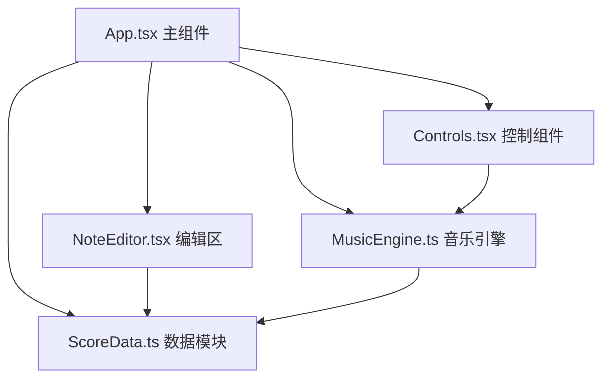

## 1. 架构设计



## 2. 技术说明

- **前端框架**：React 18 + TypeScript
- **构建工具**：Vite（端口 3000，HMR 开启）
- **音频引擎**：Web Audio API 原生实现
- **状态管理**：React useState/useReducer + 自定义历史栈（撤销/重做）
- **依赖库**：uuid（生成唯一 ID）

## 3. 数据模型

### 3.1 核心类型定义

```typescript
// 音符时值类型
export type NoteDuration = 'whole' | 'half' | 'quarter' | 'eighth' | 'sixteenth';

// 单个音符
export interface Note {
  id: string;           // 唯一 ID
  pitch: number;        // MIDI 音高编号 (C3=48 到 C5=72)
  duration: NoteDuration;
  startTime: number;    // 起始时间位置（以八分音符为单位，0-63）
}

// 乐谱数据
export interface ScoreData {
  notes: Note[];
  bpm: number;
}
```

### 3.2 工具函数

- `serializeScore(score: ScoreData): string` - 序列化为 JSON
- `deserializeScore(json: string): ScoreData` - 从 JSON 反序列化
- `getFrequencyFromMidi(midi: number): number` - MIDI 转频率
- `getDurationBeats(duration: NoteDuration): number` - 时值转换为拍数

## 4. 模块职责

### 4.1 ScoreData.ts
- 定义 Note、ScoreData、NoteDuration 类型
- 序列化/反序列化函数
- 音高频率换算、时值换算等纯函数工具

### 4.2 MusicEngine.ts
- 封装 Web Audio API
- 合成钢琴音色（正弦波 + 泛音）
- 播放序列调度（基于 BPM 和 startTime）
- play() / pause() / stop() 控制
- 播放进度回调（用于高亮当前音符列）

### 4.3 NoteEditor.tsx
- SVG 渲染五线谱、高音谱号、网格、音符
- 点击网格添加/删除音符
- 垂直拖拽调整音高
- 播放时高亮当前列
- 动画效果（弹入、过渡、闪烁）

### 4.4 Controls.tsx
- 播放/暂停/停止按钮
- BPM 滑块（40-240，步长 5）
- 清空按钮
- 时值选择按钮
- 撤销/重做按钮
- 键盘快捷键监听（Ctrl+Z / Ctrl+Y）

### 4.5 App.tsx
- 管理全局状态：notes、selectedDuration、bpm、isPlaying、currentColumn
- 撤销/重做历史栈（最多 20 步）
- 组件间数据传递与事件回调
- 整体布局与主题样式
