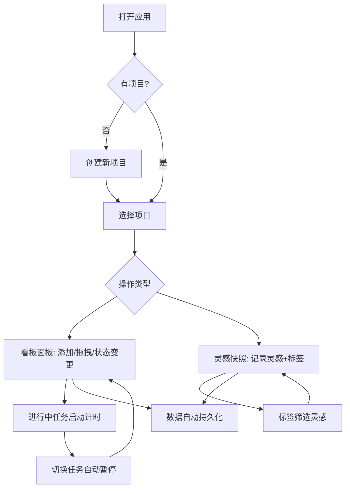

## 1. 产品概述

创意流水账是一款面向小型团队和个人创作者的轻量级创意项目管理应用，帮助用户在多个并发创意项目（如写作、视频制作、设计）中集中管理灵感、拆解任务优先级并量化时间投入，解决灵感分散、任务混乱、进展缓慢的核心痛点。

- 目标用户：独立创作者、小型创意团队（1-5人）
- 核心价值：将碎片化的创意灵感与结构化的任务管理统一，通过时间追踪让投入可视化，驱动项目从"想法"到"完成"

## 2. 核心功能

### 2.1 用户角色

| 角色 | 注册方式 | 核心权限 |
|------|----------|----------|
| 个人用户 | 无需注册，本地使用 | 创建/编辑/删除项目、任务、灵感，追踪时间 |

### 2.2 功能模块

1. **主页面**：项目看板（左栏项目列表 + 右栏项目详情），包含看板面板与灵感快照面板切换

### 2.3 页面详情

| 页面名称 | 模块名称 | 功能描述 |
|----------|----------|----------|
| 主页面 | 项目列表 | 左栏展示所有项目卡片（毛玻璃效果），支持创建/命名/删除项目，点击切换选中项目 |
| 主页面 | 看板面板 | 右栏展示当前项目的待办任务卡片，卡片按优先级拖拽排序，状态分为待开始/进行中/已完成，拖拽时0.25秒弹性缓动，完成后卡片变淡+文字划线 |
| 主页面 | 灵感快照面板 | 右栏展示当前项目的灵感条目列表，支持添加纯文本/Markdown简化格式灵感，附带时间戳和标签，按时间倒序，标签筛选高亮 |
| 主页面 | 时间追踪 | 进行中任务卡片旁的启动/暂停计时按钮，精确到秒（等宽字体00:00:00），计时中按钮脉冲动画，切换任务自动暂停上一个，项目卡片底部显示今日时长和总时长 |
| 主页面 | 数据持久化 | 所有数据存储在localStorage，页面刷新不丢失，首次加载0.5秒淡入动画 |

## 3. 核心流程

用户打开应用 → 查看项目列表 → 选中或创建项目 → 在看板面板添加/拖拽/变更任务状态 → 为进行中任务启动计时 → 在灵感快照面板记录灵感并打标签 → 切换项目继续工作 → 数据自动持久化

## 4. 用户界面设计

### 4.1 设计风格

- **主色调**：深色主题，背景#1A1A2E，卡片面板#16213E，标题高亮#E94560，正文#EAF0F1
- **输入框**：背景#0F3460，聚焦边框#533483
- **按钮**：主色#E94560，悬停#FF6B6B
- **标签圆点颜色**：视觉=#FF6B6B，声音=#4ECDC4，文字=#FFE66D，交互=#95E1D3，其他=#F38181
- **字体**：标题使用醒目的无衬线体，计时数字使用等宽字体（monospace），正文清晰可读
- **布局**：左右两栏，毛玻璃效果（背景模糊10px，圆角12px）
- **动画**：拖拽0.25秒弹性缓动，状态变更0.2秒透明度过渡，首次加载0.5秒淡入，计时按钮脉冲动画

### 4.2 页面设计概览

| 页面名称 | 模块名称 | UI元素 |
|----------|----------|--------|
| 主页面 | 项目列表 | 毛玻璃卡片，项目名称，今日时长/总时长，选中高亮，添加按钮，删除按钮 |
| 主页面 | 看板面板 | 任务卡片（优先级拖拽排序），状态标记（待开始/进行中/已完成），计时按钮，添加任务输入框 |
| 主页面 | 灵感快照面板 | 灵感输入框（支持Markdown粗体和链接），标签选择器（彩色圆点），灵感列表（时间倒序），筛选标签按钮组 |

### 4.3 响应式

- 桌面优先设计，宽度≥768px时左右两栏布局
- 宽度<768px时自动切换为上下单列布局
- 所有卡片宽度自适应100%
- 触摸优化：拖拽操作支持触摸事件

### 4.4 性能要求

- 拖拽响应帧率不低于50FPS
- 计时器更新延迟不超过100ms
- 所有数据使用localStorage持久化
