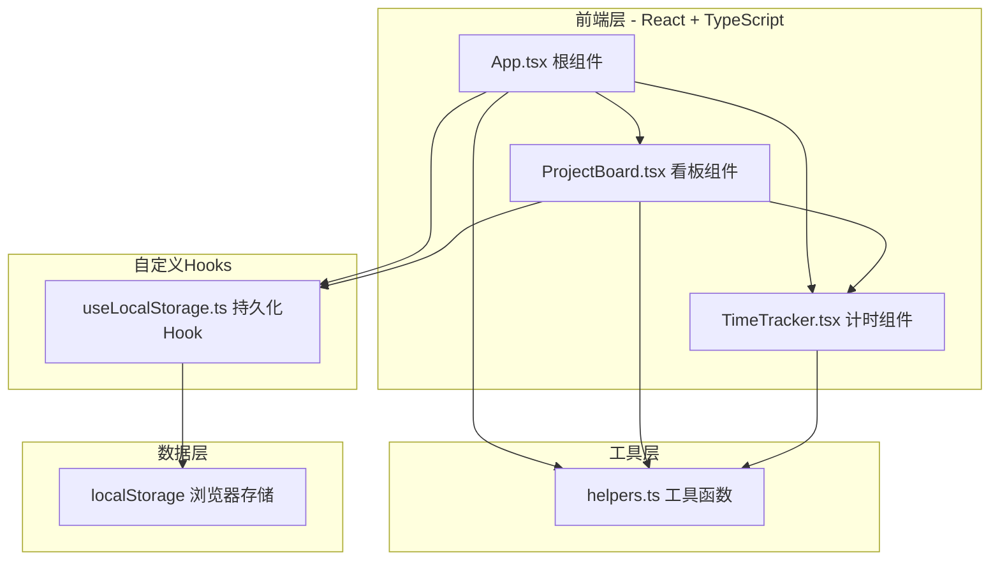
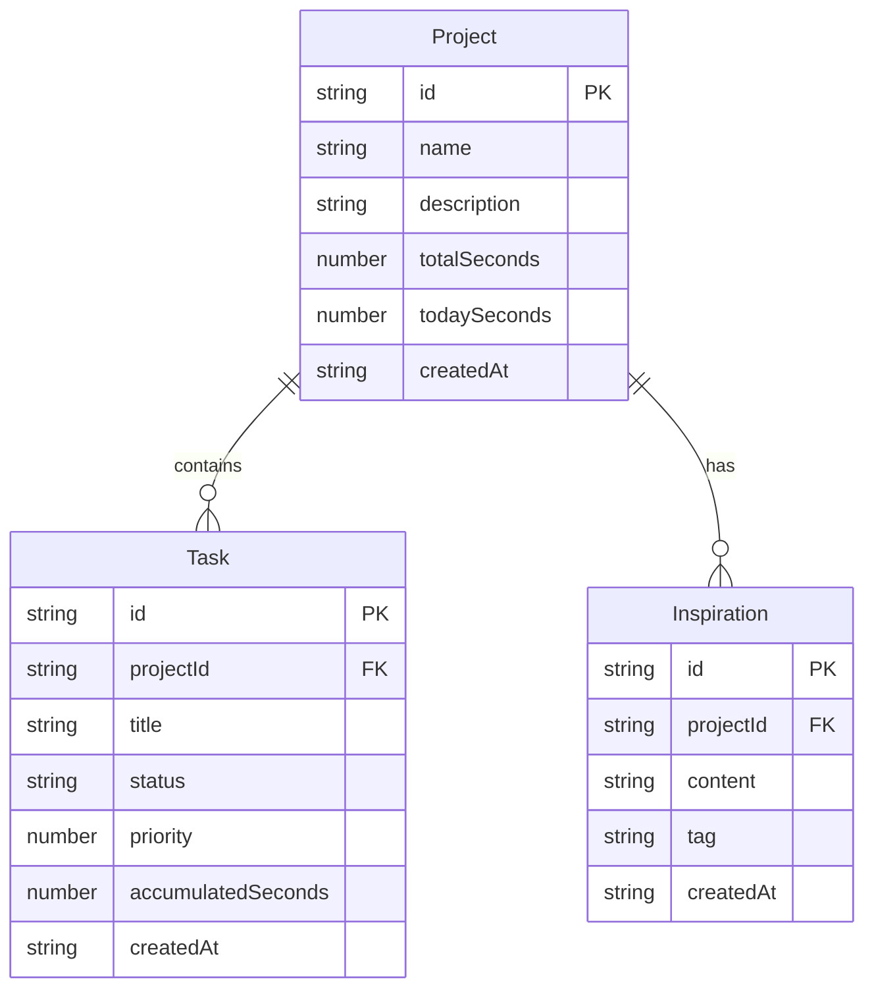

## 1. 架构设计



## 2. 技术说明

- **前端**：React@18 + TypeScript + Vite
- **初始化工具**：Vite
- **后端**：无（纯前端应用）
- **数据库**：localStorage（浏览器本地存储）
- **依赖**：react, react-dom, typescript, vite, @vitejs/plugin-react, uuid, date-fns
- **样式**：CSS-in-JS（内联样式 + CSS模块）

## 3. 路由定义

| 路由 | 用途 |
|------|------|
| / | 主页面，包含项目列表和项目详情（看板/灵感切换） |

> 注：本应用为单页面应用，无多路由需求，项目切换通过状态管理实现。

## 4. 数据模型

### 4.1 数据模型定义



### 4.2 数据定义

```typescript
interface Project {
  id: string;
  name: string;
  description: string;
  totalSeconds: number;
  todaySeconds: number;
  createdAt: string;
}

type TaskStatus = "todo" | "inProgress" | "done";

interface Task {
  id: string;
  projectId: string;
  title: string;
  status: TaskStatus;
  priority: number;
  accumulatedSeconds: number;
  createdAt: string;
}

type InspirationTag = "视觉" | "声音" | "文字" | "交互" | "其他";

interface Inspiration {
  id: string;
  projectId: string;
  content: string;
  tag: InspirationTag;
  createdAt: string;
}
```

## 5. 文件组织

```
├── package.json
├── vite.config.js
├── tsconfig.json
├── index.html
└── src/
    ├── App.tsx
    ├── components/
    │   ├── ProjectBoard.tsx
    │   └── TimeTracker.tsx
    ├── hooks/
    │   └── useLocalStorage.ts
    └── utils/
        └── helpers.ts
```

## 6. 关键技术决策

1. **拖拽排序**：使用HTML5原生拖拽API实现，避免引入额外依赖，确保50FPS性能
2. **计时器**：使用setInterval(100ms)高频更新，显示精确到秒，通过requestAnimationFrame优化渲染
3. **Markdown简化格式**：自行实现粗体和链接的正则解析，不引入完整Markdown库
4. **状态管理**：使用React useState + props传递，不引入Redux等状态管理库，保持轻量
5. **持久化**：useLocalStorage自定义Hook封装，每次状态变更自动同步localStorage
6. **动画**：CSS transition + keyframe animation实现，不引入动画库
