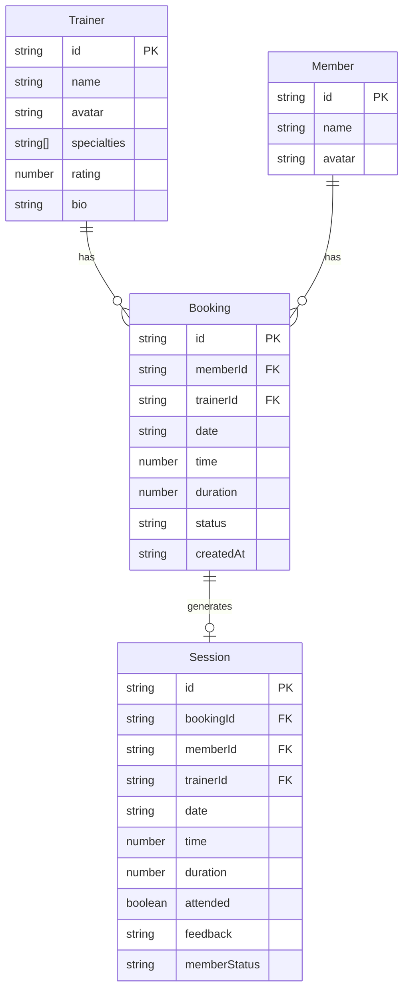

## 1. 架构设计

```mermaid
graph TB
    "前端 React+TypeScript" --> "Vite Dev Server :3000"
    "Vite Dev Server :3000" --> "代理 /api → :4000"
    "Express 后端 :4000" --> "内存数据存储"
    "前端 React+TypeScript" --> "Zustand 状态管理"
    "前端 React+TypeScript" --> "React Router 路由"
    "前端 React+TypeScript" --> "Axios HTTP客户端"
```

### 数据流向
```mermaid
graph LR
    "用户交互" --> "React组件"
    "React组件" --> "Zustand Store"
    "Zustand Store" --> "Axios API调用"
    "Axios API调用" --> "Express Router"
    "Express Router" --> "内存数据(数组)"
    "内存数据(数组)" --> "JSON响应"
    "JSON响应" --> "Zustand Store"
    "Zustand Store" --> "React组件UI更新"
```

## 2. 技术说明

- 前端：React 18 + TypeScript + Vite + TailwindCSS + Zustand + React Router DOM + Axios
- 初始化工具：vite-init (react-express-ts 模板)
- 后端：Express 4 + TypeScript + CORS + UUID
- 数据库：内存存储（数组对象）
- 图表：纯CSS柱状图实现

## 3. 路由定义

| 路由 | 用途 |
|------|------|
| / | 首页，显示欢迎和快捷入口 |
| /booking | 会员预约页面，教练列表和时间段选择 |
| /history | 历史记录页面，分页显示预约历史 |
| /trainer | 教练日程管理页面，课程列表和评价 |
| /stats | 管理员统计看板页面，数据概览和趋势图 |

## 4. API 定义

### 4.1 教练相关
| 方法 | 路径 | 描述 | 请求体 | 响应 |
|------|------|------|--------|------|
| GET | /api/trainers | 获取所有教练列表 | - | Trainer[] |
| GET | /api/trainers/:id | 获取教练详情 | - | Trainer |
| GET | /api/trainers/:id/slots | 获取教练可预约时段 | - | Slot[] |

### 4.2 预约相关
| 方法 | 路径 | 描述 | 请求体 | 响应 |
|------|------|------|--------|------|
| POST | /api/bookings | 创建预约 | {memberId, trainerId, date, time, duration} | Booking |
| GET | /api/bookings?memberId= | 获取会员预约列表 | - | Booking[] |
| DELETE | /api/bookings/:id | 取消预约 | - | {success} |

### 4.3 课程/出勤相关
| 方法 | 路径 | 描述 | 请求体 | 响应 |
|------|------|------|--------|------|
| GET | /api/sessions?trainerId= | 获取教练课程列表 | - | Session[] |
| PUT | /api/sessions/:id | 更新课程状态(出勤+评价) | {attended, feedback, memberStatus} | Session |

### 4.4 统计相关
| 方法 | 路径 | 描述 | 请求体 | 响应 |
|------|------|------|--------|------|
| GET | /api/stats/dashboard | 获取看板数据 | - | DashboardStats |

### 4.5 TypeScript 类型定义

```typescript
interface Trainer {
  id: string;
  name: string;
  avatar: string;
  specialties: string[];
  rating: number;
  bio: string;
}

interface Member {
  id: string;
  name: string;
  avatar: string;
}

interface Slot {
  date: string;
  time: number;
  available: boolean;
  bookingId?: string;
}

interface Booking {
  id: string;
  memberId: string;
  trainerId: string;
  date: string;
  time: number;
  duration: 30 | 45 | 60;
  status: 'booked' | 'attended' | 'cancelled';
  createdAt: string;
}

interface Session {
  id: string;
  bookingId: string;
  memberId: string;
  trainerId: string;
  date: string;
  time: number;
  duration: number;
  attended: boolean;
  feedback?: string;
  memberStatus?: 'progress' | 'maintain' | 'decline';
}

interface DashboardStats {
  todayBookings: number;
  weeklyActiveTrainers: number;
  weeklyActiveMembers: number;
  dailyBookings: { date: string; count: number }[];
}
```

## 5. 服务端架构图

```mermaid
graph TD
    "Express Router" --> "trainerRouter"
    "Express Router" --> "bookingRouter"
    "Express Router" --> "sessionRouter"
    "Express Router" --> "statsRouter"
    "trainerRouter" --> "内存数据: trainers[]"
    "bookingRouter" --> "内存数据: bookings[]"
    "sessionRouter" --> "内存数据: sessions[]"
    "statsRouter" --> "聚合查询: bookings[] + trainers[] + members[]"
```

## 6. 数据模型

### 6.1 数据模型定义



### 6.2 初始数据
- 6个教练：涵盖瑜伽、力量训练、普拉提、有氧操、拳击、拉伸等专长
- 10个会员：预置会员数据
- 预置部分预约和课程记录用于演示

## 7. 文件结构与调用关系

```
project/
├── package.json              # 依赖和启动脚本
├── vite.config.js            # Vite配置，端口3000，代理/api→4000
├── tsconfig.json             # TypeScript严格模式配置
├── index.html                # 入口HTML
├── src/
│   ├── client/
│   │   ├── App.tsx           # 主组件，路由分发，API调用
│   │   ├── pages/
│   │   │   ├── HomePage.tsx      # 首页
│   │   │   ├── MemberPage.tsx    # 会员预约页面
│   │   │   ├── TrainerPage.tsx   # 教练日程页面
│   │   │   ├── StatsPage.tsx     # 统计看板页面
│   │   │   └── HistoryPage.tsx   # 历史记录页面
│   │   ├── components/       # 可复用组件
│   │   │   ├── Layout.tsx        # 布局(导航栏+侧边栏)
│   │   │   ├── TrainerCard.tsx   # 教练卡片
│   │   │   ├── SlotGrid.tsx      # 时段网格
│   │   │   ├── SessionCard.tsx   # 课程卡片
│   │   │   ├── FeedbackModal.tsx # 评价弹窗
│   │   │   ├── BarChart.tsx      # 柱状图
│   │   │   ├── Loading.tsx       # 加载动画
│   │   │   └── Toast.tsx         # 提示消息
│   │   ├── store/            # Zustand状态管理
│   │   │   └── useStore.ts       # 全局状态
│   │   └── styles/           # 样式文件
│   │       └── global.css        # 全局样式
│   └── server/
│       └── server.ts         # Express服务端，端口4000，CRUD，内存数据
└── shared/
    └── types.ts              # 共享类型定义
```

### 调用关系
- `App.tsx` → `Layout.tsx` → 各页面组件
- `MemberPage.tsx` → `TrainerCard.tsx` → `SlotGrid.tsx` → `POST /api/bookings`
- `TrainerPage.tsx` → `SessionCard.tsx` → `FeedbackModal.tsx` → `PUT /api/sessions`
- `StatsPage.tsx` → `BarChart.tsx` → `GET /api/stats/dashboard`
- `HistoryPage.tsx` → `GET /api/bookings?memberId=`
- 各组件 → `useStore.ts` (Zustand全局状态)
- 所有API调用通过Axios，经Vite代理转发到Express后端
