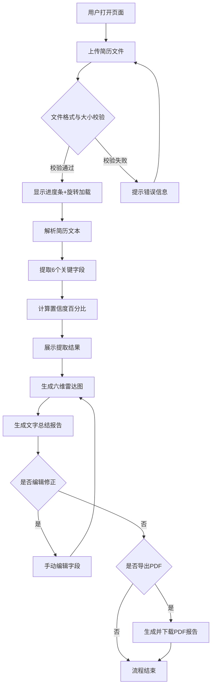

## 1. 产品概述

简历解析大师是一款面向HR和招聘人员的在线简历智能解析与评估工具。用户上传PDF或图片格式简历后，系统自动提取6个关键字段并生成综合评分雷达图，帮助招聘人员快速评估候选人资质。

- 目标用户：HR、招聘人员、猎头
- 核心价值：将简历人工审阅从分钟级缩短至秒级，提供可视化能力评估和一键导出报告

## 2. 核心功能

### 2.1 用户角色

| 角色 | 注册方式 | 核心权限 |
|------|----------|----------|
| 招聘人员 | 无需注册 | 上传简历、查看解析结果、编辑修正、导出PDF报告 |

### 2.2 功能模块

1. **主页**：文件上传区、解析结果展示区、雷达图与评分区、导出功能区

### 2.3 页面详情

| 页面名称 | 模块名称 | 功能描述 |
|----------|----------|----------|
| 主页 | 文件上传区 | 支持拖拽/点击上传PDF/PNG/JPG，显示进度条、文件大小限制提示（10MB上限）、格式校验、旋转加载动画 |
| 主页 | 字段提取结果区 | 展示6个提取字段（姓名、邮箱、电话、教育背景、工作经历、技能标签），每个字段旁显示置信度百分比（绿/黄/红三色），支持手动编辑修正 |
| 主页 | 评分雷达图区 | Canvas绘制六维能力雷达图，平滑动画+渐变填充色，柔和背景突出图表 |
| 主页 | 文字总结报告区 | 基于提取字段自动生成文字总结，支持一键导出PDF（含雷达图截图+文字报告） |

## 3. 核心流程

用户打开页面 → 上传简历文件（拖拽或点击）→ 系统校验文件格式和大小 → 显示进度条和旋转加载动画 → 解析完成自动滚动到结果区 → 展示6个字段提取结果和置信度 → 用户可手动编辑修正 → 自动生成六维雷达图和文字总结 → 用户点击导出PDF

## 4. 用户界面设计

### 4.1 设计风格

- 主色调：深蓝（#1a237e）与白色
- 点缀色：金色（#f9a825）用于按钮和高亮
- 雷达图背景：柔和灰色（#f5f5f5）
- 卡片式布局，圆角12px，轻微阴影
- 按钮和输入框悬停时0.2秒放大高亮过渡
- 字体：标题使用粗体无衬线字体，正文使用清晰易读字体

### 4.2 页面设计概览

| 页面名称 | 模块名称 | UI元素 |
|----------|----------|--------|
| 主页 | 文件上传区 | 虚线边框拖拽区域、上传图标、进度条（金色填充）、格式提示文字、旋转加载spinner |
| 主页 | 字段提取结果区 | 6张卡片排列，每张含字段标签、提取值输入框、置信度指示条（三色）、编辑图标 |
| 主页 | 评分雷达图区 | Canvas画布、柔和灰背景卡片、六维雷达图（渐变填充）、维度标签 |
| 主页 | 文字总结报告区 | 文字报告卡片、导出PDF金色按钮 |

### 4.3 响应式设计

- 桌面端：多列网格布局，字段结果2-3列排列
- 平板端：2列布局
- 手机端：单列堆叠布局，卡片全宽展示
- 触摸优化：按钮和交互区域最小44px触控目标

### 4.4 性能要求

- 10页以内简历解析不超过5秒
- 雷达图渲染帧率不低于30fps
- 文件上传进度实时反馈
