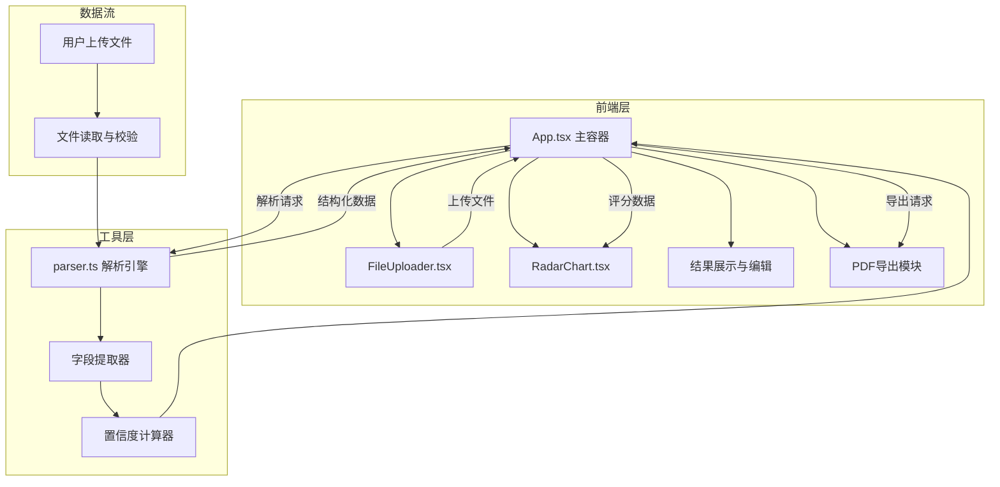

## 1. 架构设计



## 2. 技术说明

- 前端：React@18 + TypeScript + Vite
- 初始化工具：vite-init（react-ts模板）
- 后端：无（纯前端应用，客户端解析）
- 数据库：无（无持久化需求）
- 关键依赖：
  - jspdf：PDF文档生成
  - html2canvas：DOM截图转Canvas用于PDF导出

## 3. 路由定义

| 路由 | 用途 |
|------|------|
| / | 单页应用主页，包含上传、解析、展示、导出全部功能 |

## 4. 组件架构

### 4.1 文件结构

```
├── package.json
├── vite.config.js
├── tsconfig.json
├── index.html
└── src/
    ├── main.tsx
    ├── App.tsx
    ├── App.css
    ├── components/
    │   ├── FileUploader.tsx
    │   └── RadarChart.tsx
    └── utils/
        └── parser.ts
```

### 4.2 核心数据类型

```typescript
interface ExtractedField {
  label: string;
  value: string;
  confidence: number;
}

interface ParseResult {
  name: ExtractedField;
  email: ExtractedField;
  phone: ExtractedField;
  education: ExtractedField;
  experience: ExtractedField;
  skills: ExtractedField;
}

interface RadarScore {
  dimension: string;
  score: number;
}

interface AppState {
  file: File | null;
  parseResult: ParseResult | null;
  isParsing: boolean;
  uploadProgress: number;
  radarScores: RadarScore[];
}
```

### 4.3 组件职责

| 组件 | 职责 |
|------|------|
| App.tsx | 全局状态管理、协调上传-解析-展示-导出流程 |
| FileUploader.tsx | 拖拽/点击上传、格式校验、进度条、加载动画 |
| RadarChart.tsx | Canvas雷达图绘制、平滑动画、渐变填充 |
| parser.ts | 文件读取、文本提取、字段匹配、置信度计算、评分映射 |

## 5. 解析策略

### 5.1 文件读取

- PDF：使用浏览器FileReader + 文本提取策略
- 图片：基于OCR模拟（前端正则匹配模式）

### 5.2 字段提取规则

| 字段 | 提取策略 | 置信度因素 |
|------|----------|------------|
| 姓名 | 匹配"姓名/Name"标签后的文本 | 是否有标签引导、文本长度合理性 |
| 邮箱 | 正则匹配email格式 | 是否符合标准邮箱格式 |
| 电话 | 正则匹配手机/固话格式 | 是否符合电话号码模式 |
| 教育背景 | 匹配"教育/学历"板块文本 | 是否有明确教育标签、内容丰富度 |
| 工作经历 | 匹配"工作/经验"板块文本 | 是否有工作标签、时间线完整性 |
| 技能标签 | 匹配"技能/技术"板块关键词 | 技能关键词匹配数量 |

### 5.3 评分映射

六维评分基于提取字段的完整度、格式规范度、内容丰富度综合计算（0-100分），映射到雷达图各维度。

## 6. 导出策略

- 使用html2canvas截取雷达图Canvas区域
- 使用jspdf将雷达图截图和文字报告组合生成PDF
- PDF布局：上方雷达图、下方文字总结
