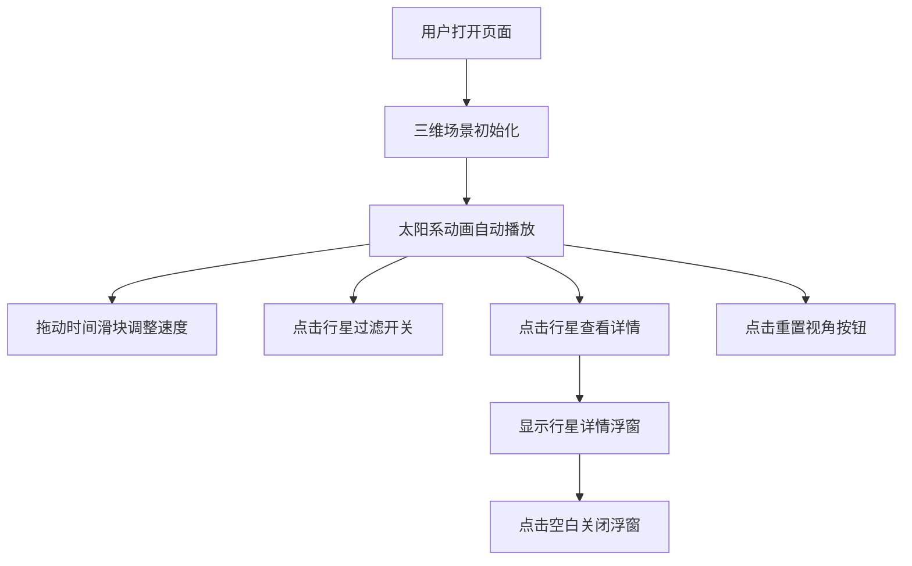

## 1. 产品概述

一个基于Web的太阳系三维可视化模拟应用，为天文爱好者和教育工作者提供直观的行星轨道和运动展示。解决静态星图无法体现行星公转速度差异、轨道倾角、近日点远日点变化，以及缺乏交互观察能力的问题。

- 主要用户：天文爱好者、教育工作者、学生
- 核心价值：将抽象的天文概念转化为可交互、可观察的三维动态场景

## 2. 核心功能

### 2.1 功能模块

1. **三维太阳系模拟引擎**：太阳、八大行星、椭圆轨道、粒子光晕、行星自转与公转
2. **用户交互控制面板**：时间加速滑块、行星过滤开关、重置视角按钮
3. **行星详情信息框**：点击行星显示物理参数详情
4. **深空主题UI**：渐变背景、星尘粒子动画、响应式布局

### 2.2 页面详情

| 页面名称 | 模块名称 | 功能描述 |
|-----------|-------------|---------------------|
| 主页面 | 三维场景 | 以太阳为中心渲染八大行星及其椭圆轨道，轨道半透明#4FC3F7色，线宽1.5px，带慢速旋转动画 |
| 主页面 | 太阳效果 | 发光球体带500粒子动态光晕，颜色从#FFD54F到#FF6F00渐变，大小2-5px随机，持续闪烁 |
| 主页面 | 行星运动 | 行星大小放大20倍，轨道半径缩小为真实值万分之一，公转速度按真实比例（水星最快、海王星最慢），每颗行星自转 |
| 主页面 | 控制面板 | 时间加速滑块（1-1000倍，步长1，高亮色#FFB74D），行星过滤开关（关闭后行星及轨道隐藏，保留虚线），重置视角按钮（1秒ease-in-out动画） |
| 主页面 | 信息浮窗 | 点击行星弹出半透明深色浮窗rgba(0,0,0,0.7)，圆角12px，白字显示中文名称、轨道半径(AU)、公转周期(地球年)、自转周期(小时)、质量(地球倍数)、卫星数量，0.3秒淡入，点击空白关闭 |
| 主页面 | 背景效果 | 深空渐变背景(#0D1B2A到#1B2838)，左右两侧200个星尘粒子(白色透明度0.3-0.6，1-2px随机大小，缓慢上下漂移) |

## 3. 核心流程

用户打开页面 → 三维场景自动加载并开始动画 → 通过时间滑块调整模拟速度 → 点击过滤开关显示/隐藏行星 → 点击任意行星查看详情 → 点击重置视角恢复初始观察角度 → 点击空白区域关闭信息浮窗

## 4. 用户界面设计

### 4.1 设计风格

- **主色调**：深空渐变 #0D1B2A → #1B2838
- **轨道色**：#4FC3F7 半透明
- **时间滑块高亮**：#FFB74D
- **太阳光晕渐变**：#FFD54F → #FF6F00
- **浮窗背景**：rgba(0,0,0,0.7) 圆角12px
- **控件风格**：圆角低多边形风格，悬停0.2秒缩放(1.05)效果

### 4.2 页面设计概述

| 页面名称 | 模块名称 | UI元素 |
|-----------|-------------|-------------|
| 主页面 | 三维场景 | Three.js WebGL画布全屏渲染 |
| 主页面 | 控制面板 | 右侧固定定位，包含滑块、开关列表、按钮 |
| 主页面 | 行星浮窗 | 居中或跟随点击位置，含标题、参数列表、淡入动画 |
| 主页面 | 背景粒子 | CSS动画实现的星尘漂移效果 |

### 4.3 响应式

- 桌面端（≥768px）：控制面板位于右侧垂直排列，行星浮窗居中弹出
- 移动端（<768px）：控制面板改为底部水平排列，行星详情浮窗改为全屏底部弹窗

### 4.4 3D场景指导

- **环境**：深空黑色背景，无HDRI，营造宇宙空旷感
- **光照**：点光源位于太阳位置，提供场景主要照明；微弱环境光保证行星暗面可见
- **相机**：PerspectiveCamera，初始位置在z轴正方向，可通过OrbitControls交互
- **交互**：鼠标拖拽旋转视角，滚轮缩放，点击行星触发详情
- **动画**：行星公转（基于真实周期比例）、自转、太阳光晕粒子闪烁、轨道慢速旋转
- **性能**：帧率保持30FPS以上，轨道计算更新频率≤16.6ms
