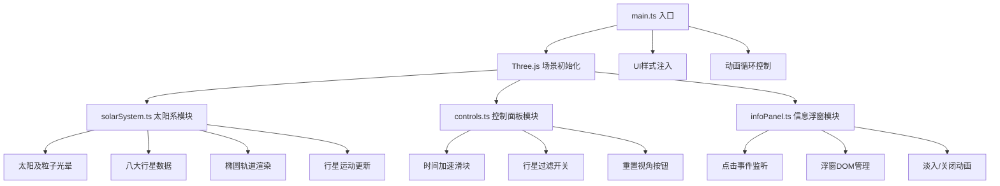

## 1. 架构设计



## 2. 技术说明

- **前端框架**：无框架，纯TypeScript
- **三维引擎**：Three.js @latest
- **构建工具**：Vite @latest
- **语言**：TypeScript（严格模式，target ES2020）
- **样式**：CSS-in-JS通过uiStyles.ts动态注入

## 3. 目录结构

| 文件路径 | 作用 |
|----------|------|
| package.json | 依赖配置（three, typescript, vite, @types/three） |
| vite.config.js | Vite构建配置，端口3000，开启HMR |
| tsconfig.json | TypeScript配置（严格模式，ES2020） |
| index.html | 入口HTML，标题"太阳系模拟"，含根节点 |
| src/main.ts | 应用入口，初始化场景/相机/渲染器，启动动画循环 |
| src/solarSystem.ts | 太阳系创建与更新（太阳、行星、轨道、粒子） |
| src/controls.ts | 用户控制面板（时间滑块、过滤开关、重置视角） |
| src/infoPanel.ts | 行星详情浮窗（点击事件、数据展示、动画） |
| src/uiStyles.ts | CSS样式字符串（深空主题、响应式、控件样式） |

## 4. 核心数据结构

### 行星数据定义

```typescript
interface PlanetData {
  name: string;          // 中文名称
  color: number;         // 十六进制颜色
  radius: number;        // 行星半径（相对地球，已放大20倍）
  orbitRadius: number;   // 轨道半径（真实值万分之一）
  orbitSpeed: number;    // 公转速度（相对比例）
  rotationSpeed: number; // 自转速度
  au: number;            // 轨道半径（天文单位）
  orbitalPeriod: number; // 公转周期（地球年）
  rotationPeriod: number;// 自转周期（小时）
  mass: number;          // 质量（地球倍数）
  satellites: number;    // 卫星数量
}
```

## 5. 性能优化

- 轨道LineLoop使用THREE.BufferGeometry减少内存开销
- 粒子系统使用THREE.Points批量渲染
- 行星位置更新基于requestAnimationFrame的deltaTime
- 轨道计算节流，更新频率不超过16.6ms
- DOM事件使用事件委托减少监听器数量
